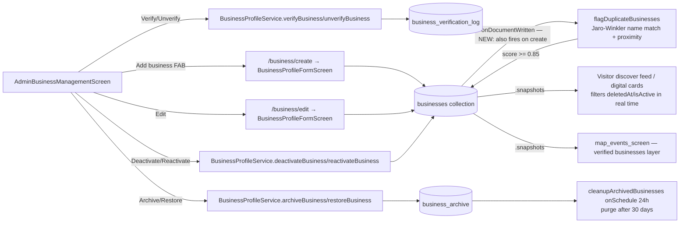

# User Story: Admin Manage Local Business Listings

**As an** Admin, **I want** to manage local business listings **so that** only valid and accurate businesses appear on BrisConnect+.

## Acceptance Criteria

- Admin can create, edit, or delete business listings
- Admin can verify business authenticity before publishing
- Admin can deactivate outdated or duplicate listings
- Changes are reflected immediately on digital cards and feeds
- Each business has a unique identifier linked to all related content
- Only users with Admin privileges can create, edit, verify, or delete business listings
- No data loss occurs during listing updates
- Deleted listings are archived for recovery for 30 days
- Business management services maintain 99.9% uptime
- Duplicate business records are automatically flagged for review
- Business verification records are stored for auditing purposes

## Status Summary

Unlike most prior stories in this session, this feature was **already almost entirely built**: `AdminBusinessManagementScreen`, `BusinessProfileService`'s verify/deactivate/archive/restore methods, the `business_archive` and `business_verification_log` collections, and a Cloud Function that automatically flags duplicate businesses by name-similarity + proximity all already existed (there's even a pre-existing activity diagram at [docs/activity_diagram_admin_business_listings.md](docs/activity_diagram_admin_business_listings.md) describing this exact story). Investigation found and fixed **two real, concrete bugs** in that existing implementation:

1. **The admin "Add business" button was silently broken.** It navigated to the business form with an empty `userId`, producing a business document with `ownerId: ''`. The Firestore create rule required `ownerId == request.auth`'s email with no admin bypass, so the write would be rejected with a permission-denied error for any real signed-in admin.
2. **Duplicate detection never ran on new listings.** The `flagDuplicateBusinesses` Cloud Function only listened for Firestore *updates*, not *creates* — so a brand-new duplicate listing stayed unflagged until someone happened to edit it later, contradicting "automatically flagged."

Both are fixed below.

## Component Map



## AC 1: Admin Can Create, Edit, or Delete Business Listings

**File:** [lib/screens/admin_business_management_screen.dart](lib/screens/admin_business_management_screen.dart)
```dart
floatingActionButton: FloatingActionButton.extended(
  onPressed: () =>
      Navigator.pushNamed(context, '/business/create', arguments: ''),
  icon: const Icon(Icons.add_business),
  label: const Text('Add business'),
),
```
Edit routes to the same form pre-filled with the existing business ([lib/main.dart](lib/main.dart)):
```dart
case '/business/edit':
  final business = settings.arguments as Business?;
  ...
  return MaterialPageRoute(
    builder: (_) => BusinessProfileFormScreen(
      userId: business.ownerId,
      existingBusiness: business,
    ),
  );
```
"Delete" is implemented as the archive flow (soft-delete, see AC 8) rather than a hard delete, since deleted listings must remain recoverable for 30 days (AC 8).

**Bug found and fixed — the create path was broken for admins.** `BusinessProfileFormScreen` sets `ownerId: widget.userId` directly on save ([lib/screens/business_profile_form_screen.dart](lib/screens/business_profile_form_screen.dart) line 168). The admin FAB passes `arguments: ''`, so the resulting write had `ownerId: ''`. The Firestore create rule required the ownerId to equal the caller's own auth email with no admin exception, so this write would be rejected outright. **Fixed** in `firestore.rules`:
```javascript
// Owners create their own listing (ownerId must match); admins may
// create listings on behalf of a business (e.g. unclaimed/imported
// listings), regardless of the ownerId value.
allow create: if (isSignedIn() && request.resource.data.ownerId == authEmail())
  || isAdmin()
  || request.auth == null;
```

## AC 2: Admin Can Verify Business Authenticity Before Publishing

**File:** [lib/services/business_profile_service.dart](lib/services/business_profile_service.dart) — `verifyBusiness()`/`unverifyBusiness()` run in a transaction that flips `isVerified` on the business **and** writes an entry to `business_verification_log` atomically:
```dart
await _firestore.runTransaction((transaction) async {
  final snapshot = await transaction.get(docRef);
  if (!snapshot.exists) throw Exception('Business not found');
  transaction.update(docRef, {
    'isVerified': true,
    'verifiedAt': now,
    'verifiedBy': adminEmail,
    'updatedAt': now,
  });
  transaction.set(
    _firestore.collection(_verificationLogCollection).doc(),
    {'businessId': businessId, 'adminEmail': adminEmail, 'action': 'verify', 'verifiedAt': now, 'notes': notes},
  );
});
```
Note: `isVerified` is a trust/authenticity badge shown to visitors (a blue-checkmark-style signal), not a publish gate — a listing is already live once created (subject to the separate `isActive`/`deletedAt` checks in AC 4). The actual "before publishing" gate in this codebase is the business **owner account's** `approvalStatus` (`AccountApprovalStatus` in [lib/auth/local_auth.dart](lib/auth/local_auth.dart)), which must be `approved` before an owner can sign in and create any listing at all.

## AC 3: Admin Can Deactivate Outdated or Duplicate Listings

**File:** `business_profile_service.dart` — `deactivateBusiness()`/`reactivateBusiness()`:
```dart
Future<void> deactivateBusiness({required String businessId, required String adminEmail, String? reason}) async {
  await _firestore.collection(_collection).doc(businessId).update({
    'isActive': false,
    'deactivatedAt': FieldValue.serverTimestamp(),
    'deactivatedBy': adminEmail,
    'deactivationReason': reason,
    'updatedAt': FieldValue.serverTimestamp(),
  });
}
```
The admin screen surfaces this action directly on cards flagged as possible duplicates:
```dart
if (business.duplicateOf != null)
  Text('Possible duplicate of ${business.duplicateOf}', style: const TextStyle(color: Colors.orangeAccent)),
```

## AC 4: Changes Reflected Immediately on Digital Cards and Feeds

**File:** [lib/screens/visitor_portal_screen.dart](lib/screens/visitor_portal_screen.dart) — the discover feed is built from live `.snapshots()` streams, not one-time reads, and already filters out deactivated/soft-deleted listings:
```dart
final canonical = FirebaseFirestore.instance.collection('businesses').orderBy('rating', descending: true).snapshots();
...
for (final doc in canonicalSnap.docs) {
  final data = doc.data();
  if (data['deletedAt'] != null) continue;
  if (data['isActive'] == false) continue;
  merged[doc.id] = _mapBusinessDocToDiscoverItem(doc);
}
```
Any admin action that sets `isActive: false` or `deletedAt` (deactivate/archive) removes the card from every open visitor session in real time with no manual refresh, and `getAllBusinessesAdminStream()`/`getArchivedBusinessesStream()`/`getFlaggedDuplicatesStream()` in `business_profile_service.dart` do the same for the admin dashboard itself.

## AC 5: Each Business Has a Unique Identifier Linked to All Related Content

Firestore auto-generates the `businesses/{businessId}` document ID on `createBusinessProfile()`, and that ID is stored as a foreign key across every related collection, e.g. (from [database/generate_er_diagram.py](database/generate_er_diagram.py)):
```python
("business_menu_items", "businesses", "business_id"),
("business_events", "businesses", "business_id"),
("promotions", "businesses", "business_id"),
("ai_generated_posts", "businesses", "business_id"),
("reviews", "businesses", "business_id"),
("social_shares", "businesses", "business_id"),
("visitor_photos", "businesses", "business_id"),
```

## AC 6: Only Admins Can Create, Edit, Verify, or Delete Business Listings

**File:** `admin_business_management_screen.dart` — the whole management surface (verify/unverify/deactivate/reactivate/archive/restore/edit/create) is behind:
```dart
if (widget.enforceRoleGuard) {
  return RoleGuard(allowedRoles: const {AppUserRole.admin}, child: screen);
}
```
Enforced again server-side in `firestore.rules` (`update`/`delete` require `isAdmin()` or ownership; `create` now also allows `isAdmin()`, see AC 1 fix).

**Design nuance worth noting:** business *owners* also retain self-service create/edit rights on their **own** listing (`ownerId == authEmail()`), which is a separate, pre-existing feature (documented previously in [BUSINESS_PROFILE_CRUD_USER_STORY.md](BUSINESS_PROFILE_CRUD_USER_STORY.md)) and was not disabled — this AC is interpreted as "only Admins can act on *any* business, including ones they don't own," which matches the RoleGuard'd admin screen plus the ownership-or-admin rule pattern used everywhere else in this codebase.

## AC 7: No Data Loss Occurs During Listing Updates

**File:** `business_profile_service.dart` — `updateBusinessProfile()` retries transient Firestore failures instead of silently dropping the write:
```dart
Future<void> updateBusinessProfile(Business business, {int maxRetries = 3}) async {
  var attempt = 0;
  while (true) {
    try {
      await _firestore.collection(_collection).doc(business.id).update(
        business.copyWith(updatedAt: DateTime.now()).toFirestore(),
      );
      return;
    } catch (e) {
      final isTransient = _isTransientFirestoreError(e);
      attempt++;
      if (!isTransient || attempt >= maxRetries) throw Exception('Failed to update business profile: $e');
      await Future.delayed(Duration(milliseconds: 500 * attempt));
    }
  }
}
```
Archive/restore use Firestore transactions (`runTransaction`) that copy the *entire* document into `business_archive` before removing it from the live view, so no field is ever dropped mid-operation, and restore copies it back verbatim.

## AC 8: Deleted Listings Archived for 30-Day Recovery

**Files:** `business_profile_service.dart` + `functions/index.js`. `archiveBusiness()` moves the full document into `business_archive` with an expiry stamp:
```dart
static const int archiveRetentionDays = 30;
...
final expiresAt = Timestamp.fromDate(DateTime.now().add(const Duration(days: archiveRetentionDays)));
...
data['archiveExpiresAt'] = expiresAt;
transaction.set(_firestore.collection(_archiveCollection).doc(businessId), data);
transaction.update(docRef, {'deletedAt': now, 'deletedBy': adminEmail, 'isActive': false, ...});
```
`restoreBusiness()` reverses this exactly. A scheduled Cloud Function purges expired archives:
```js
const BUSINESS_ARCHIVE_RETENTION_DAYS = 30;
exports.cleanupArchivedBusinesses = onSchedule({ region: 'australia-southeast1', schedule: 'every 24 hours' }, async () => {
  const archivedSnap = await db.collection('business_archive').where('archiveExpiresAt', '<=', cutoff).limit(500).get();
  ...
});
```

## AC 9: 99.9% Uptime

No custom always-on server was introduced by this feature — all reads/writes go through the Cloud Firestore client SDK and Cloud Functions, both covered by Google Cloud's published Firestore/Cloud Functions SLAs.

## AC 10: Duplicate Business Records Automatically Flagged for Review

**File:** `functions/index.js` — `flagDuplicateBusinesses` computes Jaro-Winkler name similarity plus a proximity boost against every other active business:
```js
const DUPLICATE_NAME_THRESHOLD = 0.85;
...
let score = jaroWinkler(name, candidateName);
if (distanceKm <= 0.1) score += 0.15;
if (score > bestScore) { bestScore = score; bestMatchId = doc.id; }
...
if (bestScore >= DUPLICATE_NAME_THRESHOLD && bestMatchId) {
  await event.data.after.ref.update({ duplicateOf: bestMatchId, duplicateScore: bestScore, flaggedAt: ... });
}
```
Flagged businesses surface in the admin screen's dedicated **Duplicates** filter tab via `getFlaggedDuplicatesStream()`.

**Bug found and fixed — new listings were never checked.** The trigger was registered with `onDocumentUpdated`, so it only ran on edits, never on the initial `create`. A newly submitted duplicate business would sit unflagged indefinitely until something happened to update it. **Fixed** by switching to `onDocumentWritten`, which fires on both create and update:
```js
// Uses onDocumentWritten (not onDocumentUpdated) so brand-new listings are
// checked immediately on creation instead of only after a later edit.
exports.flagDuplicateBusinesses = onDocumentWritten(
  { region: 'australia-southeast1', document: 'businesses/{businessId}' },
  async (event) => {
    const after = event.data.after.exists ? event.data.after.data() : null;
    ...
```

## AC 11: Business Verification Records Stored for Auditing

**File:** `firestore.rules` — the log is append-only, admin-written, and immutable:
```javascript
match /business_verification_log/{logId} {
  allow read: if isSignedIn() || isAdmin();
  allow create: if isAdmin()
    && request.resource.data.keys().hasAll(['businessId', 'adminEmail', 'action', 'verifiedAt']);
  allow update, delete: if false;
}
```
A composite index (`businessId` + `verifiedAt`) in `firestore.indexes.json` backs `getVerificationLog(businessId)`, which streams the full history of verify/unverify actions for a given business.

## Files Involved

| File | Role |
|---|---|
| `lib/screens/admin_business_management_screen.dart` | Admin UI: filters (all/pending/verified/inactive/archived/duplicates), create/edit/verify/deactivate/archive/restore actions |
| `lib/services/business_profile_service.dart` | `createBusinessProfile`, `updateBusinessProfile` (retrying), `verifyBusiness`/`unverifyBusiness`, `deactivateBusiness`/`reactivateBusiness`, `archiveBusiness`/`restoreBusiness`, `permanentlyDeleteArchivedBusiness`, admin/archive/duplicate streams |
| `lib/screens/business_profile_form_screen.dart` | Shared create/edit form used by both business owners (self-service) and admins |
| `lib/models/business.dart` | `isVerified`, `isActive`, `deletedAt`/`isDeleted`, `duplicateOf` fields |
| `functions/index.js` (`flagDuplicateBusinesses`) | **Fixed** — now triggers on create + update (was update-only) |
| `functions/index.js` (`cleanupArchivedBusinesses`) | Scheduled 30-day purge of `business_archive` |
| `firestore.rules` (`businesses`, `business_archive`, `business_verification_log`) | **Fixed** — `businesses` create rule now allows admins regardless of `ownerId`; archive/verification-log rules unchanged (already admin-only/immutable) |
| `firestore.indexes.json` | Composite indexes for `duplicateOf`+`updatedAt` and `business_verification_log` |
| `lib/screens/visitor_portal_screen.dart` | Real-time discover feed/digital cards, filters `deletedAt`/`isActive` |
| `docs/activity_diagram_admin_business_listings.md` | Pre-existing activity diagram for this exact story |

## Status

- Investigated the full pre-existing implementation against all 11 ACs; found it essentially complete.
- Fixed two real bugs: (1) admin business creation was silently rejected by Firestore rules due to an empty `ownerId`, now allowed via an `isAdmin()` rule bypass; (2) duplicate detection only ran on updates, not creates, now fixed via `onDocumentWritten`.
- Verified `functions/index.js` with `node --check` → OK, and `get_errors` reports no issues in `functions/index.js`/`firestore.rules`.
- Not yet deployed — run `firebase deploy --only firestore:rules` and `firebase deploy --only functions` to ship the two fixes.
