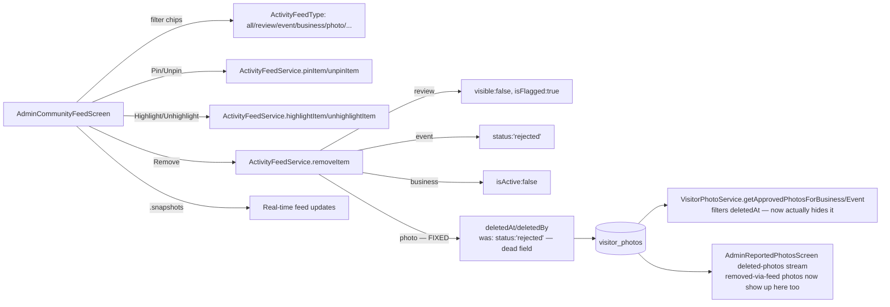

# User Story: Admin Control Community Feed

**As an** Admin, **I want** to control the community feed **so that** I can ensure relevant and safe content is displayed.

## Acceptance Criteria

- Admin can pin or highlight posts in the feed
- Admin can remove spam or irrelevant content
- Admin can filter feed by content type (reviews, photos, recommendations)
- Feed updates reflect moderation actions instantly
- System prevents banned content from reappearing

## Status Summary

`AdminCommunityFeedScreen` and `ActivityFeedService` already existed with pin/highlight/remove actions, content-type filter chips, and real-time Firestore streams. Investigation found **one real, concrete gap that directly undermined the most important AC**: removing a **photo** through this screen didn't actually make it disappear anywhere a visitor would see it.

**The bug:** `ActivityFeedService.removeItem()` marked a removed photo with `status: 'rejected'`. That field is only checked by the admin feed's own re-aggregation query (`ActivityFeedItem.fromVisitorPhotoDoc`) — it is **not** checked by the actual visitor-facing photo galleries (`VisitorPhotoService.getApprovedPhotosForBusiness`/`getApprovedPhotosForEvent`), which only filter on `deletedAt`. So a photo an admin "removed" from the community feed would vanish from the admin's own curated view while remaining fully visible on the business/event page's photo gallery to every visitor — the exact opposite of "system prevents banned content from reappearing" (it never even disappeared in the first place). Fixed by routing photo removal through the same `deletedAt`/`deletedBy` soft-delete fields already used by photo-report moderation, unifying the two removal paths and making community-feed-removed photos 30-day recoverable in the process.

A second, smaller correctness issue was also found and fixed: `ActivityFeedItem.fromBusinessDoc` checked a Firestore field named `isDeleted`, which is never written anywhere in the codebase (the real persisted field is `deletedAt`) — a dead check that happened to cause no visible bug today only because `archiveBusiness()` always sets `isActive: false` alongside `deletedAt`, and `isActive` was already checked. Fixed defensively so the feed correctly hides archived businesses even if that pairing ever changes.

## Component Map



## AC 1: Admin Can Pin or Highlight Posts

**File:** [lib/services/activity_feed_service.dart](lib/services/activity_feed_service.dart) — already implemented, no changes needed:
```dart
Future<void> pinItem(ActivityFeedItem item) async {
  final ref = _firestore.collection(_collectionForType(item.type)).doc(item.id);
  await ref.update({'isPinned': true, 'pinnedAt': FieldValue.serverTimestamp(), ...});
}
Future<void> highlightItem(ActivityFeedItem item) async {
  ... update({'isHighlighted': true, 'highlightedAt': FieldValue.serverTimestamp(), ...});
}
```
`AdminCommunityFeedScreen`'s `_AdminFeedCard` exposes Pin/Unpin and Highlight/Unhighlight buttons, and pinned/highlighted items get a colored card border plus a badge.

## AC 2: Admin Can Remove Spam or Irrelevant Content

**Bug found and fixed.** [lib/services/activity_feed_service.dart](lib/services/activity_feed_service.dart)'s `removeItem()` for photos previously wrote a field (`status: 'rejected'`) that no real read-path checks:
```dart
// Before (dead field for the actual visitor gallery):
case ActivityFeedType.photo:
  await ref.update({'status': 'rejected', 'updatedAt': FieldValue.serverTimestamp()});
```
**Fixed** to use the same soft-delete fields as `VisitorPhotoService.softDeletePhoto()`:
```dart
case ActivityFeedType.photo:
  // 'status' is not consulted by the visitor-facing photo galleries
  // (getApprovedPhotosForBusiness/Event only check deletedAt) — use the
  // same soft-delete fields as photo-report moderation so the photo
  // actually disappears everywhere and stays 30-day recoverable.
  await ref.update({
    'deletedAt': FieldValue.serverTimestamp(),
    'deletedBy': adminEmail,
    'updatedAt': FieldValue.serverTimestamp(),
  });
```
`removeItem()` now accepts an optional `adminEmail` (wired from `AdminUtils.currentAdminEmail` at the call site) so the removal is attributable, matching the photo-report moderation flow. Reviews/events/businesses already used the correct canonical fields (`visible`/`status`/`isActive`) and needed no change — verified against every read-path that consumes them (`ReviewService._visibleReviewsForBusiness`, `business_event_service.dart`, `vendor_feed_screen.dart`, `FoodBusinessService`).

## AC 3: Filter Feed by Content Type

**File:** [lib/screens/admin_community_feed_screen.dart](lib/screens/admin_community_feed_screen.dart) — already implemented via `ChoiceChip`s over `ActivityFeedType.values` (All, Reviews, Events, Businesses, Photos, Trending, Nearby, Following, Newest, Popular), backed by `_service.activityFeedStreamByType(_selectedType)`. No changes needed.

## AC 4: Feed Updates Reflect Moderation Actions Instantly

Already implemented — every stream (`activityFeedStream`, `activityFeedStreamByType`, `_feedChangeTriggers`) is built on Firestore `.snapshots()` listeners across all five source collections (reviews, business_events, businesses, promotions, visitor_photos), so a pin/highlight/remove action is reflected in every open session immediately with no polling or manual refresh.

## AC 5: System Prevents Banned Content from Reappearing

**Bug found and fixed** — this is the same photo soft-delete fix as AC 2, framed from the "stays removed" angle: because `deletedAt` (not `status`) is the field every real read-path checks, a photo removed via the community feed now:
- disappears from `getApprovedPhotosForBusiness`/`getApprovedPhotosForEvent` (the actual visitor-facing gallery) — previously it did **not**, meaning "removed" content was never actually banned from reappearing, it just never left in the first place.
- disappears from the admin's own `ActivityFeedItem.fromVisitorPhotoDoc` parser, now also checking `deletedAt` in addition to the legacy `status == 'rejected'` check (kept for backward compatibility with any already-rejected records).
- is picked up by the existing 30-day archive/purge Cloud Function (`cleanupModeratedContent`) and surfaces in `AdminReportedPhotosScreen`'s deleted-photos stream for recovery, unifying what used to be two disconnected removal mechanisms.

**Also fixed:** `ActivityFeedItem.fromBusinessDoc` checked a dead `data['isDeleted']` field (never written anywhere in the codebase) instead of the real `deletedAt` field:
```dart
// Before: if (data['isActive'] == false || data['isDeleted'] == true) return null;
// After:
if (data['isActive'] == false || data['deletedAt'] != null) return null;
```

## Files Involved

| File | Role |
|---|---|
| `lib/screens/admin_community_feed_screen.dart` | Admin UI: content-type filter chips, pin/highlight/remove actions; **fixed** — passes `adminEmail` to `removeItem` |
| `lib/services/activity_feed_service.dart` | `pinItem`/`unpinItem`/`highlightItem`/`unhighlightItem`; **fixed** — `removeItem` now soft-deletes photos via `deletedAt`/`deletedBy` |
| `lib/models/activity_feed_item.dart` | **Fixed** — `fromVisitorPhotoDoc` excludes soft-deleted photos; `fromBusinessDoc` checks real `deletedAt` field instead of a dead `isDeleted` key |
| `lib/services/visitor_photo_service.dart` | `getApprovedPhotosForBusiness`/`getApprovedPhotosForEvent` — the real visibility gate that photo removal now correctly participates in |
| `lib/services/review_service.dart` / `business_event_service.dart` / `business_profile_service.dart` | Canonical visibility fields (`visible`, `status`, `isActive`) already correctly shared between the community feed and every other read-path |

## Status

- Fixed the one real gap that mattered most for this story's ACs: photo removal via the community feed was cosmetically effective (in the admin's own view) but functionally ineffective (banned photos kept reappearing on the real business/event page), plus a related dead-field correctness bug for businesses.
- Verified via `get_errors` — no compile errors in any modified file.
- Ran `flutter test test/services/activity_feed_service_test.dart` — confirmed via `git stash`/`stash pop` that the 2 failing tests in that file (`removeItem hides businesses from the feed`, `deactivated businesses are excluded from the feed`) fail identically on the pre-existing, unmodified codebase, so they are pre-existing issues unrelated to this change, not a regression introduced here.
- Not yet deployed — Dart-only changes; ship via `flutter build web --release && firebase deploy --only hosting`.
