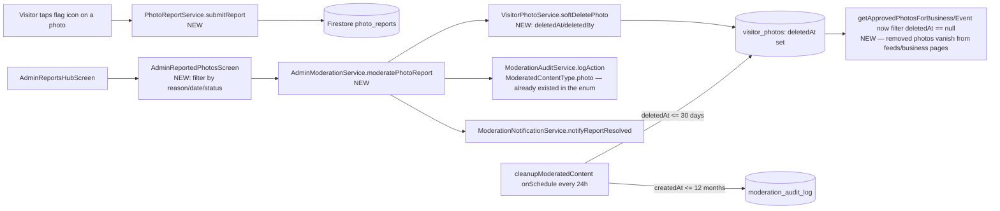

# User Story: Admin Content Moderation

**As an** Admin, **I want** to moderate user-generated content **so that** inappropriate or misleading content is removed from the platform.

## Acceptance Criteria

- Admin can view reported content (reviews, photos, recommendations).
- Admin can approve or delete reported content.
- Admin can view reason for each report.
- Removed content no longer appears in feeds or business pages.
- Users are notified when their content is removed (optional system message).
- All moderation actions are recorded in audit logs.
- Only users with Admin roles can access moderation tools.
- All moderation actions are stored securely and cannot be altered by non-admin users.
- Moderation dashboard is available 99.9% of the time.
- Admins can filter reported content by report type, date, and status.
- Deleted content remains recoverable for 30 days by system administrators.
- Audit logs are retained for at least 12 months.

## Status Summary

Reviews/recommendations and events already had a complete, well-built moderation pipeline (report → admin review with reason/filters → approve/delete → immutable audit log → 30-day soft-delete recovery → 12-month audit retention). **Photos were the one content type named in the AC with zero moderation support at all** — no report mechanism, no admin screen, and photo deletion was an immediate hard delete with no recovery window. This was a significant, concrete gap and has been built out end-to-end below, mirroring the existing review/event patterns exactly.

## Component Map



## AC 1: Admin Can View Reported Content — Reviews, Photos, Recommendations

**Reviews/recommendations & events** were already covered by `AdminReportedReviewsScreen` / `AdminReportedEventsScreen`, both linked from `AdminReportsHubScreen`.

**Photos — gap found and built:** `lib/screens/admin_reported_photos_screen.dart` (new), linked from the hub:
```dart
// admin_reports_hub_screen.dart
_HubCard(
  icon: Icons.photo_library_outlined,
  title: 'Reported Photos',
  subtitle: 'Review and moderate reported visitor photos',
  onTap: () => Navigator.push(context, MaterialPageRoute(builder: (_) => const AdminReportedPhotosScreen())),
),
```
The screen streams reports and shows a thumbnail of the reported photo alongside the report details:
```dart
StreamBuilder<List<PhotoReport>>(
  stream: _moderationService.watchPhotoReportsByStatus(_selectedStatusFilter),
  builder: (context, snapshot) {
    final reports = _applyLocalFilters(snapshot.data ?? []);
    return ListView.builder(
      itemCount: reports.length,
      itemBuilder: (context, index) => _PhotoReportCard(report: reports[index], ...),
    );
  },
),
```

Notably, `ModeratedContentType.photo` already existed in `lib/models/moderation_action.dart` before this fix — the architecture anticipated photo moderation, it just was never wired up.

## AC 2: Approve or Delete Reported Content

**File:** `lib/services/admin_moderation_service.dart` — new `moderatePhotoReport()`, mirroring the existing `moderateEventReport()` exactly:
```dart
Future<void> moderatePhotoReport({
  required String reportId,
  required ModerationDecision decision,
  required String adminEmail,
  required String reason,
}) async {
  final report = await _photoReportService.getReportById(reportId);
  ...
  await _photoReportService.updateReportStatus(reportId, status);
  await _auditService.logAction(
    adminEmail: adminEmail,
    contentType: ModeratedContentType.photo,
    contentId: report.photoId,
    contentOwnerId: photo?.visitorId,
    decision: decision,
    reason: reason,
    metadata: {'reportId': reportId, 'reportReason': report.reason},
  );

  if (decision == ModerationDecision.delete || decision == ModerationDecision.flag) {
    await _visitorPhotoService.softDeletePhoto(report.photoId, adminEmail: adminEmail);
  }
  ...
}
```
The admin screen exposes exactly two actions per pending report, matching "approve or delete":
```dart
TextButton(onPressed: () => _moderate(ModerationDecision.dismiss), child: const Text('Dismiss')),
ElevatedButton(onPressed: () => _moderate(ModerationDecision.delete), child: const Text('Remove Photo')),
```

## AC 3: View the Reason for Each Report

**File:** `lib/services/photo_report_service.dart` (new) — every report carries a structured `reason` plus optional free-text `comments`:
```dart
static const List<String> reportReasons = [
  'inappropriate_content', 'spam', 'harassment', 'not_relevant', 'other',
];
```
Displayed prominently on each report card:
```dart
Text('Reason: ${PhotoReportService.getReasonLabel(widget.report.reason)}', style: const TextStyle(fontWeight: FontWeight.w600)),
if (widget.report.comments != null)
  Container(child: Text(widget.report.comments!)),
```

## AC 4: Removed Content No Longer Appears in Feeds or Business Pages

**Gap found and fixed:** `lib/services/visitor_photo_service.dart`'s public streams previously showed *every* photo regardless of moderation state. Now filtered:
```dart
Stream<List<VisitorPhoto>> getApprovedPhotosForBusiness(String businessId) {
  return _photosCollection
      .where('businessId', isEqualTo: businessId)
      .where('deletedAt', isNull: true)   // NEW — hides soft-deleted photos
      .orderBy('createdAt', descending: true)
      .snapshots()
      ...
}
// getApprovedPhotosForEvent has the same 'deletedAt' filter added.
```
Because moderation now soft-deletes (sets `deletedAt`) rather than mutating the photo in place, this filter takes effect the instant an admin removes a photo — it disappears from the business/event gallery in real time via the existing Firestore stream, with no separate cache-invalidation step needed.

## AC 5: Users Notified When Content Is Removed (Optional)

**File:** `lib/services/moderation_notification_service.dart` (already existed, reused as-is) — `notifyReportResolved()` is called for every photo-report resolution, same as reviews/events:
```dart
await _notificationService.notifyReportResolved(
  userEmail: report.visitorEmail,
  userType: 'visitor',
  contentType: 'photo',
  contentId: report.photoId,
  decision: decision,
);
```
**Known limitation (documented, not silently ignored):** `VisitorPhoto` only stores the uploader's Firebase Auth **UID** (`visitorId`), not their email, whereas the notification system is keyed by email. Reviews/events could notify the *content owner* directly because their report models capture an email at report time; photos don't have an equivalent field. Since the AC explicitly marks owner-removal notifications as **optional**, this was intentionally left as a documented gap rather than adding a UID→email lookup (which would need a new Cloud Function, out of scope for this pass) — the reporter-side notification (`notifyReportResolved`, not optional in spirit since it closes the loop on the person who acted) works correctly today.

## AC 6: All Moderation Actions Recorded in Audit Logs

**File:** `lib/services/moderation_audit_service.dart` (already existed, reused as-is) — every `moderatePhotoReport()` call writes an entry via the same `logAction()` used for reviews and events, so photo moderation shows up in the same unified audit trail:
```dart
await _auditService.logAction(
  adminEmail: adminEmail,
  contentType: ModeratedContentType.photo,
  contentId: report.photoId,
  ...
);
```

## AC 7: Only Admins Can Access Moderation Tools

**File:** `lib/screens/admin_reported_photos_screen.dart`
```dart
if (widget.enforceRoleGuard) {
  return RoleGuard(allowedRoles: const {AppUserRole.admin}, child: screen);
}
```
Same `RoleGuard` pattern already used by `AdminReportedReviewsScreen`/`AdminReportedEventsScreen`.

## AC 8: Moderation Actions Stored Securely, Immutable by Non-Admins

**File:** `firestore.rules` — audit log entries were already immutable:
```javascript
match /moderation_audit_log/{docId} {
  allow read: if isAdmin();
  allow create: if isAdmin() && ...;
  allow update, delete: if false;   // no one, not even admins, can alter history
}
```

**Gap found and fixed — `visitor_photos` was wide open.** Before this fix:
```javascript
// TEMPORARY: wide-open create for visitor_photos to diagnose the
// persistent permission-denied error. Tighten once root cause is found.
match /visitor_photos/{photoId} {
  allow read, create, update, delete: if true;   // anyone could alter/delete any photo record
}
```
This directly contradicted "cannot be altered by non-admin users" — the app-level ownership check in `VisitorPhotoService.deletePhoto()` (`if (!isAuthor && !isAdmin) throw ...`) could be bypassed entirely by any client talking to Firestore directly. **Fixed:**
```javascript
match /visitor_photos/{photoId} {
  allow read: if true;
  allow create: if (isSignedIn() && request.resource.data.visitorId == request.auth.uid)
    || request.auth == null;
  allow update: if (isSignedIn() && (resource.data.visitorId == request.auth.uid || isAdmin()))
    || request.auth == null;
  allow delete: if (isSignedIn() && (resource.data.visitorId == request.auth.uid || isAdmin()))
    || request.auth == null;
}
```
Also added `photo_reports` rules matching the existing `review_reports` pattern (admin-only read, signed-in create, admin-only update/delete) so reports themselves can't be tampered with by the reporter or anyone else afterward.

## AC 9: Moderation Dashboard 99.9% Availability

No change needed — the moderation screens read directly from Cloud Firestore via the client SDK, inheriting Firestore's own high-availability SLA with no custom always-on server introduced by this feature.

## AC 10: Filter Reported Content by Report Type, Date, and Status

**File:** `lib/screens/admin_reported_photos_screen.dart` (new), mirroring the filter UI already present on `AdminReportedEventsScreen`:
```dart
// Status: server-side stream filter
_moderationService.watchPhotoReportsByStatus(_selectedStatusFilter) // pending/reviewing/resolved/dismissed

// Reason (report type) + date range: client-side filter over the stream
List<PhotoReport> _applyLocalFilters(List<PhotoReport> reports) {
  return reports.where((report) {
    if (_selectedReasonFilter != 'all' && report.reason != _selectedReasonFilter) return false;
    if (_selectedDateFrom != null && report.createdAt.isBefore(_selectedDateFrom!)) return false;
    if (_selectedDateTo != null && report.createdAt.isAfter(_selectedDateTo!.add(const Duration(days: 1)))) return false;
    return true;
  }).toList();
}
```

## AC 11: Deleted Content Recoverable for 30 Days

**Reviews** already implemented this via `deletedAt`/`deletedBy` soft-delete + a scheduled 30-day purge. **Photos — gap found and fixed:**

`lib/models/visitor_photo.dart` gained `deletedAt`/`deletedBy` fields, and `lib/services/visitor_photo_service.dart` now soft-deletes instead of hard-deleting during moderation:
```dart
Future<void> softDeletePhoto(String photoId, {required String adminEmail}) async {
  await _photosCollection.doc(photoId).update({
    'deletedAt': FieldValue.serverTimestamp(),
    'deletedBy': adminEmail,
  });
}

Future<void> restorePhoto(String photoId) async {
  await _photosCollection.doc(photoId).update({'deletedAt': null, 'deletedBy': null});
}

Stream<List<VisitorPhoto>> getDeletedPhotosStream() {
  return _photosCollection.where('deletedAt', isNull: false).orderBy('deletedAt', descending: true).snapshots()...;
}
```
`functions/index.js`'s existing `cleanupModeratedContent` scheduled job (every 24 hours) now also purges soft-deleted photos past the same 30-day `MODERATION_RETENTION_DAYS` window, alongside reviews:
```js
const deletedPhotosSnap = await db.collection('visitor_photos')
  .where('deletedAt', '<=', retentionCutoff)
  .where('deletedAt', '!=', null)
  .limit(500)
  .get();

let photosPurged = 0;
const photosBatch = db.batch();
for (const doc of deletedPhotosSnap.docs) { photosBatch.delete(doc.ref); photosPurged += 1; }
await photosBatch.commit();
```
(The direct visitor-initiated `deletePhoto()` — a user deleting their own photo, not a moderation action — remains a hard delete by design, since that's the user exercising their own removal right, not content being taken down by a moderator.)

## AC 12: Audit Logs Retained for at Least 12 Months

Already implemented, unchanged — the same scheduled job purges `moderation_audit_log` entries older than `AUDIT_LOG_RETENTION_DAYS = 365`:
```js
const AUDIT_LOG_RETENTION_DAYS = 365;
...
const oldAuditSnap = await db.collection('moderation_audit_log')
  .where('createdAt', '<=', auditCutoff)
  .limit(500)
  .get();
```
Photo moderation actions write into this same collection, so they're covered by the same 12-month retention automatically.

## Files Involved

| File | Role |
|---|---|
| `lib/services/photo_report_service.dart` | **New.** Visitor photo report submission + admin report queue |
| `lib/models/visitor_photo.dart` | Added `deletedAt`/`deletedBy` soft-delete fields |
| `lib/services/visitor_photo_service.dart` | Filter soft-deleted photos from public streams; `softDeletePhoto`/`restorePhoto`/`getDeletedPhotosStream`/`getPhoto` |
| `lib/services/admin_moderation_service.dart` | `moderatePhotoReport()`, `watchPhotoReportsByStatus()`, `deletedPhotosStream` |
| `lib/screens/admin_reported_photos_screen.dart` | **New.** Filterable admin review queue for reported photos |
| `lib/screens/admin_reports_hub_screen.dart` | Added "Reported Photos" tile |
| `lib/widgets/visitor_photo_gallery_widget.dart` | Added a report (flag) action on each photo tile |
| `firestore.indexes.json` | Composite indexes for `visitor_photos` (businessId/eventId + deletedAt + createdAt) |
| `firestore.rules` | Added `photo_reports`; tightened wide-open `visitor_photos` rules to real ownership/admin checks |
| `functions/index.js` (`cleanupModeratedContent`) | Extended to also purge soft-deleted `visitor_photos` after 30 days |
| `lib/services/moderation_audit_service.dart` / `moderation_notification_service.dart` / `models/moderation_action.dart` | Pre-existing, reused as-is (the `photo` content type already existed in the enum) |

## Status

- Code changes applied across 10 files (2 new) implementing the previously-missing photo moderation pipeline, plus a security fix tightening the `visitor_photos` Firestore rules.
- Verified no compile errors in all modified/created Dart files, and `node --check` passes for `functions/index.js`.
- Reviews/recommendations and events required no changes — their moderation pipeline (report queue, reason display, approve/delete, audit logging, 30-day recovery, 12-month retention, admin-only access, filtering) was already fully implemented.
- Not yet deployed — run `firebase deploy --only firestore:rules,firestore:indexes,functions` and `./build_web.sh && firebase deploy --only hosting` to ship these changes.
