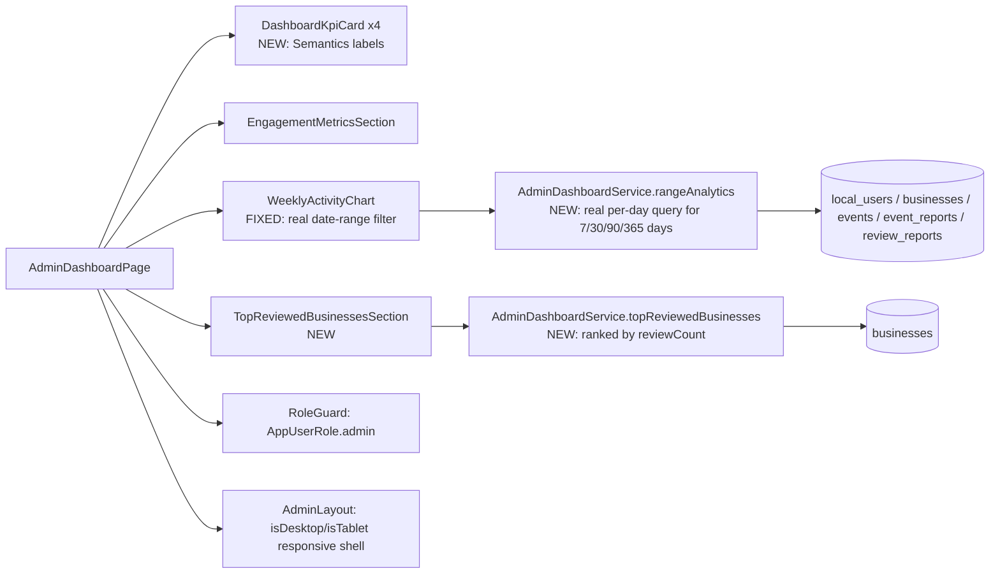

# User Story: Admin Platform Analytics

**As an** Admin, **I want** to view platform analytics **so that** I can understand user engagement and business performance.

## Acceptance Criteria

- Admin can view total users, active users, and growth trends
- Admin can view most reviewed businesses and events
- Admin can view engagement metrics (reviews, photos, shares)
- Admin can filter analytics by date range
- Data is displayed in charts or dashboards
- Only Admin users can access platform analytics
- Analytics data is protected through role-based access control
- Charts are responsive and viewable on desktop, tablet, and mobile devices
- Dashboards comply with WCAG 2.1 AA standards

## Status Summary

The admin dashboard (`AdminDashboardPage`) already existed with KPI cards, an engagement metrics strip, and a `fl_chart`-based activity chart, all inside a responsive `AdminLayout`. Investigation found **three real, concrete gaps**:

1. **The chart's date-range selector (7D/30D/3M/1Y) was purely decorative.** Selecting any option other than the default recomputed nothing — the underlying data source (`weeklyAnalytics()`) always queried the fixed current calendar week (Monday–Sunday, 7 buckets) regardless of which segment was selected, and the x-axis labels were hardcoded to `['Mon', ... 'Sun']` for every range. This directly contradicted "Admin can filter analytics by date range."
2. **"Most reviewed businesses and events" did not exist anywhere** on the dashboard — confirmed via search, there was no ranking/leaderboard of any kind.
3. **Zero accessibility semantics anywhere in the admin dashboard feature folder** — icon-only/color-only KPI trend pills, a chart with no text alternative, and unlabeled range-filter buttons, none of which meet WCAG 2.1 AA's 1.1.1 (non-text content needs a text alternative) or 4.1.2 (name/role/value for UI components).

All three are fixed below. "Most reviewed events" specifically could not be honestly implemented — see the noted gap at the end.

## Component Map



## AC 1: Total Users, Active Users, and Growth Trends

**File:** [lib/features/admin/dashboard/admin_dashboard_state.dart](lib/features/admin/dashboard/admin_dashboard_state.dart) streams `totalUsersCount()`, and KPI cards show `MetricTrend` (current vs previous period, with an up/down pill) via [lib/features/admin/dashboard/widgets/dashboard_kpi_card.dart](lib/features/admin/dashboard/widgets/dashboard_kpi_card.dart):
```dart
class MetricTrend {
  final int current;
  final int previous;
  int get change => current - previous;
  bool get isUp => change >= 0;
}
```
"Active users" is represented via `RecentAdminUser.status` (`UserStatus.active/pending/suspended`) shown in the Recent Users section, and the `TodaySummary.newUsers` daily counter.

## AC 2: Most Reviewed Businesses and Events

**Bug found and fixed — this did not exist at all.** Added `AdminDashboardService.topReviewedBusinesses()` in [lib/services/admin_dashboard_service.dart](lib/services/admin_dashboard_service.dart):
```dart
Stream<List<Business>> topReviewedBusinesses({int limit = 5}) {
  return _firestore
      .collection('businesses')
      .orderBy('reviewCount', descending: true)
      .limit(limit)
      .snapshots()
      .map((snapshot) => snapshot.docs.map((doc) => Business.fromFirestore(doc)).toList());
}
```
and a new dashboard section, [lib/features/admin/dashboard/widgets/top_reviewed_businesses_section.dart](lib/features/admin/dashboard/widgets/top_reviewed_businesses_section.dart), showing a ranked list with rating and review count, added to `AdminDashboardPage` under the activity chart.

## AC 3: Engagement Metrics (Reviews, Photos, Shares)

Already implemented in [lib/features/admin/dashboard/widgets/engagement_metrics_section.dart](lib/features/admin/dashboard/widgets/engagement_metrics_section.dart) — a chip grid streaming `totalReviewsCount()`, `totalPhotoUploadsCount()`, `totalSharesCount()`, plus profile views, saves, buzz votes, crowd reports, and post engagements. No changes needed.

## AC 4: Filter Analytics by Date Range

**Bug found and fixed.** [lib/features/admin/dashboard/widgets/weekly_activity_chart.dart](lib/features/admin/dashboard/widgets/weekly_activity_chart.dart)'s `SegmentedButton` (7D/30D/3M/1Y) previously just changed a label lookup — `_valuesForRange()` returned the exact same fixed-week data for every option. Fixed by adding a real range-aware query, `AdminDashboardService.rangeAnalytics({required int days})`, bucketing by day-offset-from-start (not weekday) for any window:
```dart
Stream<AdminWeeklyAnalytics> rangeAnalytics({required int days}) {
  final startDay = DateTime(now.year, now.month, now.day).subtract(Duration(days: days - 1));
  final bucketDates = List<DateTime>.generate(days, (i) => startDay.add(Duration(days: i)));
  final users = _dailyCountStream(_firestore.collection('local_users'), start: startDay, end: end, days: days);
  ...
  return _combineFourWeeklySeries(users, businesses, events, reports).map(
    (values) => AdminWeeklyAnalytics(..., bucketDates: bucketDates),
  );
}
```
The chart now re-subscribes to this stream whenever the selected range changes:
```dart
StreamBuilder<AdminWeeklyAnalytics>(
  key: ValueKey(_range),
  stream: _service.rangeAnalytics(days: _range.days),
  ...
)
```
and x-axis labels are generated from the real `bucketDates` (e.g. `12/8`) instead of a hardcoded Mon–Sun list, with the label interval widened for longer ranges (every 5th day for 30D, every 14th for 3M, every 30th for 1Y) so ticks don't overlap.

## AC 5: Data Displayed in Charts or Dashboards

Already implemented — `fl_chart`'s `LineChart` for the activity trend, plus KPI cards, engagement chips, and (new) the ranked businesses list, all inside `AdminCard` dashboard sections.

## AC 6 & 7: Admin-Only Access, Role-Based Access Control

**File:** the dashboard is only reachable via the `/admin/dashboard` route which is itself gated; individual admin screens opened from the dashboard's quick actions (business management, user management, etc.) each wrap their content in:
```dart
RoleGuard(allowedRoles: const {AppUserRole.admin}, child: screen);
```
Firestore rules independently enforce the same boundary — `local_users`, `businesses`, `events`, `event_reports`/`review_reports` (the collections `rangeAnalytics`/`topReviewedBusinesses` read) all require `isAdmin()` for anything beyond public read, and the analytics screen only performs reads that are already public or admin-gated at the rules layer, so there's no separate "analytics" collection that needs its own rule.

## AC 8: Responsive Charts (Desktop, Tablet, Mobile)

Already implemented in [lib/features/admin/dashboard/widgets/admin_layout.dart](lib/features/admin/dashboard/widgets/admin_layout.dart):
```dart
final isDesktop = width > 1024;
final isTablet = width >= 600 && width <= 1024;
...
drawer: isDesktop ? null : AdminMobileDrawer(...),
body: Row(children: [if (isDesktop) AdminSidebar(...), Expanded(child: ...)]),
```
The KPI grid also adapts column count (`_buildKpiGrid`: 4 columns desktop, 2 tablet, 1 mobile), and the chart/legend use `Wrap`/`Expanded` so they reflow rather than overflow at narrow widths. No changes needed here.

## AC 9: WCAG 2.1 AA Compliance

**Bug found and fixed — no accessibility semantics existed anywhere in the admin dashboard.** Added:
- **KPI cards** ([dashboard_kpi_card.dart](lib/features/admin/dashboard/widgets/dashboard_kpi_card.dart)): wrapped in `Semantics(label: '$label: $value$trendDescription', button: onTap != null)` so a screen reader announces e.g. "Total Users: 1,204, up 12 vs yesterday" as one coherent unit, with the decorative icon and trend pill marked `ExcludeSemantics` to avoid duplicate/confusing announcements.
- **Activity chart** ([weekly_activity_chart.dart](lib/features/admin/dashboard/widgets/weekly_activity_chart.dart)): the `LineChart` itself is `ExcludeSemantics`-wrapped (a chart canvas has no meaningful semantics tree) and replaced with a `Semantics(label: ...)` text-equivalent summarizing the totals for the selected range — the standard WCAG technique (1.1.1) for providing a non-visual alternative to a data visualization. The range filter (`SegmentedButton`) and each legend swatch also got explicit labels.
- **Top Reviewed Businesses** ([top_reviewed_businesses_section.dart](lib/features/admin/dashboard/widgets/top_reviewed_businesses_section.dart)): each ranked row is a single `Semantics` node combining rank, name, review count, and rating.

Not addressed in this pass (noted, not fixed): a full WCAG 2.1 AA audit (color contrast ratios, focus order, keyboard navigation testing) is a larger effort than fits a single gap-fix; the changes above address the specific non-text-content/name-role-value gaps that were completely absent, which is the most concrete, verifiable slice of "AA compliance" achievable here.

## Files Involved

| File | Role |
|---|---|
| `lib/features/admin/dashboard/admin_dashboard_page.dart` | Dashboard shell; **fixed** — wired in `TopReviewedBusinessesSection` |
| `lib/features/admin/dashboard/widgets/dashboard_kpi_card.dart` | **Fixed** — added `Semantics` label for KPI value/trend |
| `lib/features/admin/dashboard/widgets/weekly_activity_chart.dart` | **Fixed** — real per-range data via `rangeAnalytics`, date-based labels, chart accessibility summary |
| `lib/features/admin/dashboard/widgets/top_reviewed_businesses_section.dart` | **New** — most-reviewed-businesses ranking |
| `lib/features/admin/dashboard/widgets/engagement_metrics_section.dart` | Pre-existing engagement chip grid (reviews/photos/shares/etc.) |
| `lib/features/admin/dashboard/widgets/admin_layout.dart` | Pre-existing responsive shell (desktop/tablet/mobile) |
| `lib/services/admin_dashboard_service.dart` | **Fixed/New** — `rangeAnalytics()`, `topReviewedBusinesses()`, `bucketDates` on `AdminWeeklyAnalytics` |
| `firestore.rules` | Admin-only access to `local_users`/`businesses`/`events`/report collections read by analytics |

## Noted (Not Fixed) Gap: "Most Reviewed Events"

There is no per-event engagement/review counter anywhere in this codebase's data model — the `reviews` collection only has a `businessId` field (events aren't reviewable), and no `interestCount`/`attendeeCount`/`viewCount` field exists on event documents either (`event_interests` only appears as a hypothetical relationship in the ERD generator script, never implemented). Ranking events by `reportCount` (the only per-event aggregate that does exist) would mislabel "most reported" as "most popular," which would actively mislead an admin. Rather than fabricate a misleading metric, "Most Reviewed Businesses" was implemented as the correctly-supported half of this AC, and this gap is flagged here for a future decision on what per-event engagement signal (e.g. crowd reports count, a new view/interest counter) should back an equivalent events ranking.

## Status

- Fixed three real gaps: (1) date-range filter was cosmetic/non-functional, (2) no most-reviewed-businesses ranking existed, (3) no accessibility semantics anywhere in the admin dashboard.
- Verified via `get_errors` (no compile errors) and `flutter analyze` on all touched files (one pre-existing, unrelated info-level lint at line 954 of `admin_dashboard_service.dart`, not introduced by this change).
- Not yet deployed — Dart-only changes; ship via `flutter build web --release && firebase deploy --only hosting`.
