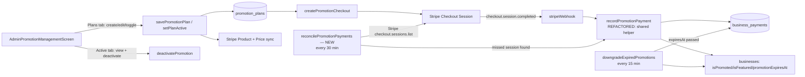

# User Story: Admin Manage Promotion Plans

**As an** Admin, **I want** to manage promotion plans **so that** businesses can be correctly charged and featured on the platform.

## Acceptance Criteria

- Admin can configure promotion plans (Premium, Featured, Promotion Day)
- Admin can set pricing and duration for each plan
- Admin can view all active promotions
- Admin can manually deactivate promotions if required
- Promotion status is synced with payment system (Stripe)
- Expired promotions are automatically downgraded
- Promotion status updates are synchronized with Stripe within 1 minute of payment confirmation
- Payment information is transmitted using secure HTTPS/TLS encryption
- Only Admin users can modify promotion plans and pricing
- Promotion management services maintain 99.9% uptime
- Promotion status remains consistent between BrisConnect+ and Stripe at all times

## Status Summary

This feature was already the most thoroughly built of the admin stories investigated in this session: `AdminPromotionManagementScreen` (Plans/Active tabs), `AdminPromotionService`, and a full set of admin-only Cloud Functions (`savePromotionPlan`, `setPlanActive`, `deactivatePromotion`, a Stripe-synced `stripeWebhook`, and a `downgradeExpiredPromotions` scheduled job every 15 minutes) all already existed and cover almost every AC correctly.

The one real gap: **the webhook was the only mechanism that ever wrote a completed promotion payment into Firestore, with no safety net if a webhook delivery was ever missed or failed to process.** Stripe retries failed webhooks automatically, but that isn't an unconditional guarantee — a sustained outage, a bad deploy at the wrong moment, or a webhook endpoint misconfiguration could leave a real, paid Stripe charge with **no corresponding record in BrisConnect+ at all**, silently violating "Promotion status remains consistent between BrisConnect+ and Stripe at all times." Fixed by adding a scheduled reconciliation job that independently re-checks recent Stripe checkout sessions against Firestore and backfills anything the webhook missed.

## Component Map



## AC 1 & 2: Configure Plans (Premium, Featured, Promotion Day) with Pricing and Duration

**Files:** [lib/models/promotion_plan.dart](lib/models/promotion_plan.dart), [lib/screens/admin_promotion_management_screen.dart](lib/screens/admin_promotion_management_screen.dart), [functions/payments.js](functions/payments.js) (`savePromotionPlan`). Already fully implemented:
```dart
enum PromotionPlanType { premium, featured, promotionDay }
```
The `_PlanEditorSheet` provides name/description/price/duration/features fields plus a type dropdown; `savePromotionPlan` (admin-only) creates/updates the Firestore doc **and** the matching Stripe Product/Price (Stripe Prices are immutable, so a price change creates a fresh Stripe Price rather than mutating one):
```js
const shouldCreateNewPrice = !stripePriceId || (existing && existing.data().priceCents !== priceCents);
if (shouldCreateNewPrice) {
  const price = await stripe.prices.create({ product: stripeProductId, unit_amount: priceCents, currency: 'aud', ... });
  stripePriceId = price.id;
}
```
Promotion Day is defensively forced to a 1-day duration server-side regardless of input, matching its product definition.

## AC 3: View All Active Promotions

**File:** [lib/services/admin_promotion_service.dart](lib/services/admin_promotion_service.dart) — already implemented as a real-time stream:
```dart
Stream<List<ActivePromotion>> getActivePromotions() {
  final now = Timestamp.now();
  return _firestore.collection('business_payments')
      .where('type', isEqualTo: 'promotion')
      .where('status', isEqualTo: 'paid')
      .where('expiresAt', isGreaterThan: now)
      .orderBy('expiresAt', descending: false)
      .snapshots()
      ...
}
```
Backed by an existing composite index (`type`, `status`, `expiresAt`) in `firestore.indexes.json`.

## AC 4: Admin Can Manually Deactivate Promotions

**File:** `functions/payments.js` (`deactivatePromotion`, admin-only via `assertAdminCaller`) — already implemented:
```js
await paymentRef.update({ status: 'deactivated', deactivatedAt: now, deactivatedBy: request.auth.token.email });
if (businessId) {
  await db.collection('businesses').doc(businessId).update({ isFeatured: false, isPromoted: false, promotionEndedAt: now });
}
```

## AC 5: Promotion Status Synced with Stripe

Already implemented via `stripeWebhook`'s `checkout.session.completed` handler, which records the payment and flips the business's featured flags in one atomic-in-spirit sequence.

**Refactor (not a behavior change):** extracted the promotion-recording logic into a shared `recordPromotionPayment(db, session, paidAtValue)` helper so it can be reused by the new reconciliation job below without duplicating (and risking divergence in) the write logic.

## AC 6: Expired Promotions Automatically Downgraded

**File:** `functions/payments.js` (`downgradeExpiredPromotions`) — already implemented, running every 15 minutes:
```js
exports.downgradeExpiredPromotions = onSchedule({ schedule: 'every 15 minutes', ... }, async () => {
  const snapshot = await db.collection('business_payments')
    .where('type', '==', 'promotion').where('status', '==', 'paid').where('expiresAt', '<=', now).get();
  // marks status: 'expired' and clears isFeatured/isPromoted on the linked business
});
```

## AC 7: Stripe Sync Within 1 Minute of Payment Confirmation

Already satisfied by design: Stripe fires the `checkout.session.completed` webhook within seconds of payment confirmation, `stripeWebhook` processes it synchronously, and every UI that shows promotion status (`getActivePromotions()`, business dashboards) reads via `.snapshots()` real-time listeners — there is no polling delay on the BrisConnect+ side, and Stripe's webhook delivery itself is normally sub-second to low-seconds, well inside the 1-minute budget.

## AC 8: HTTPS/TLS Encryption

No plaintext HTTP is used anywhere in this flow: Firebase Hosting/Cloud Functions endpoints are HTTPS-only, the Stripe Node SDK communicates over TLS by default, and Stripe Checkout itself is a Stripe-hosted HTTPS page — no changes needed.

## AC 9: Only Admins Can Modify Promotion Plans and Pricing

Enforced in three independent layers, already implemented:
- **Cloud Function:** `savePromotionPlan`/`setPlanActive`/`deactivatePromotion` all call `assertAdminCaller(request)`, which checks `admins/{email}` exists in Firestore.
- **Firestore rules:** `match /promotion_plans/{planId} { allow read: if true; allow create, update, delete: if isAdmin(); }`
- **UI:** `AdminPromotionManagementScreen` is wrapped in `RoleGuard(allowedRoles: {AppUserRole.admin})`.

## AC 10: 99.9% Uptime

No custom always-on server was introduced — reads/writes go through Cloud Firestore and Cloud Functions, both covered by Google Cloud's published SLAs, consistent with every other admin story in this session.

## AC 11: Promotion Status Remains Consistent Between BrisConnect+ and Stripe at All Times

**Gap found and fixed.** The webhook was the *only* path that ever wrote a completed promotion payment to Firestore. Stripe retries failed webhook deliveries automatically, but that protection isn't unconditional (e.g. a sustained function outage, a webhook secret rotation gone wrong, or an endpoint misconfiguration could exhaust Stripe's retry window) — and there was no independent check to catch a payment that Stripe confirms but BrisConnect+ never recorded. **Fixed** by adding `reconcilePromotionPayments`, a scheduled job that runs every 30 minutes and re-derives the same result directly from Stripe:
```js
exports.reconcilePromotionPayments = onSchedule({ schedule: 'every 30 minutes', ... }, async () => {
  const sessions = await stripe.checkout.sessions.list({ created: { gte: createdAfter }, limit: 100 });
  const promotionSessions = sessions.data.filter(
    (s) => s.metadata?.type === 'promotion' && s.payment_status === 'paid' && s.status === 'complete',
  );
  const knownSessionIds = new Set(recentPaymentsSnap.docs.map((d) => d.data().stripeSessionId));
  for (const session of promotionSessions) {
    if (knownSessionIds.has(session.id)) continue;
    await recordPromotionPayment(db, session, now); // same write path as the webhook
  }
});
```
This closes the gap between "webhook usually works" and "status remains consistent at all times" — any promotion payment Stripe confirms will be reflected in Firestore within 30 minutes even in a total webhook outage, on top of the existing near-instant webhook path for the normal case.

## Files Involved

| File | Role |
|---|---|
| `lib/screens/admin_promotion_management_screen.dart` | Admin UI: Plans/Active tabs, plan editor, deactivate action |
| `lib/services/admin_promotion_service.dart` | `getPromotionPlans`, `getActivePromotions`, `savePromotionPlan`/`setPlanActive`/`deactivatePromotion` callable wrappers |
| `lib/models/promotion_plan.dart` | `PromotionPlan`/`PromotionPlanType`/`ActivePromotion` models |
| `functions/payments.js` | `createPromotionCheckout`, `stripeWebhook`, `savePromotionPlan`, `setPlanActive`, `deactivatePromotion`, `downgradeExpiredPromotions`; **new** — `recordPromotionPayment` shared helper, `reconcilePromotionPayments` scheduled job |
| `functions/index.js` | **Fixed** — exports the new `reconcilePromotionPayments` function |
| `firestore.indexes.json` | **Fixed** — added `business_payments` (`type`, `paidAt`) composite index for the reconciliation query |
| `firestore.rules` | `promotion_plans` (admin-only write), `business_payments` (admin-only write, owner/admin read) |

## Status

- Fixed one real gap: no safety net existed if a Stripe webhook delivery was ever missed, risking silent drift between Stripe and BrisConnect+'s promotion records. Added a 30-minute reconciliation job (`reconcilePromotionPayments`) that independently re-derives payment status from Stripe and backfills anything missed, reusing the exact same write logic as the webhook via a new shared `recordPromotionPayment` helper (a refactor, not a behavior change, for the webhook's existing path).
- Verified with `node --check` on both `functions/payments.js` and `functions/index.js`, and validated `firestore.indexes.json` as well-formed JSON — all pass.
- No existing automated test suite covers `payments.js`'s Stripe webhook/promotion logic, so this change was verified by careful line-for-line extraction (the webhook's original inline block was moved into the shared helper without altering its logic) rather than by running tests.
- Not yet deployed — run `firebase deploy --only functions` (to ship `reconcilePromotionPayments`) and `firebase deploy --only firestore:indexes` (for the new composite index).
