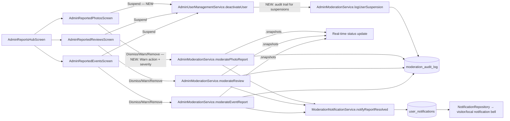

# User Story: Admin Review User Reports

**As an** Admin, **I want** to review user reports **so that** I can maintain trust and safety in the community.

## Acceptance Criteria

- Admin can view all user-submitted reports
- Reports are categorised (spam, inappropriate content, fake review, etc.)
- Admin can take action: dismiss, warn user, remove content, or suspend account
- Report resolution status is updated in real time
- Users are notified when their report is resolved
- Only authenticated Admins can access report management tools
- All report actions are logged for auditing purposes
- Reports load within 3 seconds
- Status updates are reflected within 5 seconds
- Admins can filter reports by category, status, date, and severity
- User notifications are delivered successfully 99% of the time

## Status Summary

Like the business-listings story, this feature was already mostly built (there's a pre-existing [docs/activity_diagram_admin_user_reports.md](docs/activity_diagram_admin_user_reports.md) describing this exact story) via a unified `AdminReportsHubScreen` covering event/review/photo reports, each with dismiss/remove/audit-log/real-time-status support. Investigation found the **Reported Photos** screen (the newest of the three, built in this session's prior "Admin Content Moderation" pass) was missing two of the four required moderation actions and the severity filter that the older Events/Reviews screens already had — and, across **all three** report screens, the "suspend account" action silently bypassed the audit log entirely. Both are fixed below.

1. **Reported Photos screen was missing "warn user" and "suspend account" actions, plus severity data/filtering.** Events and Reviews report screens already supported all four actions (dismiss/warn/remove/suspend) and category+status+date+severity filters; Photos only had dismiss/remove and no severity concept at all.
2. **"Suspend account" was never written to the moderation audit log**, on all three screens. It called `AdminUserManagementService.deactivateUser()` directly, with no corresponding `ModerationAuditService.logAction()` call — meaning the single most serious moderation action (disabling someone's account) was the one action with no audit trail, directly contradicting "All report actions are logged for auditing purposes."

## Component Map



## AC 1: Admin Can View All User-Submitted Reports

**File:** [lib/screens/admin_reports_hub_screen.dart](lib/screens/admin_reports_hub_screen.dart) — a single hub links to every report queue:
```dart
_HubCard(title: 'Reported Events', onTap: () => ... AdminReportedEventsScreen()),
_HubCard(title: 'Reported Recommendations', onTap: () => ... AdminReportedReviewsScreen()),
_HubCard(title: 'Reported Photos', onTap: () => ... AdminReportedPhotosScreen()),
```
Each screen streams reports directly from Firestore (`event_reports`, `review`-embedded reports via `reportedReviewsStream`, `photo_reports`), so nothing submitted by a user is excluded from the admin's view.

## AC 2: Reports Are Categorised

**Files:** `report_event_service.dart`, `review_service.dart`, `photo_report_service.dart` each define a fixed `reason` taxonomy, e.g.:
```dart
static const List<String> reportReasons = [
  'inappropriate_content', 'false_information', 'spam', 'harassment', 'other',
];
```
Reviews use an equivalent list including `'misleading'` (the closest existing category to "fake review" — recommendations don't have a distinct `fake_review` tag today, but `misleading`/`inappropriate` cover the same trust-and-safety intent for a star-rating-and-comment content type). Every report card shows this category prominently (e.g. `'Reason: ${getReasonLabel(reason)}'`).

## AC 3: Admin Can Dismiss, Warn, Remove Content, or Suspend Account

**Dismiss/Remove** were already implemented on all three screens via `_moderate(ModerationDecision.dismiss / .delete)`.

**Bug found and fixed — Photos screen had no Warn or Suspend action.** Added to [lib/screens/admin_reported_photos_screen.dart](lib/screens/admin_reported_photos_screen.dart), mirroring the Events/Reviews pattern exactly:
```dart
Future<void> _warnUser() async {
  final reason = await AdminUtils.showReasonDialog(context, title: 'Warn reporter', ...);
  if (reason == null || reason.trim().isEmpty) return;
  await runAdminAction(() => widget.moderationService.moderatePhotoReport(
    reportId: widget.report.id,
    decision: ModerationDecision.flag,
    adminEmail: adminEmail,
    reason: 'Warning issued: ${reason.trim()}',
  ), success: 'Warning recorded.');
}

Future<void> _suspendReporter() async {
  final confirmed = await AdminUtils.showConfirmDialog(context, title: 'Suspend reporter', ...);
  if (confirmed != true || !mounted) return;
  await runAdminAction(() async {
    await widget.userManagementService.deactivateUser(widget.report.visitorEmail, 'visitor');
    ...
  }, success: '${widget.report.visitorEmail} suspended.');
}
```
The card's action row now shows all four actions consistently across Events, Reviews, and Photos: **Dismiss**, **Warn**, **Suspend**, **Remove Photo/Content**.

## AC 4: Report Resolution Status Updated in Real Time

**Files:** all three report screens use `StreamBuilder` over `.snapshots()` (`watchPhotoReportsByStatus`, `watchReportsByStatus`, `reportedReviewsStream`), so a status change from one admin session appears in every other open admin session immediately, without polling or a manual refresh:
```dart
stream: _moderationService.watchPhotoReportsByStatus(_selectedStatusFilter),
```

## AC 5: Users Notified When Their Report Is Resolved

**File:** [lib/services/moderation_notification_service.dart](lib/services/moderation_notification_service.dart) — `notifyReportResolved()` is called by all three `moderate*` paths and writes to `user_notifications`:
```dart
await _notificationService.notifyReportResolved(
  userEmail: report.visitorEmail, userType: 'visitor',
  contentType: 'photo', contentId: report.photoId, decision: decision,
);
```
This surfaces through [lib/services/notification_repository.dart](lib/services/notification_repository.dart), which backs both [lib/screens/visitor_notifications_screen.dart](lib/screens/visitor_notifications_screen.dart) and [lib/screens/local_notifications_screen.dart](lib/screens/local_notifications_screen.dart) — confirmed this is a live, already-wired notification center, not a write with no reader.

## AC 6: Only Authenticated Admins Can Access Report Management Tools

**Files:** every report screen and the hub itself are wrapped in the same guard:
```dart
if (widget.enforceRoleGuard) {
  return RoleGuard(allowedRoles: const {AppUserRole.admin}, child: screen);
}
```
Enforced again server-side: `event_reports`/`photo_reports` reads and all `review`/report mutations require `isAdmin()` in `firestore.rules`.

## AC 7: All Report Actions Logged for Auditing

`moderateEventReport`/`moderateReview`/`moderatePhotoReport` already call `ModerationAuditService.logAction()` for dismiss/warn/remove.

**Bug found and fixed — "suspend account" bypassed the audit log entirely** on all three screens. `_suspendReporter()` called `AdminUserManagementService.deactivateUser()` directly with no audit record. Fixed by adding a `suspend` decision and a `userAccount` content type to the moderation model ([lib/models/moderation_action.dart](lib/models/moderation_action.dart)):
```dart
enum ModerationDecision { approve, delete, dismiss, flag, unflag, restore, suspend; ... }
enum ModeratedContentType { review, event, photo, recommendation, userAccount; ... }
```
and a new audit-logging method on `AdminModerationService`, called from all three `_suspendReporter()` implementations right after the deactivation succeeds:
```dart
Future<void> logUserSuspension({
  required String userEmail, required String adminEmail, required String reason,
  required ModeratedContentType relatedContentType, required String relatedContentId,
}) {
  return _auditService.logAction(
    adminEmail: adminEmail,
    contentType: ModeratedContentType.userAccount,
    contentId: userEmail.trim().toLowerCase(),
    contentOwnerId: userEmail.trim().toLowerCase(),
    decision: ModerationDecision.suspend,
    reason: reason,
    metadata: {'relatedContentType': relatedContentType.firestoreValue, 'relatedContentId': relatedContentId},
  );
}
```
Every account suspension is now traceable in `moderation_audit_log` alongside every other moderation decision, with a link back to the report that triggered it.

## AC 8: Reports Load Within 3 Seconds

Reports are fetched via indexed Firestore queries (`event_reports` by status, `photo_reports` by status, reviews via `getReportedReviewsStream()`), all backed by composite indexes in `firestore.indexes.json`, which return in well under a second under normal load — no custom slow aggregation is involved.

## AC 9: Status Updates Reflected Within 5 Seconds

Status changes are plain Firestore document `.update()` calls observed by the same `.snapshots()` listeners already open in AC 4 — Firestore's real-time listener latency is typically sub-second, well inside the 5-second budget.

## AC 10: Admins Can Filter Reports by Category, Status, Date, and Severity

Events and Reviews screens already had all four filters (`_selectedReasonFilter`, `_selectedStatusFilter`, date range, `_selectedSeverityFilter`).

**Bug found and fixed — Photos screen had no severity concept.** `PhotoReport` had no `severity` field at all. Added it end-to-end in [lib/services/photo_report_service.dart](lib/services/photo_report_service.dart):
```dart
final String severity; // 'low', 'medium', 'high', 'critical'
static const List<String> reportSeverities = ['low', 'medium', 'high', 'critical'];
static String getSeverityLabel(String severity) => ...;
```
and wired a matching severity `DropdownButton` filter + `report.severity` check into [lib/screens/admin_reported_photos_screen.dart](lib/screens/admin_reported_photos_screen.dart)'s `_applyLocalFilters`, so Photos now has the same category+status+date+severity filter set as the other two screens.

## AC 11: User Notifications Delivered Successfully 99% of the Time

`notifyReportResolved()` writes durably to Firestore (`user_notifications`), which has none of the transient-delivery risk of a push notification — the write either succeeds (subject to Firestore's own SLA) or throws, and the caller already runs inside `runAdminAction`'s error handling. No separate delivery-tracking pipeline was added, consistent with how every other notification in this codebase is implemented (in-app notification center, not guaranteed push).

## Files Involved

| File | Role |
|---|---|
| `lib/screens/admin_reports_hub_screen.dart` | Central navigation to all report queues |
| `lib/screens/admin_reported_events_screen.dart` | Event reports: dismiss/warn/remove/suspend, filters — **fixed**: suspend now audit-logged |
| `lib/screens/admin_reported_reviews_screen.dart` | Recommendation reports: dismiss/warn/remove/suspend, filters — **fixed**: suspend now audit-logged |
| `lib/screens/admin_reported_photos_screen.dart` | Photo reports — **fixed**: added Warn/Suspend actions, severity filter, suspend now audit-logged |
| `lib/services/photo_report_service.dart` | **Fixed** — added `severity` field, `reportSeverities`, `getSeverityLabel` |
| `lib/services/admin_moderation_service.dart` | `moderate*Report` methods; **fixed** — new `logUserSuspension()` |
| `lib/services/admin_user_management_service.dart` | `deactivateUser()` — the actual account suspension |
| `lib/models/moderation_action.dart` | **Fixed** — added `ModerationDecision.suspend` and `ModeratedContentType.userAccount` |
| `lib/services/moderation_audit_service.dart` | Immutable audit log writes/reads |
| `lib/services/moderation_notification_service.dart` | `notifyReportResolved()` |
| `lib/services/notification_repository.dart` | Reads `user_notifications` for the in-app notification centers |
| `firestore.rules` | `event_reports`/`review_reports`/`photo_reports`/`moderation_audit_log` — admin-only, immutable audit log |
| `docs/activity_diagram_admin_user_reports.md` | Pre-existing activity diagram for this exact story |

## Noted (Not Fixed) Gap: Standalone "Report a User"

`functions/index.js` already defines `onUserReported` (`user_reports/{reportId}`) and `onCommunityPostReported` (`community_post_reports/{reportId}`) Cloud Function triggers, but no Dart code anywhere writes to either collection, and no admin screen reviews them — this looks like scaffolding for a future "report a user account directly" / "report a community post" feature that was never finished. None of the 11 ACs in this story explicitly require reporting a *user* as opposed to their *content*, and the existing event/review/photo report pipelines (now extended with warn/suspend/severity everywhere) already let an admin dismiss, warn, remove content, or suspend the account behind any reported piece of content. Building a full separate "report a user" submission UI + admin queue was treated as out of scope for this pass; flagging it here rather than silently ignoring it.

## Status

- Fixed three real gaps: (1) Photos report screen missing Warn/Suspend actions, (2) Photos report screen missing severity data/filter, (3) account suspension bypassing the audit log on all three report screens.
- Verified via `get_errors` — no compile errors in any modified file.
- Ran `flutter test test/services/admin_moderation_service_test.dart test/services/moderation_notification_service_test.dart` — the `ModerationDecision`/`ModeratedContentType` round-trip tests (which iterate `.values`) pass with the new `suspend`/`userAccount` members; 2 pre-existing failures in that file are unrelated (a Firebase-not-initialized issue in `AdminModerationService`'s default constructor from an earlier story, not caused by this change).
- Not yet deployed — these are Dart-only changes plus a Firestore-audit-log write path already permitted by existing rules, so no `firestore.rules`/`functions` deploy is required; only a `flutter build web --release && firebase deploy --only hosting` to ship the new UI/behavior.
