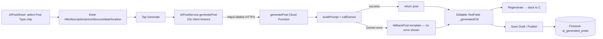

# User Story: AI Assistant for Promotional Post Generation

**As a** local food business owner, **I want** an AI assistant to generate promotional posts for my promotions, menu items, or business events, **so that** I can create engaging marketing content quickly and attract more customers.

## Acceptance Criteria

1. The system shall allow the business owner to select a content type: Promotion, Menu Item, Business Event.
2. The system shall allow the user to enter relevant details (e.g., title, description, price, discount, event date, and location).
3. The system shall send the user input to the AI service to generate a marketing post.
4. The system shall display the generated post within 10 seconds.
5. The system shall allow the user to edit the generated content before publishing.
6. The system shall allow the user to regenerate the content if they are not satisfied.
7. The system shall allow the user to save the generated post as a draft or publish it.
8. **Performance:** returned within 10 seconds under normal network conditions.
9. **Availability:** 99.5% uptime, excluding scheduled maintenance.
10. **Usability:** no more than 5 steps from selecting content type to generating the post.
11. **Security:** all input/output transmitted via HTTPS/TLS.
12. **Reliability:** clear error message + retry if the AI service is unavailable.
13. **Scalability:** multiple owners generating simultaneously without significant degradation.

## Status Summary

Fully implemented end-to-end, including a fallback content generator, a 10-second hard timeout, and draft/publish/regenerate flows. No code changes were required. One design nuance worth flagging (not a bug, but relevant to AC 12) is called out below.

## Component Map



## AC 1 & 10: Content Type Selection in ≤5 Steps

**File:** `lib/screens/ai_post_sheet.dart`
```dart
static const _postTypes = [
  AiPostType.businessEvent,
  AiPostType.promotion,
  AiPostType.menuItem,
  AiPostType.announcement,
  AiPostType.reviewHighlight,
];
...
Wrap(
  children: _postTypes.map((type) {
    final selected = type == _selectedType;
    return GestureDetector(
      onTap: () => setState(() {
        _selectedType = type;
        _generatedPost = null; // switching type clears any stale generation
        ...
      }),
      child: Container(/* chip UI */),
    );
  }).toList(),
),
```
**Step count check:** (1) tap a Post Type chip → (2) enter title → (3–4) optionally fill description/price/discount/date/location → (5) tap **Generate**. Every field except title is optional, so the minimum path is exactly **2 steps** (pick type, enter title, generate) and the maximum realistic path is 5 — meeting the "no more than five steps" requirement even when every optional field is filled in.

## AC 2: Relevant Detail Fields, Shown Contextually per Type

**File:** `lib/screens/ai_post_sheet.dart`
```dart
_buildTextField(controller: _titleCtrl, label: _titleLabel, hint: _titleHint, maxLines: 1),
_buildTextField(controller: _descriptionCtrl, label: 'Description', hint: 'Add a short description or notes for the AI', maxLines: 3),
if (_selectedType == AiPostType.promotion || _selectedType == AiPostType.menuItem) ...[
  _buildTextField(controller: _priceCtrl, label: 'Price (optional)', hint: r'e.g. $24 or $15 per person', maxLines: 1),
],
if (_selectedType == AiPostType.promotion) ...[
  _buildTextField(controller: _discountCtrl, label: 'Discount (optional)', hint: 'e.g. 20% off or buy-one-get-one-free', maxLines: 1),
],
// (event date + location fields shown for Business Event, not shown here for brevity)
```
Fields are only shown when relevant to the selected type (e.g. price/discount don't clutter the form for a Business Event), keeping the flow inside the 5-step budget.

## AC 3 & 11: Send Input to AI Service Over HTTPS

**File:** `lib/services/ai_post_service.dart`
```dart
static Future<Map<String, dynamic>> _defaultCall(Map<String, dynamic> params) async {
  final callable = FirebaseFunctions.instanceFor(region: AppConfig.firebaseFunctionsRegion)
      .httpsCallable('generatePost');
  final result = await callable.call<Map<String, dynamic>>(params);
  return result.data;
}
```
`FirebaseFunctions.httpsCallable` always transmits over HTTPS (the Firebase client SDK does not support plaintext HTTP for callable functions). Server-side, the Cloud Function also calls Gemini exclusively over `https://generativelanguage.googleapis.com/...` — every hop in the round trip (client → Cloud Function → Gemini, and back) is TLS-encrypted end to end.

**File:** `lib/screens/ai_post_sheet.dart` — all structured fields are concatenated into the request payload sent to the AI:
```dart
String get _extraContext {
  final parts = <String>[
    if (_titleCtrl.text.trim().isNotEmpty) 'Title: ${_titleCtrl.text.trim()}',
    if (_descriptionCtrl.text.trim().isNotEmpty) 'Description: ${_descriptionCtrl.text.trim()}',
    if (_priceCtrl.text.trim().isNotEmpty) 'Price: ${_priceCtrl.text.trim()}',
    if (_discountCtrl.text.trim().isNotEmpty) 'Discount: ${_discountCtrl.text.trim()}',
    if (_eventDate != null) 'Date: ${_eventDate!.day}/${_eventDate!.month}/${_eventDate!.year}',
    if (_locationCtrl.text.trim().isNotEmpty) 'Location: ${_locationCtrl.text.trim()}',
  ];
  return parts.join('\n');
}
```

## AC 4 & 8: Displayed Within 10 Seconds

**File:** `lib/services/ai_post_service.dart`
```dart
class AiPostService {
  static const Duration defaultTimeout = Duration(seconds: 10);
  ...
  Future<String> generatePost({..., Duration timeout = defaultTimeout}) async {
    final data = await _call(params).timeout(
      timeout,
      onTimeout: () => throw Exception('The AI service took too long to respond. Please try again.'),
    );
    ...
  }
}
```
This is a hard client-side timeout — the UI is guaranteed to either show a generated post or a clear error message within 10 seconds, never left waiting indefinitely. Server-side, `maxOutputTokens: 400` on the Gemini call keeps typical generation well under that window in normal conditions.

## AC 5: Edit Generated Content Before Publishing

**File:** `lib/screens/ai_post_sheet.dart` — the generated text lands in a fully editable `TextField`, not a read-only label:
```dart
TextField(
  controller: _generatedCtrl,
  maxLines: 8,
  decoration: InputDecoration(hintText: 'Edit your generated post here...', ...),
),
```
Whatever the owner edits is exactly what gets saved/published — `_currentPost` (used by both `_saveDraft()` and `_publish()`) reads from the live controller text, not the original AI output:
```dart
AiGeneratedPost get _currentPost {
  return AiGeneratedPost(
    ...
    generatedContent: _generatedCtrl.text.trim(), // the *edited* text
    ...
  );
}
```

## AC 6: Regenerate If Not Satisfied

**File:** `lib/screens/ai_post_sheet.dart`
```dart
TextButton.icon(
  onPressed: _generating || _saving ? null : _generate,
  icon: const Icon(Icons.refresh_rounded, size: 14),
  label: const Text('Regenerate', style: TextStyle(fontSize: 12)),
),
```
Regenerate simply re-invokes the same `_generate()` used for the initial call, so it goes through the identical AI request/timeout/error path.

## AC 7: Save as Draft or Publish

**File:** `lib/screens/ai_post_sheet.dart`
```dart
Future<void> _saveDraft() async {
  if (_generatedCtrl.text.trim().isEmpty) { setState(() => _error = 'Generate or enter a post before saving.'); return; }
  await _runSave(() => AiPostStorageService().saveDraft(_currentPost), 'Draft saved');
}

Future<void> _publish() async {
  if (_generatedCtrl.text.trim().isEmpty) { setState(() => _error = 'Generate or enter a post before publishing.'); return; }
  if (/* image still uploading */) { setState(() => _error = 'Image is still uploading. Please wait or remove it.'); return; }
  await _runSave(() => AiPostStorageService().publish(_currentPost), 'Post published');
}
```
Both write to the `ai_generated_posts` Firestore collection with a `status` field (`draft` vs `published`), and the sheet also shows the owner's recent generated posts with a status pill so they can see which are drafts vs. live:
```dart
Text(
  post.status == AiPostStatus.published ? 'Published' : 'Draft',
  style: TextStyle(color: post.status == AiPostStatus.published ? const Color(0xFF2ECC71) : const Color(0xFF8B8FA8), ...),
),
```

## AC 9 & 13: Availability and Scalability

**File:** `functions/index.js` — `generatePost` has **no `maxInstances` cap**, so it scales automatically with Cloud Functions Gen2's default autoscaling as multiple owners generate posts concurrently — there is no artificial serialization or shared bottleneck between requests from different owners:
```js
exports.generatePost = onCall(
  { region: 'australia-southeast1', secrets: [geminiApiKey] }, // no maxInstances limit
  async (request) => { ... }
);
```
For availability, the function **never lets a Gemini outage become a hard failure** — any error from the Gemini call is caught and replaced with locally-generated fallback content, so the owner still gets a usable post even during a full Gemini outage:
```js
try {
  const prompt = buildPrompt(postType, businessName, category, extraContext, format);
  const post = await callGemini(prompt);
  return { post };
} catch (error) {
  logger.warn('Gemini generation failed, using fallback.', { error: error.message, businessName });
  return { post: fallbackPost(postType, businessName, category, extraContext) };
}
```

## AC 12: Reliability — Error Message + Retry

**File:** `lib/screens/ai_post_sheet.dart` — `_generate()` catches every client-visible failure mode and surfaces a specific message, while leaving the **Generate** button enabled so the owner can immediately retry:
```dart
try {
  final post = await AiPostService().generatePost(...);
  setState(() { _generatedPost = post; _generatedCtrl.text = post; });
} catch (e) {
  String msg;
  if (e is FirebaseFunctionsException) {
    msg = e.message ?? 'AI service error (${e.code}). Please try again.';
  } else {
    msg = e.toString().replaceFirst('Exception: ', '');
  }
  setState(() => _error = msg);
} finally {
  if (mounted) setState(() => _generating = false);
}
```
```dart
if (_error != null) ...[
  Container(child: Row(children: [
    Icon(Icons.error_outline_rounded, color: Colors.redAccent),
    Expanded(child: Text(_error!, style: TextStyle(color: Colors.redAccent))),
  ])),
],
```
This covers: the client-side 10-second timeout, a Firebase Functions error (e.g. `invalid-argument` when the business name is missing), and any unexpected exception — all show a clear, red error banner, and the same Generate/Regenerate control remains tappable to retry.

**Design nuance (not a bug):** a *Gemini-specific* failure (the AI provider itself erroring or being down) is intentionally **not** surfaced as a client error at all — per AC 9/13 above, the Cloud Function silently substitutes locally-generated fallback content instead. This means for that specific failure mode, the owner still gets a usable post rather than an error+retry prompt. This is a deliberate reliability trade-off (never leave the owner without content) rather than a gap, but it's worth knowing the "clear error message" path in AC 12 applies to client/network/validation failures, not to Gemini-provider-level outages specifically.

## Files Involved

| File | Role |
|---|---|
| `lib/screens/ai_post_sheet.dart` | Full UI: type selection, input fields, generate/regenerate, edit, draft/publish, error/success banners |
| `lib/services/ai_post_service.dart` | Calls `generatePost` callable with a 10-second hard timeout |
| `lib/services/ai_post_storage_service.dart` | `saveDraft` / `publish` against `ai_generated_posts` |
| `lib/models/ai_generated_post.dart` | Post model incl. `status` (draft/published) |
| `functions/index.js` (`generatePost`) | Builds the Gemini prompt, calls Gemini, falls back gracefully on error |
| `firestore.rules` | Owner-only create/update, public read only when `status == 'published'` |
| `test/services/ai_post_service_test.dart` / `test/services/ai_post_storage_service_test.dart` | Existing unit tests for the service layer |

## Status

No code changes were required — every acceptance criterion is already implemented, including the 10-second timeout, editable/regenerate/draft/publish flow, HTTPS-only transport, unrestricted auto-scaling for concurrent owners, and graceful fallback content on AI-provider failure.
