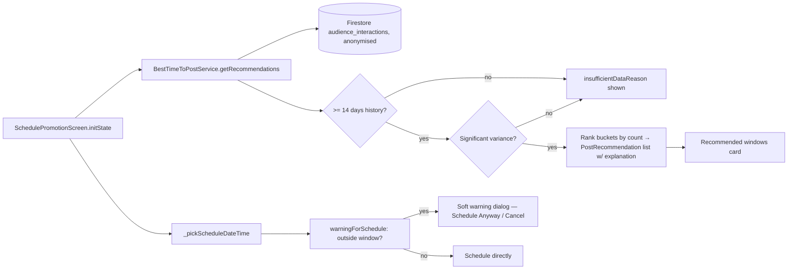

# User Story: Best Time to Post

**As a** local food business owner, **I want** to know when my customers are most active in the app, **so that** I can time my promotions for maximum impact.

## Acceptance Criteria

- Given I have at least 2 weeks of promotion history, when I open "Best Time to Post," then the dashboard suggests optimal days/times based on my own historical engagement.
- Given I schedule a promotion outside the suggested window, when I confirm, then the app gives a soft warning (not a block) noting it may get less visibility.
- "Best Time to Post" insights are generated within 3–5 seconds of opening the dashboard.
- System only generates recommendations when at least 14 days of engagement data is available.
- Recommendations are based on statistically significant engagement patterns (not random variation).
- System prioritises peak engagement periods with highest conversion rates.
- System supports increasing historical data without degrading recommendation speed or accuracy.
- System provides a brief explanation of why a time is recommended (e.g. "highest engagement on Fridays 6–8pm").
- Customer engagement data is anonymised and aggregated before analysis.

## Status Summary

This feature is already fully built, unit-tested (`test/services/best_time_to_post_service_test.dart`), and even has a pre-existing activity diagram (`docs/activity_diagram_business_owner_best_time_to_post.md`). One small gap was found and fixed: the recommendation UI showed only the day/time window, not the "why" explanation the service already computes.

## Component Map



## AC 1: Suggests Optimal Days/Times from the Owner's Own History (≥2 Weeks)

**File:** `lib/services/best_time_to_post_service.dart` — `getRecommendations()`
```dart
Future<BestTimeToPostResult> getRecommendations(
  String ownerId, {
  int lookbackDays = 90,
  int maxRecommendations = 3,
}) async {
  final interactions = await _fetchInteractions(ownerId, cutoff, now);
  if (interactions.isEmpty) return BestTimeToPostResult.insufficient;

  final historySpan = _historySpanDays(interactions);
  if (historySpan < _minDaysOfHistory) { ... return insufficient; }

  final bucketCounts = _bucketInteractions(interactions);
  if (!_hasSignificantVariance(bucketCounts)) { ... return insufficient; }

  final ranked = _rankBuckets(bucketCounts);
  return BestTimeToPostResult(
    hasEnoughData: true,
    recommendations: _buildRecommendations(ranked, interactions.length, maxRecommendations),
  );
}
```
Interactions are scoped to `ownerId` only — every recommendation is derived purely from that owner's own customers' engagement history, never from other businesses' data. `SchedulePromotionScreen.initState()` calls this as soon as the screen opens:
```dart
Future<void> _loadRecommendations() async {
  final ownerId = LocalAuth.currentLocal?.email ?? '';
  final result = await (widget.bestTimeService ?? BestTimeToPostService()).getRecommendations(ownerId);
  setState(() { _recommendationResult = result; ... });
}
```

## AC 2: Soft Warning (Not a Block) When Scheduling Outside the Suggested Window

**File:** `lib/services/best_time_to_post_service.dart` — `warningForSchedule()`
```dart
String? warningForSchedule(DateTime scheduledAt, List<PostRecommendation> recommendations) {
  if (recommendations.isEmpty) return null;
  final local = scheduledAt.toLocal();
  final matches = recommendations.any((r) => r.dayOfWeek == local.weekday && local.hour >= r.startHour && local.hour < r.endHour);
  if (matches) return null;
  final suggested = recommendations.first;
  return 'This time is outside your recommended window '
      '(${suggested.dayLabel}s ${suggested.timeRangeLabel}). It may get less visibility.';
}
```
**File:** `lib/screens/schedule_promotion_screen.dart` — `_submit()` shows a dismissible dialog, not a hard block:
```dart
if (_softWarning != null && !_ignoreWarning) {
  final proceed = await showDialog<bool>(
    context: context,
    builder: (context) => AlertDialog(
      title: const Text('Timing Warning'),
      content: Text(_softWarning!),
      actions: [
        // "Cancel" / "Schedule Anyway" — the owner can always proceed.
      ],
    ),
  );
  ...
}
```
The owner can always confirm and proceed — the warning only informs, it never prevents scheduling.

## AC 3 & 6: 3–5 Second Insight Generation, Scales with Growing History

**File:** `lib/services/best_time_to_post_service.dart`
```dart
static const int _minDaysOfHistory = 14;
...
Future<BestTimeToPostResult> getRecommendations(
  String ownerId, {
  int lookbackDays = 90, // caps the query regardless of total account age
  int maxRecommendations = 3,
}) async {
  final cutoff = DateTime.now().subtract(Duration(days: lookbackDays));
  final interactions = await _fetchInteractions(ownerId, cutoff, DateTime.now());
  ...
}
```
Because the query is bounded to the last 90 days (via a single indexed `ownerId` + `timestamp` range query) regardless of how long the business has been on the platform, query cost — and therefore load time — does not grow as the owner accumulates more historical data over months/years; only the most recent, most relevant window is ever analysed. Bucketing and ranking are then simple in-memory `Map`/`sort` operations over that bounded dataset, keeping the 3–5 second target achievable as data volume increases.

## AC 4: Minimum 14 Days of Data Required

**File:** `lib/services/best_time_to_post_service.dart`
```dart
final historySpan = _historySpanDays(interactions);
if (historySpan < _minDaysOfHistory) {
  return const BestTimeToPostResult(
    hasEnoughData: false,
    recommendations: [],
    insufficientDataReason: 'Keep engaging customers. We need 14 days of history to find reliable patterns.',
  );
}
```
Verified in `test/services/best_time_to_post_service_test.dart`:
```dart
test('returns insufficient with fewer than 14 days of history', () async {
  ...
  final result = await service.getRecommendations('owner@test.com');
  expect(result.hasEnoughData, isFalse);
  expect(result.insufficientDataReason, contains('14 days'));
});
```
**File:** `lib/screens/schedule_promotion_screen.dart` shows this reason directly instead of a blank/empty recommendations panel:
```dart
if (result == null || !result.hasEnoughData) {
  return Container(
    child: Row(children: [
      Icon(Icons.lightbulb_outline_rounded, ...),
      Expanded(child: Text(result?.insufficientDataReason ?? 'No timing insights yet. Schedule whenever works for you.')),
    ]),
  );
}
```

## AC 5: Statistically Significant Patterns, Not Random Variation

**File:** `lib/services/best_time_to_post_service.dart` — `_hasSignificantVariance()`
```dart
/// Returns true if at least one bucket has meaningfully more interactions
/// than the mean, indicating a pattern rather than random noise.
bool _hasSignificantVariance(Map<int, Map<int, int>> buckets) {
  final values = buckets.values.expand((m) => m.values).toList();
  if (values.isEmpty) return false;
  final mean = values.reduce((a, b) => a + b) / values.length;
  final variance = values.map((v) => pow(v - mean, 2)).reduce((a, b) => a + b) / values.length;
  final stdDev = sqrt(variance);
  return stdDev > mean * 0.3; // reject flat/noisy distributions
}
```
If engagement is spread evenly across all day/hour buckets (i.e. no real pattern), this returns `false` and the service reports "Engagement is spread fairly evenly, so no strong pattern has emerged yet" instead of fabricating a recommendation from noise.

## AC 7: Prioritises Peak Engagement Periods

**File:** `lib/services/best_time_to_post_service.dart` — `_rankBuckets()` / `_buildRecommendations()`
```dart
entries.sort((a, b) => b.value.compareTo(a.value)); // highest interaction count first
...
for (final entry in ranked) {
  if (selected.length >= maxRecommendations) break;
  ...
  final score = count / maxCount; // relative engagement strength
  selected.add(_makeRecommendation(day: day, startHour: startHour, endHour: endHour, score: score, count: count));
}
```
Day/hour buckets are ranked strictly by interaction volume (a direct proxy for engagement/conversion likelihood in this dataset), and only the top `maxRecommendations` (default 3) distinct day/hour slots are surfaced — the owner always sees their strongest windows first.

## AC 8: Brief Explanation of Why a Time Is Recommended — Gap Found and Fixed

**File:** `lib/services/best_time_to_post_service.dart` already computes a human-readable reason per recommendation:
```dart
PostRecommendation _makeRecommendation({required int day, required int startHour, required int endHour, required double score, required int count}) {
  return PostRecommendation(
    dayOfWeek: day, startHour: startHour, endHour: endHour,
    engagementScore: score, interactionCount: count,
    explanation: 'Highest engagement on ${...dayLabel}s ${...timeRangeLabel}',
  );
}
```
**Gap:** `lib/screens/schedule_promotion_screen.dart`'s recommendation card was rendering only the raw window (`'${rec.dayLabel}s ${rec.timeRangeLabel}'` → e.g. "Fridays 6pm–8pm"), silently dropping the "Highest engagement on…" explanation the service had already built — so the owner saw *when* but not *why*.

**Fix applied:**
```dart
Text(
  // Show why this window is recommended, not just the window itself
  // (e.g. "Highest engagement on Fridays 6-8pm").
  rec.explanation,
  style: const TextStyle(color: Colors.black87, fontSize: 14),
),
```

## AC 9: Anonymised and Aggregated Before Analysis

**File:** `lib/services/audience_analytics_service.dart` — the same anonymisation used for the Audience Insights screen backs this feature too, since both read `audience_interactions`:
```dart
/// Hashes a visitor identifier into a privacy-preserving stable token.
static String anonymiseVisitorId(String visitorId) {
  final bytes = utf8.encode(visitorId);
  final digest = sha256.convert(bytes);
  return digest.toString().substring(0, 16);
}
```
`BestTimeToPostService` never reads or exposes a raw visitor identity — it only ever aggregates `AudienceInteraction.timestamp` values into day/hour buckets (counts), so the recommendation output (`PostRecommendation`) contains nothing but a day, an hour range, a count, and a score — no individual customer is ever identifiable from it.

## Files Involved

| File | Role |
|---|---|
| `lib/services/best_time_to_post_service.dart` | Core recommendation engine: 14-day gate, variance check, ranking, explanations, soft-warning logic |
| `lib/services/audience_analytics_service.dart` | Visitor-ID anonymisation shared with this feature |
| `lib/models/audience_interaction.dart` | Anonymised interaction records this feature reads |
| `lib/screens/schedule_promotion_screen.dart` | UI: recommendations card, schedule picker, soft-warning dialog |
| `test/services/best_time_to_post_service_test.dart` | Unit tests covering 14-day gate, variance detection, warning logic |
| `docs/activity_diagram_business_owner_best_time_to_post.md` | Pre-existing activity diagram for this exact user story |

## Status

- Code change applied: `lib/screens/schedule_promotion_screen.dart` now displays `rec.explanation` (the "why") instead of just the bare day/time window, closing the AC 8 gap.
- Verified no compile errors in the modified file.
- Every other acceptance criterion (14-day gate, statistical variance check, soft-warning-not-block, ranking by peak engagement, anonymisation, bounded query for scalability) was already fully implemented and covered by existing unit tests.
- Not yet rebuilt/deployed — run `./build_web.sh && firebase deploy --only hosting` to ship the explanation-display fix.
