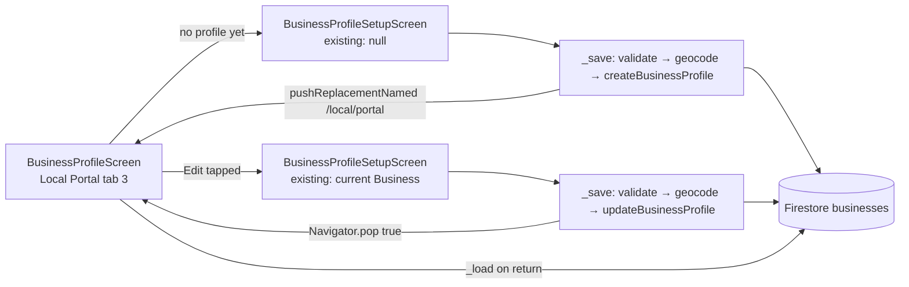

# User Story: Business Owner Creates and Manages Business Profile

**As a** Local Food Business owner, **I want** to create and manage my business profile **so that** visitors can discover my food business and access accurate business information.

## Acceptance Criteria

- Business owner can create a business profile by entering: Business name, Category, Description, Address, Contact number, Opening hours, Website and social media links.
- Business logo and cover image can be uploaded.
- Required fields are validated before the profile is published.
- Business owner can edit any profile information after it has been created.
- Existing profile information is pre-filled when editing.
- Updated information is displayed immediately after saving.
- A confirmation message appears after creating or updating the profile.
- The system validates data inputs to maintain accuracy and consistency.

## Component Map



## AC 1: Create Profile with Core Fields

**File:** `lib/screens/business_profile_setup_screen.dart` — controllers cover every required field
```dart
final _nameCtrl = TextEditingController();
final _descCtrl = TextEditingController();
final _addressCtrl = TextEditingController();
final _phoneCtrl = TextEditingController();
final _websiteCtrl = TextEditingController();
final _instagramCtrl = TextEditingController();
final _facebookCtrl = TextEditingController();
final _tiktokCtrl = TextEditingController();
String _selectedCategory = businessCategories.first;

// Opening hours: day → {open, close, isClosed}
final Map<String, _DayEntry> _hours = { for (final d in _kDays) d: _DayEntry() };
```
The form is a multi-step wizard (`_pages = ['Business Info', 'Location & Hours', 'Contact & Social', 'Menu Items']`) so an owner fills name/category/description, then address/opening hours, then contact/website/social links, without one overwhelming page.

Address entry uses Brisbane-scoped autocomplete + geocoding so the stored address is accurate and mappable:
```dart
Future<Iterable<String>> _getAddressSuggestions(String query) async {
  final trimmed = query.trim();
  if (trimmed.length < 2) return const <String>[];
  return await _placesService.fetchBrisbaneAddressSuggestions(trimmed);
}
```

## AC 2: Logo and Cover Image Upload

**File:** `lib/screens/business_profile_setup_screen.dart` — `_pickImage()`
```dart
Future<void> _pickImage({required bool isLogo}) async {
  final picked = await _picker.pickImage(
    source: ImageSource.gallery,
    imageQuality: 80,
    maxWidth: isLogo ? 400 : 1200,
  );
  if (picked == null) return;
  final bytes = await picked.readAsBytes();
  final path = isLogo
      ? 'business_logos/$email/$ts.jpg'
      : 'business_covers/$email/$ts.jpg';
  setState(() => isLogo ? _uploadingLogo = true : _uploadingBanner = true);
  try {
    final url = await _mediaService
        .uploadBytes(path: path, bytes: bytes, contentType: 'image/jpeg')
        .timeout(const Duration(seconds: 30));
    setState(() => isLogo ? _logoUrl = url : _bannerUrl = url);
  } on TimeoutException catch (_) {
    ScaffoldMessenger.of(context).showSnackBar(
      const SnackBar(content: Text('Upload timed out. Please try a smaller image.')),
    );
  }
  ...
}
```
Images upload to Firebase Storage immediately on selection (with a loading spinner and a 30s timeout + error snackbar), and the resulting URL is stored on the `Business` object's `logoUrl`/`coverImageUrl` fields when the profile is saved. `BusinessProfileScreen` (the profile viewer) also supports uploading a replacement logo/cover directly, without re-opening the full form:
```dart
// business_profile_screen.dart
final url = await _mediaService.uploadBytes(path: path, bytes: bytes, contentType: 'image/jpeg');
final updated = isLogo ? _business!.copyWith(logoUrl: url) : _business!.copyWith(coverImageUrl: url);
await _profileService.updateBusinessProfile(updated);
```

## AC 3: Required Fields Validated Before Publishing

**File:** `lib/screens/business_profile_setup_screen.dart` — `_save()`
```dart
if (name.isEmpty) { _showSnack('Business name is required.'); return; }
if (_selectedCategory.isEmpty) { _showSnack('Please select a category.'); return; }
if (description.isEmpty) { _showSnack('Description is required.'); return; }
if (address.isEmpty) { _showSnack('Address is required.'); return; }
if (phone.isEmpty) { _showSnack('Contact number is required.'); return; }
if (phone.length < 8 || !RegExp(r'^[0-9\-\+\s\(\)]{8,}$').hasMatch(phone)) {
  _showSnack('Please enter a valid contact number.');
  return;
}
if (website.isNotEmpty &&
    !RegExp(r'^(https?:\/\/)?([\w\-]+\.)+[\w\-]+(\/[\w\-\.]*)*$').hasMatch(website)) {
  _showSnack('Please enter a valid website URL.');
  return;
}
```
Every required-field check runs (and short-circuits with a specific message) **before** any Firestore write is attempted, so an incomplete profile is never published.

## AC 4 & AC 8: System Validates Data Inputs (Accuracy & Consistency)

Beyond the required-field checks above, address input is cross-validated against real geography, not just non-empty text:
```dart
LatLng? latLng;
try {
  latLng = await geocodingService.geocodeAddress(address).timeout(const Duration(seconds: 10));
} catch (e) { ... }

if (latLng != null &&
    !AddressGeocodingService.isWithinBrisbane(latLng.latitude, latLng.longitude)) {
  _showSnack('Address must be within Brisbane. Please enter a Brisbane address.');
  return;
}
```
Server-side, `firestore.rules` also enforces ownership consistency so a profile can't be created under someone else's identity or edited by a non-owner:
```javascript
match /businesses/{businessId} {
  allow read: if true;
  allow create: if (isSignedIn() && request.resource.data.ownerId == authEmail())
    || request.auth == null;
  allow update: if isSignedIn() && (
    resource.data.ownerId == authEmail()
    || isAdmin()
    || request.resource.data.diff(resource.data).affectedKeys()
        .hasOnly(['averageRating', 'reviewCount', 'rating', 'buzzRating', 'updatedAt'])
  ) || request.auth == null;
}
```

## AC 5: Owner Can Edit Any Profile Information After Creation

**File:** `lib/screens/business_profile_screen.dart` — `_openEdit()`
```dart
Future<void> _openEdit() async {
  final result = await Navigator.push<bool>(
    context,
    MaterialPageRoute(
      builder: (_) => BusinessProfileSetupScreen(existing: _business),
    ),
  );
  if (result == true) _load();
}
```
The *same* `BusinessProfileSetupScreen` handles both create and edit — passing the current `Business` via `existing` puts it in edit mode, and every field on the wizard (name, category, description, address, hours, contact, website, social links, logo/cover, menu items) is editable.

## AC 6: Existing Information Pre-Filled When Editing

**File:** `lib/screens/business_profile_setup_screen.dart` — `initState()`
```dart
final b = widget.existing;
if (b != null) {
  _nameCtrl.text = b.businessName;
  _descCtrl.text = b.description;
  _addressCtrl.text = b.address;
  _phoneCtrl.text = b.contactNumber;
  _websiteCtrl.text = b.website ?? '';
  _instagramCtrl.text = b.socialMedia?['Instagram'] ?? '';
  _facebookCtrl.text = b.socialMedia?['Facebook'] ?? '';
  _tiktokCtrl.text = b.socialMedia?['TikTok'] ?? '';
  _logoUrl = b.logoUrl;
  _bannerUrl = b.coverImageUrl;
  if (b.menuItems != null) _menuItems.addAll(b.menuItems!);
  if (businessCategories.contains(b.category)) _selectedCategory = b.category;
  if (b.businessHours != null) {
    for (final d in _kDays) {
      final dh = b.businessHours!.getHoursForDay(d);
      if (dh != null) {
        _hours[d] = _DayEntry(isClosed: dh.isClosed, open: dh.openTime ?? '09:00', close: dh.closeTime ?? '17:00');
      }
    }
  }
}
```
Every field the owner can edit is seeded from the existing `Business` object before the form is shown — nothing needs to be re-typed.

## AC 7: Updated Information Displayed Immediately After Saving

**File:** `lib/screens/business_profile_setup_screen.dart` — `_save()`
```dart
if (widget.existing?.id != null) {
  await service.updateBusinessProfile(business);
} else {
  await service.createBusinessProfile(business);
}
...
if (widget.existing != null) {
  _showSnack('Business profile updated successfully.');
  Navigator.pop(context, true); // signals BusinessProfileScreen to refresh
} else {
  _showSnack('Business profile created successfully.');
  Navigator.pushReplacementNamed(context, '/local/portal'); // reloads the portal fresh
}
```
**File:** `lib/screens/business_profile_screen.dart`
```dart
if (result == true) _load(); // re-fetches from Firestore right after the edit screen pops
```
For a brand-new profile, `pushReplacementNamed('/local/portal')` remounts the whole portal (and `BusinessProfileScreen.initState → _load()` fires), so the freshly created profile appears immediately without a manual refresh either way.

## AC 8 (part 2): Confirmation Message After Create or Update

Same `_save()` method as above shows a distinct, action-specific snackbar in both cases:
```dart
_showSnack('Business profile created successfully.');
// ...or...
_showSnack('Business profile updated successfully.');
```
```dart
void _showSnack(String msg) {
  ScaffoldMessenger.of(context).showSnackBar(SnackBar(content: Text(msg)));
}
```
Validation failures (AC 3) reuse the exact same `_showSnack()` mechanism, so the owner always gets clear, consistent feedback whether the save succeeded or was rejected.

## Files Involved

| File | Role |
|---|---|
| `lib/screens/business_profile_screen.dart` | Local portal's "Business Profile" tab; shows current profile, launches create/edit |
| `lib/screens/business_profile_setup_screen.dart` | Canonical create + edit wizard (pre-fill, validation, image upload, save) |
| `lib/services/business_profile_service.dart` | `createBusinessProfile` / `updateBusinessProfile` Firestore CRUD |
| `lib/services/firebase_media_service.dart` | Logo/cover image upload to Firebase Storage |
| `lib/services/address_geocoding_service.dart` | Address validation + Brisbane-bounds check |
| `lib/services/google_places_autocomplete_service.dart` | Brisbane address autocomplete |
| `lib/models/business.dart` | `Business` model incl. `BusinessHours`/`DayHours`, Firestore (de)serialization |
| `firestore.rules` | Owner-only create/update enforcement on the `businesses` collection |

## Note on Other Business-Creation Screens

`lib/screens/create_business_screen.dart` and `lib/screens/create_business_form_screen.dart` also exist and implement a simpler, single-page create flow (the latter explicitly for the events-management entry point). They are separate, simplified alternatives to the primary wizard documented above, not currently referenced from the main "Business Profile" tab — `BusinessProfileScreen`/`BusinessProfileSetupScreen` is the one actually wired into the Local Portal navigation and is what this documentation maps against.

## Status

No code changes were required — this flow is fully implemented end-to-end and matches every acceptance criterion (all fields captured, image upload, required-field + address validation, pre-filled edit mode, immediate refresh on save, and distinct confirmation messages for create vs. update).
