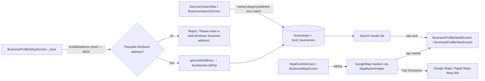

# User Story: Business Appears in Search and on the Interactive Map

**As a** Local Food Business owner, **I want** my business to appear in search results and on the interactive map **so that** visitors can easily find and locate my business.

## Acceptance Criteria

- Users can search for businesses by business name, category, or location.
- Relevant businesses appear in the search results.
- Business location is displayed correctly on the interactive map.
- Selecting a business from the search results or clicking its map marker opens the business profile.
- Invalid business addresses cannot be saved.
- Users can open directions to the business through Google Maps.
- Business location information is displayed accurately based on the registered address.

## Status Summary

Search, map display, marker-tap-to-profile, and Google Maps directions are all already fully implemented. One real gap was found and fixed: **invalid addresses could actually be saved** because the geocoder always falls back to a default coordinate instead of failing — the existing (but unused) `isValidAddress()` check is now wired into the save flow.

## Component Map



## AC 1 & 2: Search by Name, Category, or Location — Relevant Results

**File:** `lib/screens/business_search_screen.dart` — `_performSearch()`
```dart
void _performSearch() {
  final query = _searchController.text.toLowerCase();
  final category = _selectedCategory == 'All Categories' ? null : _selectedCategory;

  setState(() {
    _searchResults = _allBusinesses.where((business) {
      if (category != null && business.category != category) return false;
      if (query.isEmpty) return true;

      return business.businessName.toLowerCase().contains(query) ||
          business.category.toLowerCase().contains(query) ||
          business.description.toLowerCase().contains(query) ||
          business.address.toLowerCase().contains(query) ||
          business.contactNumber.toLowerCase().contains(query);
    }).toList();
  });
}
```
This matches on **name**, **category** (both the free-text query and the dedicated category filter chips), and **location** (`address`) all in one pass, so "pizza", "Restaurant & Cafe", and "West End" all return relevant results. The visitor portal's `DiscoverSearchBar` feeds the same kind of filtering into `visitor_portal_screen.dart`'s discover feed for the main browsing experience.

## AC 3 & 7: Location Displayed Correctly on the Map, Accurately Reflecting the Registered Address

**File:** `lib/screens/map_events_screen.dart` — businesses are streamed live from Firestore and placed using the exact `lat`/`lng` stored on their profile:
```dart
_businessSub = _businessService.getVerifiedBusinessesStream().listen(
  _onBusinessesReceived,
  onError: (_) => _loadAllBusinessesForDev(),
);
```
Markers are only ever built from a business's own stored coordinates (via `MapMarkerHelper`/`MapPin`), so the pin position always matches whatever address the owner registered — if the owner updates their address (which re-geocodes and re-saves `lat`/`lng`, see AC 5), the map marker moves automatically on the next snapshot.

`lib/screens/business_map_screen.dart` filters out businesses without coordinates before rendering, so a pin is never shown at a wrong/default location:
```dart
final filteredBusinesses =
    widget.businesses.where((b) => b.lat != null && b.lng != null).toList();
```

## AC 4: Selecting a Result or Marker Opens the Business Profile

**Search result tap** — `lib/screens/business_search_screen.dart`
```dart
return _BusinessSearchResultCard(
  business: business,
  onTap: () {
    Navigator.push(
      context,
      MaterialPageRoute(
        builder: (_) => BusinessProfileDetailScreen(businessId: business.id!),
      ),
    );
  },
  onMapTap: () {
    Navigator.push(
      context,
      MaterialPageRoute(
        builder: (_) => BusinessMapScreen(businesses: _searchResults, focusedBusiness: business),
      ),
    );
  },
);
```

**Map marker tap** — `lib/screens/map_events_screen.dart` — `_openPinDetail()`
```dart
void _openPinDetail(MapPin pin) {
  if (pin.type == MapPinType.event) { ...; return; }
  if (pin.type == MapPinType.food) {
    Navigator.of(context).push(
      MaterialPageRoute(builder: (_) => FoodBusinessDetailScreen(businessId: pin.id)),
    );
    return;
  }
  Navigator.of(context).push(
    MaterialPageRoute(
      builder: (_) => BusinessProfileViewScreen(businessId: pin.id, isOwnProfile: false),
    ),
  );
}
```
Both entry points (list card and map pin) land on a business profile screen — just the specific screen differs slightly depending on whether the business is a canonical `businesses` listing or a legacy `food_businesses` one, which the pin/result data already carries.

## AC 5: Invalid Business Addresses Cannot Be Saved — Gap Found and Fixed

**Root cause:** `lib/services/address_geocoding_service.dart`'s `geocodeAddress()` **never returns null** — if the Google Places lookup fails, it falls through to `_estimateCoordinatesFromAddress()`, which itself always returns *some* coordinate (a matched suburb, or a hard-coded Brisbane CBD default):
```dart
// Default to Brisbane CBD if no suburb match
return LatLng(-27.4698, 153.0251);
```
Meanwhile, `BusinessProfileSetupScreen._save()` only rejected the address if geocoding returned real, out-of-bounds coordinates — a **nonsense address** (e.g. `"asdfasdf"`) would fail the Places lookup, fall through to the CBD default, pass the `isWithinBrisbane` check trivially, and get **saved anyway** with fake coordinates:
```dart
latLng ??= const LatLng(-27.4698, 153.0251); // silently accepted garbage input
```

The service already had an unused method, `isValidAddress()`, that does a real, deterministic pre-check (address must be empty→reject, or mention Brisbane/QLD/Queensland, or match one of ~20 known suburb names) before ever calling the always-succeeding geocoder — but nothing called it.

**Fix applied** — `lib/screens/business_profile_setup_screen.dart` — `_save()` now rejects the save before any geocoding is attempted:
```dart
// Reject addresses that don't plausibly refer to Brisbane before doing
// any geocoding. geocodeAddress() always resolves to *some* coordinates
// (falling back to Brisbane CBD) so it can't be relied on alone to
// reject nonsense/invalid input.
final addressValidator = AddressGeocodingService();
final isPlausibleAddress = await addressValidator.isValidAddress(address);
if (!isPlausibleAddress) {
  _showSnack('Please enter a valid Brisbane business address.');
  return;
}
```
Legitimate Brisbane addresses (mentioning Brisbane/QLD/a known suburb, or later geocoded to real in-bounds coordinates) still save normally, including the existing graceful "save without exact coordinates" fallback for genuine Places API outages.

## AC 6: Open Directions Through Google Maps

**File:** `lib/screens/map_events_screen.dart` — `_launchNavigation()`
```dart
Future<void> _launchNavigation(MapPin pin) async {
  final mode = await showModalBottomSheet<String>(
    context: context,
    builder: (_) => NavModeSheet(name: pin.title),
  );
  if (mode == null) return;

  final lat = pin.latitude;
  final lng = pin.longitude;
  final googleNativeUri = Uri.parse('google.navigation:q=$lat,$lng&mode=$mode');
  final googleWebUri = Uri.parse(
    'https://www.google.com/maps/dir/?api=1&destination=$lat,$lng&travelmode=${_googleWebMode(mode)}',
  );
  final appleUri = Uri.parse('maps://?daddr=$lat,$lng&dirflg=${_appleDirFlag(mode)}');

  if (await canLaunchUrl(googleNativeUri)) {
    await launchUrl(googleNativeUri);
  } else if (await canLaunchUrl(appleUri)) {
    await launchUrl(appleUri);
  } else if (await canLaunchUrl(googleWebUri)) {
    await launchUrl(googleWebUri, mode: LaunchMode.externalApplication);
  }
}
```
`lib/screens/business_map_screen.dart` offers the same capability via a simpler, always-available web fallback link:
```dart
Future<void> _openDirections(Business business) async {
  final mapsUrl =
      'https://www.google.com/maps/search/?api=1&query=${business.lat},${business.lng}';
  await launchUrl(Uri.parse(mapsUrl), mode: LaunchMode.externalApplication);
}
```
The layered fallback (native Google Maps app → Apple Maps → Google Maps web) means directions open correctly regardless of platform or which navigation app is installed.

## Files Involved

| File | Role |
|---|---|
| `lib/screens/business_search_screen.dart` | Name/category/location search + results list → profile/map navigation |
| `lib/widgets/discover_search_bar.dart` | Debounced search input used on the visitor discover feed |
| `lib/screens/map_events_screen.dart` | Interactive map: live business pins, marker tap → profile, Get Directions |
| `lib/screens/business_map_screen.dart` | Focused business map view + simple directions link |
| `lib/widgets/map/map_marker_helper.dart` | Marker bitmap rendering |
| `lib/services/address_geocoding_service.dart` | `geocodeAddress`, `isValidAddress` (now wired in), `isWithinBrisbane` |
| `lib/screens/business_profile_setup_screen.dart` | Address validation gate before save (fixed) |
| `lib/models/business.dart` | `lat`/`lng` fields used for both search-adjacent display and map placement |

## Status

- Code change applied: `lib/screens/business_profile_setup_screen.dart` now calls `AddressGeocodingService.isValidAddress()` before saving, closing the gap where nonsense addresses could be silently saved with default Brisbane CBD coordinates.
- Verified no compile errors in the modified file.
- All other acceptance criteria (search by name/category/location, map accuracy, marker/result → profile navigation, Get Directions) were already fully implemented.
- Not yet rebuilt/deployed — run `./build_web.sh && firebase deploy --only hosting` to ship the address-validation fix.
