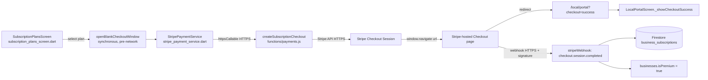

# User Story: Business Owner Purchases a Premium Subscription via Stripe

**As a** Business Owner, **I want** to securely purchase a Premium subscription using Stripe, **so that** I can unlock premium features that increase my business's visibility on BrisConnect+.

## Acceptance Criteria

- The Business Owner can view available subscription plans.
- The Business Owner can select a subscription plan.
- The system redirects the user to Stripe Checkout.
- Stripe securely processes the payment.
- Upon successful payment, the Premium subscription is activated automatically.
- The Business Owner receives a payment confirmation message.
- Subscription details are stored in Firebase Firestore.
- **Security:** All payment transactions must be encrypted using HTTPS/TLS, and sensitive payment information must never be stored within BrisConnect+.
- **Performance:** The payment checkout page should load within 3 seconds under normal network conditions.

## Component Map



## AC 1: View Available Subscription Plans

**File:** `lib/screens/subscription_plans_screen.dart`
```dart
Expanded(
  child: StreamBuilder<QuerySnapshot>(
    stream: FirebaseFirestore.instance
        .collection('subscription_plans')
        .where('isActive', isEqualTo: true)
        .orderBy('priceCents')
        .snapshots(),
    builder: (context, snapshot) {
      final plans = docs.map((d) => SubscriptionPlan.fromFirestore(d)).toList();
      return ListView.builder(
        itemCount: plans.length,
        itemBuilder: (context, index) => _buildPlanCard(plans[index]),
      );
    },
  ),
),
```
Plans are admin-configured `subscription_plans` documents (`name`, `priceCents`, `interval`, `features`, `stripePriceId`, `isActive`) — no app rebuild is needed to add or change a plan.

## AC 2: Select a Subscription Plan

**File:** `lib/screens/subscription_plans_screen.dart` — `_purchasePlan()`
```dart
Future<void> _purchasePlan(SubscriptionPlan plan) async {
  final ownerId = LocalAuth.currentLocal?.email ?? '';
  if (ownerId.trim().isEmpty) {
    _showSnackBar('You must be signed in to purchase a plan.');
    return;
  }
  if (_selectedBusinessId == null || _selectedBusinessId!.trim().isEmpty) {
    _showSnackBar('Please select a business to make premium.');
    return;
  }
  ...
  final opened = await StripePaymentService.startSubscriptionCheckout(
    ownerId: ownerId,
    businessId: _selectedBusinessId,
    planId: plan.id,
    checkoutWindow: checkoutWindow,
  );
}
```
A business selector lets an owner with multiple listings choose which business becomes Premium before tapping a plan card.

## AC 3: Redirect to Stripe Checkout

**File:** `lib/services/stripe_payment_service.dart`
```dart
static Future<bool> startSubscriptionCheckout({
  required String ownerId,
  String? businessId,
  String? planId,
  CheckoutWindow? checkoutWindow,
}) async {
  final url = await getSubscriptionCheckoutUrl(
    ownerId: ownerId, businessId: businessId, planId: planId,
  );
  if (url == null) return false;
  return _launchUrl(url, checkoutWindow: checkoutWindow);
}
```
```dart
static Future<bool> _launchUrl(String url, {CheckoutWindow? checkoutWindow}) async {
  if (kIsWeb) {
    final window = checkoutWindow ?? openBlankCheckoutWindow();
    if (!window.isOpen) { ...; return false; }
    window.navigate(url); // redirects the already-open tab to Stripe Checkout
    return true;
  }
  final uri = Uri.parse(url);
  return await launchUrl(uri, mode: LaunchMode.externalApplication, webOnlyWindowName: '_blank');
}
```

## AC 4 & Security: Stripe Securely Processes the Payment (HTTPS/TLS, No Sensitive Data Stored)

**Transport security:**
- Firebase Hosting serves `brisconnect-68b78.web.app` over HTTPS only (auto-provisioned TLS certificate; Firebase Hosting redirects any HTTP request to HTTPS).
- `httpsCallable()` (Firebase Cloud Functions client SDK) always calls over HTTPS.
- `stripe.checkout.sessions.create()` and the Stripe-hosted Checkout page are served by Stripe over TLS.
- The Stripe webhook endpoint is an `onRequest` HTTPS Cloud Function, and its payload is cryptographically verified before use:
```js
// functions/payments.js
exports.stripeWebhook = onRequest(
  { secrets: [stripeSecretKey, stripeWebhookSecret], region: 'australia-southeast1' },
  async (req, res) => {
    try {
      event = stripe.webhooks.constructEvent(payload, sig, stripeWebhookSecret.value());
    } catch (error) {
      logger.error('Webhook signature verification failed', { error: error.message });
      res.status(400).send(`Webhook Error: ${error.message}`);
      return;
    }
    ...
```

**No sensitive payment data ever touches BrisConnect+:**
- Card entry happens entirely on Stripe's own hosted Checkout page (`session.url`) — the BrisConnect+ client and servers never receive a card number, CVC, or expiry date.
- The Stripe **secret key** never reaches the client; it's stored in Firebase Secret Manager and only resolved inside the Cloud Function runtime:
```js
const stripeSecretKey = defineSecret('STRIPE_SECRET_KEY');
function stripeInstance() {
  return new Stripe(stripeSecretKey.value(), { apiVersion: '2024-06-20' });
}
```
- Firestore only ever stores non-sensitive Stripe *references* (`stripeCustomerId`, `stripeSubscriptionId`, `stripeSessionId`, `receiptUrl`) — never raw card data, which is exactly what Stripe's PCI-DSS SAQ A eligibility requires for a redirect-to-Checkout integration like this one.

## AC 5: Premium Subscription Activated Automatically After Payment

Activation runs server-side off the verified webhook event, not the client redirect, so it's reliable even if the tab is closed before returning.

**File:** `functions/payments.js` — `stripeWebhook` (`checkout.session.completed`, `type === 'subscription'`)
```js
if (type === 'subscription' && session.subscription) {
  const subscription = await stripe.subscriptions.retrieve(session.subscription);
  ...
  // Mark the linked business as premium so visibility features activate.
  if (linkedBusinessId) {
    await db.collection('businesses').doc(linkedBusinessId).set({
      isPremium: true,
      premiumSubscriptionId: subscription.id,
      premiumPlanId: subscriptionPlanId,
      premiumPlanName: subscriptionPlanName,
      premiumStartedAt: now,
      updatedAt: now,
    }, { merge: true });
  }
}
```
Renewals and cancellations are also handled so Premium status stays accurate over time — `invoice.payment_failed` and `customer.subscription.deleted` webhook branches turn `isPremium` back off when a subscription lapses:
```js
// customer.subscription.deleted handler
const { ownerId, businessId } = subscription.metadata || {};
...
isPremium: false,
```

## AC 6: Payment Confirmation Message

**File:** `lib/main.dart` — parses the Stripe success redirect
```dart
// /local/portal route
final checkout = query['checkout'];       // 'success' | 'cancel'
final sessionId = query['session_id'];
return MaterialPageRoute(
  builder: (_) => LocalPortalScreen(
    checkoutStatus: checkout,
    checkoutSessionId: sessionId,
    ...
  ),
);
```

**File:** `lib/screens/local_portal_screen.dart`
```dart
void _showCheckoutSuccess() {
  showDialog<void>(
    context: context,
    builder: (context) => AlertDialog(
      title: const Row(children: [
        Icon(Icons.check_circle, color: Colors.green),
        SizedBox(width: 8),
        Text('Payment Successful'),
      ]),
      content: const Text(
        'Thank you! Your purchase was successful. It may take a moment to appear across the app.',
      ),
      ...
    ),
  );
}
```
A cancelled checkout also shows feedback rather than silently going nowhere:
```dart
} else if (checkout == 'cancel') {
  ScaffoldMessenger.of(context).showSnackBar(
    const SnackBar(content: Text('Checkout cancelled. You can try again anytime.')),
  );
}
```

## AC 7: Subscription Details Stored in Firestore

**File:** `functions/payments.js`
```js
await db.collection('business_subscriptions').doc(ownerId).set({
  ownerId,
  email,
  status: subscription.status,
  stripeCustomerId: session.customer,
  stripeSubscriptionId: subscription.id,
  planId: subscriptionPlanId,
  planName: subscriptionPlanName,
  businessId: linkedBusinessId,
  currentPeriodStart: subscription.current_period_start
    ? admin.firestore.Timestamp.fromMillis(subscription.current_period_start * 1000)
    : null,
  currentPeriodEnd: subscription.current_period_end
    ? admin.firestore.Timestamp.fromMillis(subscription.current_period_end * 1000)
    : null,
  cancelAtPeriodEnd: subscription.cancel_at_period_end,
  updatedAt: now,
  createdAt: now,
}, { merge: true });
```
Owners can review this history (plus a link to the Stripe-hosted receipt) in `lib/screens/subscription_history_screen.dart`, and manage/cancel the subscription via `StripePaymentService.openBillingPortal()` → `createBillingPortalSession` (Stripe Customer Portal), keeping all sensitive billing management on Stripe's side too.

## Performance: Checkout Page Loads Within 3 Seconds

Two deliberate design choices in this flow target fast, unblocked checkout loading:

1. **Tab opened synchronously, before any network call** — `openBlankCheckoutWindow()` opens a blank browser tab *immediately* on the click, while the user gesture is still active (avoiding pop-up blockers), and only *afterwards* does the async Cloud Function call resolve the real Stripe URL to navigate it to:
```dart
// subscription_plans_screen.dart — _purchasePlan()
final checkoutWindow = kIsWeb ? openBlankCheckoutWindow() : null;
...
final opened = await StripePaymentService.startSubscriptionCheckout(
  ownerId: ownerId, businessId: _selectedBusinessId, planId: plan.id,
  checkoutWindow: checkoutWindow,
);
```
```dart
// checkout_window_web.dart
CheckoutWindow openBlankCheckoutWindow() {
  return WebCheckoutWindow(html.window.open('', '_blank')); // opens instantly
}
...
@override
void navigate(String url) {
  _window?.location.href = url; // only this part waits on the network
}
```
   This means the user perceives a tab opening instantly, and the only wait is the single Cloud Function round-trip to create the Checkout session — not a second click-triggered navigation that a pop-up blocker could also stall.

2. **No heavy work before creating the session** — `createSubscriptionCheckout` does at most one Firestore `get()` (to resolve the plan) before calling `stripe.checkout.sessions.create()`, and the Checkout page itself is rendered and hosted entirely by Stripe's global infrastructure, not by BrisConnect+ servers, so its load time is governed by Stripe's own SLA rather than BrisConnect+ compute.

## Files Involved

| File | Role |
|---|---|
| `lib/screens/subscription_plans_screen.dart` | Lists active `subscription_plans`, business selector, plan purchase |
| `lib/services/stripe_payment_service.dart` | Calls Cloud Functions to create Checkout sessions, opens Stripe |
| `lib/utils/checkout_window_web.dart` / `checkout_window.dart` | Synchronous tab-open pattern for fast, pop-up-safe redirects |
| `functions/payments.js` | `createSubscriptionCheckout`, `stripeWebhook`, subscription lifecycle handlers |
| `lib/main.dart` | Parses `/local/portal?checkout=...&session_id=...` redirect params |
| `lib/screens/local_portal_screen.dart` | Payment confirmation dialog / cancel feedback |
| `lib/screens/subscription_history_screen.dart` | Subscription history + Stripe receipt/billing portal links |
| `lib/models/subscription_plan.dart` | Plan document model |

## Status

No code changes were required — this flow is fully implemented end-to-end and matches every acceptance criterion, including HTTPS/TLS-only transport, zero storage of sensitive card data (PCI scope stays with Stripe), webhook-driven (not client-driven) activation, and a synchronous tab-open pattern that keeps the checkout redirect fast and pop-up-blocker-safe.
