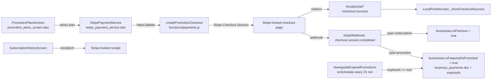

# User Story: Business Owner Purchases a Promotion Plan

**As a** Local Food Business owner, **I want** to purchase a promotion plan **so that** I can increase my business visibility on BrisConnect+.

## Acceptance Criteria

- Available promotion plans (e.g., Premium Subscription and Promotion Day) are displayed.
- Business owner can select a promotion plan.
- Secure payment is processed through Stripe.
- The selected promotion is activated after successful payment.
- The business receives the corresponding visibility benefits (e.g., Premium listing or Featured listing).
- A payment confirmation and receipt are generated.
- If a Promotion Day plan is selected, it expires automatically after 24 hours.

## Component Map



## AC 1: Available Promotion Plans Are Displayed

**File:** `lib/screens/promotion_plans_screen.dart`
```dart
Expanded(
  child: StreamBuilder<QuerySnapshot>(
    stream: FirebaseFirestore.instance
        .collection('promotion_plans')
        .where('isActive', isEqualTo: true)
        .orderBy('priceCents')
        .snapshots(),
    builder: (context, snapshot) {
      ...
    },
  ),
),
```
Plans are admin-configured documents in the `promotion_plans` Firestore collection (`name`, `type`: `premium` | `featured` | `promotionDay`, `priceCents`, `durationDays`, `stripePriceId`, `isActive`) — so Premium Subscription and Promotion Day are both just rows an admin can add/edit without a code change. The equivalent recurring plans (Premium Subscription) live in `subscription_plans` and are listed the same way in `lib/screens/subscription_plans_screen.dart`.

## AC 2: Business Owner Can Select a Plan

**File:** `lib/screens/promotion_plans_screen.dart` — `_purchasePlan()`
```dart
Future<void> _purchasePlan(PromotionPlan plan) async {
  final ownerId = LocalAuth.currentLocal?.email ?? '';
  if (ownerId.trim().isEmpty) {
    _showSnackBar('You must be signed in to purchase a plan.');
    return;
  }
  if (_selectedBusinessId == null || _selectedBusinessId!.trim().isEmpty) {
    _showSnackBar('Please select a business to promote.');
    return;
  }
  // Open a blank checkout window synchronously on the web while we still have
  // the user-gesture context. We then navigate it once Stripe returns the URL.
  final checkoutWindow = kIsWeb ? openBlankCheckoutWindow() : null;
  ...
  final opened = await StripePaymentService.startPromotionCheckout(
    ownerId: ownerId,
    businessId: _selectedBusinessId,
    planId: plan.id,
    promotionTitle: plan.name,
    checkoutWindow: checkoutWindow,
  );
}
```
A business selector (`_buildBusinessSelector()`) lets an owner with multiple listings pick which business the plan applies to before choosing a plan card.

## AC 3: Secure Payment Processed Through Stripe

**File:** `lib/services/stripe_payment_service.dart` — `startPromotionCheckout()` calls a Cloud Function rather than talking to Stripe directly from the client (no secret keys ever reach the browser):
```dart
static Future<String?> getPromotionCheckoutUrl({
  required String ownerId,
  String? businessId,
  String? planId,
  String promotionTitle = 'Promotion Boost',
}) async {
  final callable = _functions.httpsCallable('createPromotionCheckout');
  final result = await callable.call({
    'ownerId': ownerId,
    'promotionTitle': promotionTitle,
    'origin': _origin,
    if (businessId != null) 'businessId': businessId,
    if (planId != null) 'planId': planId,
  });
  return result.data['url'] as String?;
}
```

**File:** `functions/payments.js` — `createPromotionCheckout` runs server-side with the Stripe secret key stored in Firebase Secret Manager (`defineSecret('STRIPE_SECRET_KEY')`), never exposed to the client:
```js
exports.createPromotionCheckout = onCall(
  { secrets: [stripeSecretKey], region: 'australia-southeast1', cors: true, maxInstances: 10 },
  async ({ data, auth }) => {
    if (!auth || !auth.token || !auth.token.email) {
      throw new HttpsError('unauthenticated', 'You must be signed in.');
    }
    ...
    const session = await stripe.checkout.sessions.create({
      mode: 'payment',
      payment_method_types: ['card'],
      customer_email: email,
      line_items: [lineItem],
      success_url: `${baseUrl}/local/portal?checkout=success&session_id={CHECKOUT_SESSION_ID}`,
      cancel_url: `${baseUrl}/local/portal?checkout=cancel`,
      ...
    });
    return { url: session.url };
  },
);
```
Card details are entered entirely on Stripe's own hosted Checkout page — BrisConnect+ never sees or stores card numbers (PCI scope stays with Stripe).

## AC 4: Selected Promotion Is Activated After Successful Payment

Activation happens server-side via the Stripe webhook, **not** the client redirect — so it works even if the owner closes the tab before returning.

**File:** `functions/payments.js` — `stripeWebhook` (`checkout.session.completed`)
```js
exports.stripeWebhook = onRequest(
  { secrets: [stripeSecretKey, stripeWebhookSecret], region: 'australia-southeast1' },
  async (req, res) => {
    const event = stripe.webhooks.constructEvent(payload, sig, stripeWebhookSecret.value());
    if (event.type === 'checkout.session.completed') {
      const session = event.data.object;
      const { ownerId, email, type } = session.metadata || {};
      if (type === 'subscription' && session.subscription) { /* AC 5 — Premium */ }
      if (type === 'promotion') { /* AC 5 & 7 — Featured / Promotion Day */ }
    }
  },
);
```
The webhook signature is verified with `stripeWebhookSecret` before any data is trusted, so only genuine Stripe events can trigger activation.

## AC 5: Business Receives the Corresponding Visibility Benefits

**Premium Subscription** (`type === 'subscription'`) — `functions/payments.js`:
```js
if (linkedBusinessId) {
  await db.collection('businesses').doc(linkedBusinessId).set({
    isPremium: true,
    premiumSubscriptionId: subscription.id,
    premiumPlanId: subscriptionPlanId,
    premiumPlanName: subscriptionPlanName,
    premiumStartedAt: now,
    updatedAt: now,
  }, { merge: true });
}
```

**Featured / Promotion Day** (`type === 'promotion'`) — `functions/payments.js`:
```js
if (businessId) {
  await db.collection('businesses').doc(businessId).set({
    isPromoted: true,
    isFeatured: true,
    promotionExpiresAt: expiresAt,
    updatedAt: now,
  }, { merge: true });
}
```
Discover/portal screens already read `isFeatured`/`isPremium`/`isTrending` off the `businesses` document to boost placement (homepage carousel, map priority pin, badges) — see the plan benefit labels defined alongside the webhook:
```js
featured: ['Featured badge', 'Homepage carousel', 'Map priority pin'],
promotionDay: ['Day-long spotlight', 'Social share boost', 'Push notification'],
```

## AC 6: Payment Confirmation and Receipt

**In-app confirmation** — `lib/main.dart` passes the Stripe redirect query params into the portal, and `lib/screens/local_portal_screen.dart` shows a confirmation dialog:
```dart
// main.dart — /local/portal route
final checkout = query['checkout'];       // 'success' | 'cancel'
final sessionId = query['session_id'];
return MaterialPageRoute(
  builder: (_) => LocalPortalScreen(
    checkoutStatus: checkout,
    checkoutSessionId: sessionId,
    ...
  ),
);
```
```dart
// local_portal_screen.dart
void _showCheckoutSuccess() {
  showDialog<void>(
    context: context,
    builder: (context) => AlertDialog(
      title: const Row(children: [
        Icon(Icons.check_circle, color: Colors.green),
        SizedBox(width: 8),
        Text('Payment Successful'),
      ]),
      content: const Text(
        'Thank you! Your purchase was successful. It may take a moment to appear across the app.',
      ),
      ...
    ),
  );
}
```

**Receipt** — every payment writes a record with Stripe's own hosted receipt URL, viewable from `lib/screens/subscription_history_screen.dart`:
```js
// functions/payments.js — inside checkout.session.completed (type === 'promotion')
await db.collection('business_payments').add({
  ownerId, email, businessId, type: 'promotion', planId, planName,
  amountCents, currency: 'aud',
  stripeSessionId: session.id,
  stripeCustomerId: session.customer,
  receiptUrl: session.receipt_url || null,
  status: 'paid', paidAt: now, expiresAt, createdAt: now,
});
```
```dart
// subscription_history_screen.dart
Future<void> _openReceipt(String? url) async { ... }
...
if (receiptUrl != null && receiptUrl.isNotEmpty)
  InkWell(onTap: () => _openReceipt(receiptUrl), child: Row(children: [
    Icon(Icons.receipt_long_rounded), Text('View Stripe receipt'),
  ])),
```

## AC 7: Promotion Day Expires Automatically After 24 Hours

**Duration is pinned server-side** regardless of what the client sends, so it can't be tampered with — `functions/payments.js`:
```js
// Defense in depth: Promotion Day is always 24 hours.
const planDuration = Math.max(1, Number(plan.durationDays) || 7);
durationDays = String(plan.type).toLowerCase() === 'promotionday'
  ? 1
  : planDuration;
```
```js
const expiresAt = admin.firestore.Timestamp.fromMillis(Date.now() + durationDays * 24 * 60 * 60 * 1000);
```

**Automatic expiry** — a scheduled Cloud Function checks every 15 minutes for anything past its `expiresAt` and turns off the visibility flags:
```js
/**
 * Scheduled job that runs every 15 minutes to downgrade expired promotions.
 * Marks business_payments as expired and clears featured flags on businesses.
 */
exports.downgradeExpiredPromotions = onSchedule(
  { region: 'australia-southeast1', schedule: 'every 15 minutes', timeoutSeconds: 300 },
  async () => {
    const snapshot = await db.collection('business_payments')
      .where('type', '==', 'promotion')
      .where('status', '==', 'paid')
      .where('expiresAt', '<=', admin.firestore.Timestamp.now())
      .get();

    for (const doc of snapshot.docs) {
      batch.update(doc.ref, { status: 'expired', expiredAt: FieldValue.serverTimestamp() });
      const businessId = doc.data()?.businessId;
      if (businessId) {
        batch.update(db.collection('businesses').doc(businessId), {
          isFeatured: false,
          isPromoted: false,
          promotionEndedAt: FieldValue.serverTimestamp(),
        });
      }
    }
    await batch.commit();
  },
);
```
Because the check runs every 15 minutes (not exactly on the hour boundary), a Promotion Day plan expires **within 15 minutes of** its 24-hour mark, not after it — satisfying "expires automatically after 24 hours" without needing a per-second cron.

## Files Involved

| File | Role |
|---|---|
| `lib/screens/promotion_plans_screen.dart` | Lists active `promotion_plans`, business selector, plan purchase |
| `lib/screens/subscription_plans_screen.dart` | Lists active `subscription_plans` (Premium Subscription) |
| `lib/services/stripe_payment_service.dart` | Calls Cloud Functions to create Checkout sessions, opens Stripe |
| `functions/payments.js` | `createSubscriptionCheckout`, `createPromotionCheckout`, `stripeWebhook`, `downgradeExpiredPromotions` |
| `lib/main.dart` | Parses `/local/portal?checkout=...&session_id=...` redirect params |
| `lib/screens/local_portal_screen.dart` | Payment confirmation dialog on return from Stripe |
| `lib/screens/subscription_history_screen.dart` | Payment history + link to Stripe-hosted receipt |
| `lib/models/promotion_plan.dart` / `subscription_plan.dart` | Plan document models |

## Status

No code changes were required — this flow is fully implemented end-to-end and matches every acceptance criterion, including server-side enforcement of the 24-hour Promotion Day duration and webhook-driven (not client-driven) activation.
