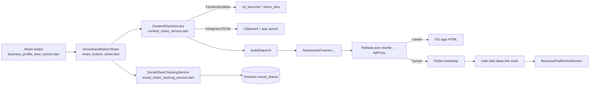

# User Story: Social Media Sharing for Local Food Businesses

**As a** Local Food Business owner, **I want** visitors to share my business on social media **so that** more people discover my business.

## Acceptance Criteria

- Business can be shared to Facebook.
- Business can be shared to Instagram.
- Business can be shared to TikTok.
- Shared link opens the correct business page.
- Confirmation message appears.
- Sharing works across mobile and desktop devices.
- Sharing action completes within 2 seconds.
- Share button is clearly visible on business page.
- Shared URLs do not allow unauthorised editing of business content.

## Component Map



## AC 1–3: Share to Facebook / Instagram / TikTok

**File:** `lib/services/share/content_share_service.dart` — `ContentShareService.shareToPlatform()`

```dart
switch (platform) {
  case 'facebook':
    final fbUrl =
        'https://www.facebook.com/sharer/sharer.php?u=${Uri.encodeComponent(url)}';
    await launchUrl(Uri.parse(fbUrl), mode: LaunchMode.externalApplication);
    return ShareResult.shared;
  case 'instagram':
    // No public web share URL — copy link + open Instagram (web) or
    // native share sheet (mobile).
    if (kIsWeb) {
      await launchUrl(Uri.parse('https://www.instagram.com/'),
          mode: LaunchMode.externalApplication);
      return ShareResult.shared;
    }
    await SharePlus.instance.share(ShareParams(text: shareText));
    return ShareResult.shared;
  case 'tiktok':
    await launchUrl(Uri.parse('https://www.tiktok.com/upload?lang=en'),
        mode: LaunchMode.externalApplication);
    return ShareResult.shared;
}
```

The picker UI lives in `lib/widgets/share_bottom_sheet.dart` (`showShareBottomSheet`), which renders one `_ShareButton` per platform and calls `_share()`.

## AC 4: Shared Link Opens the Correct Business Page

**File:** `lib/services/share/content_share_service.dart` — `buildShareUrl()`

```dart
String buildShareUrl({required ShareContentType type, required String id, String? slug}) {
  final path = switch (type) {
    ShareContentType.business => 'business',
    ...
  };
  return '$_baseUrl/$path/$id${slug != null ? '?name=${Uri.encodeComponent(slug)}' : ''}';
}
```

`firebase.json` rewrites `/business/**` to the `ogProxy` function (`functions/og_proxy.js`), which serves OG tags to crawlers or the Flutter bootstrap to humans.

> **Gap found and fixed:** `lib/main.dart`'s deep-link handling only had routes for `/food/` and `/event/`; `/business/` was missing, so a shared business link would boot the app but land on "Page not found". Added:

```dart
if (routePath.startsWith('/business/')) {
  final id = routePath.substring('/business/'.length).trim();
  if (id.isNotEmpty) {
    return MaterialPageRoute(
      builder: (_) => BusinessProfileViewScreen(businessId: id),
      settings: settings,
    );
  }
}
```

## AC 5: Confirmation Message Appears

**File:** `lib/widgets/share_bottom_sheet.dart` — `_share()`

```dart
switch (result) {
  case ShareResult.shared:
    messenger.showSnackBar(_buildSnackBar('Shared to ${service.platformLabel(platform)}!'));
  case ShareResult.copied:
    messenger.showSnackBar(_buildSnackBar('Link copied to clipboard!'));
  case ShareResult.timedOut:
    messenger.showSnackBar(_buildSnackBar(
      'Share took too long. Link copied to clipboard so you can paste it manually.'));
}
```

## AC 6: Works Across Mobile and Desktop

**File:** `lib/services/share/content_share_service.dart`

Branches on `kIsWeb` (web/desktop vs mobile share sheet) and always uses the cross-platform `share_plus` + `url_launcher` packages. `share_bottom_sheet.dart` also swaps its instructional copy depending on platform:

```dart
kIsWeb
    ? 'Your browser will share the story image directly when supported, or download it so you can upload it to your story.'
    : 'Instagram and Facebook open directly with the image. TikTok uses your phone\'s share sheet — choose TikTok and paste the copied link.',
```

## AC 7: Sharing Action Completes Within 2 Seconds

**File:** `lib/services/share/content_share_service.dart`

```dart
static const Duration shareTimeout = Duration(seconds: 2);
...
return await operation().timeout(shareTimeout, onTimeout: () async {
  await _clipboardWriter(shareText); // fallback: copy link
  return ShareResult.timedOut;
});
```

## AC 8: Share Button Clearly Visible on Business Page

**File:** `lib/screens/business_profile_view_screen.dart` — AppBar `actions`

```dart
_buildIconAction(
  icon: Icons.share_rounded,
  tooltip: 'Share',
  onTap: () => _showShareSheet(business),
),
```

## AC 9: Shared URLs Do Not Allow Unauthorised Editing

**File:** `firestore.rules`

```javascript
match /businesses/{businessId} {
  allow read: if true;                 // shared link = read-only
  allow update: if isSignedIn() && (
    resource.data.ownerId == authEmail() || isAdmin()
    || request.resource.data.diff(resource.data).affectedKeys()
        .hasOnly(['averageRating','reviewCount','rating','buzzRating','updatedAt'])
  );
}

match /social_shares/{shareId} {
  allow create: if isSignedIn() && request.resource.data.visitorId == request.auth.uid && ...;
  allow update, delete: if false;      // share records are immutable
}
```

`functions/og_proxy.js` also only ever *reads* Firestore (`db.collection(...).doc(id).get()`) to render Open Graph tags — it never writes, so a shared link can't be used to edit content.

## Files Involved

| File | Role |
|---|---|
| `lib/screens/business_profile_view_screen.dart` | Share button entry point (AppBar action) |
| `lib/widgets/share_bottom_sheet.dart` | Share picker UI + confirmation snackbars |
| `lib/services/share/content_share_service.dart` | Platform-specific share logic, URL building, 2s timeout |
| `lib/services/share/business_share_service.dart` | Thin business-specific wrapper over `ContentShareService` |
| `lib/services/social_share_tracking_service.dart` | Writes share events to `social_shares` Firestore collection |
| `lib/models/social_share_event.dart` | `social_shares` document model |
| `functions/og_proxy.js` | Serves Open Graph tags to crawlers, Flutter bootstrap to humans |
| `lib/main.dart` | Deep-link route (`/business/<id>`) → `BusinessProfileViewScreen` |
| `firestore.rules` | Read-only public access, owner/admin-only edits, immutable share records |

## Status

- Code change applied: `/business/<id>` deep-link route added to `lib/main.dart` (verified no compile errors).
- Not yet rebuilt/deployed — run `./build_web.sh && firebase deploy --only hosting` to ship this fix.
