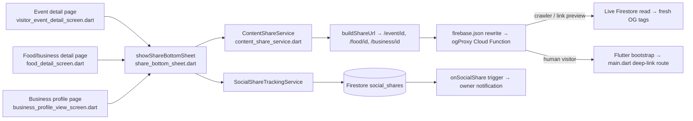

# User Story: Visitor Sharing of Events and Business Listings

**As a** Visitor, **I want** to share events and business listings to social media **so that** I can recommend them to friends and family.

## Acceptance Criteria

- Visitors can share **events** and **business listings** from their detail pages.
- Supported platforms: **Facebook**, **Instagram**, and **TikTok**.
- Shared content includes the **latest title, image, and description** from the listing.
- The share preview loads **instantly** when the share button is tapped.
- The sharing process completes **without errors** on supported platforms.
- A clear **success** or **failure** message appears after each sharing attempt.
- Sharing works across **mobile and desktop** devices.
- The app supports the latest stable versions of Facebook, Instagram, and TikTok apps/APIs.
- Shared content always reflects the **latest event/business data**.
- Shared links are **valid, unbroken, and tamper-proof**.
- The sharing feature is available **24/7 with 99.9% uptime**.
- The system handles **high-volume sharing** during popular events without delay.

## Component Map



## AC 1: Visitors Can Share Events and Business Listings from Detail Pages

Both detail screens call the same shared bottom sheet, just with a different `ShareContentType`.

**File:** `lib/screens/visitor_event_detail_screen.dart` — `_share()`
```dart
Future<void> _share() async {
  final id = (widget.event['id'] as String? ?? '').trim();
  final title = (widget.event['title'] as String? ?? 'Event').trim();
  final description = (widget.event['description'] as String? ?? '').trim();
  final imageUrl = (widget.event['imageUrl'] as String? ?? '').trim();
  ...
  await showShareBottomSheet(
    context: context,
    shareService: _shareService,
    type: ShareContentType.event,
    id: id,
    title: title,
    description: description,
    imageUrl: imageUrl.isNotEmpty ? imageUrl : null,
    businessId: businessId.isNotEmpty ? businessId : null,
  );
}
```

**File:** `lib/screens/food_detail_screen.dart` — `_share()`
```dart
await showShareBottomSheet(
  context: context,
  shareService: shareService,
  type: ShareContentType.food,
  id: id.trim(),
  title: title,
  description: description,
  location: location,
  dateTime: dateTime,
  imageUrl: imageUrl.trim().isNotEmpty ? imageUrl.trim() : null,
);
```

**File:** `lib/screens/business_profile_view_screen.dart` — `_showShareSheet()`
```dart
void _showShareSheet(Business business) {
  showShareBottomSheet(
    context: context,
    type: ShareContentType.business,
    id: business.id ?? widget.businessId,
    title: business.businessName,
    description: 'Check out ${business.businessName} on BrisConnect+!',
    imageUrl: business.coverImageUrl ?? business.logoUrl,
    businessId: business.id ?? widget.businessId,
    businessName: business.businessName,
  );
}
```

## AC 2: Supported Platforms — Facebook, Instagram, TikTok

**File:** `lib/services/share/content_share_service.dart` — `shareToPlatform()`
```dart
switch (platform) {
  case 'facebook':
    final fbUrl =
        'https://www.facebook.com/sharer/sharer.php?u=${Uri.encodeComponent(url)}';
    await launchUrl(Uri.parse(fbUrl), mode: LaunchMode.externalApplication);
    return ShareResult.shared;
  case 'instagram':
    if (kIsWeb) {
      await launchUrl(Uri.parse('https://www.instagram.com/'),
          mode: LaunchMode.externalApplication);
      return ShareResult.shared;
    }
    await SharePlus.instance.share(ShareParams(text: shareText));
    return ShareResult.shared;
  case 'tiktok':
    await launchUrl(Uri.parse('https://www.tiktok.com/upload?lang=en'),
        mode: LaunchMode.externalApplication);
    return ShareResult.shared;
}
```

## AC 3 & 9: Shared Content / Data Always Reflects the Latest Title, Image, and Description

Two layers guarantee freshness:

1. **In-app share text** is built from whatever the detail screen currently holds, which was itself just loaded from Firestore (`FutureBuilder`/`StreamBuilder` on `businesses`, `food_businesses`, or `events`/`business_events`).
2. **Link preview shown to the *recipient*** (Facebook/Instagram/TikTok crawler, or anyone who later opens the link) is rendered **live** by `functions/og_proxy.js`, which does a fresh Firestore read on every request — it is never cached to stale data:

```js
// business, food and venue all resolve against the businesses collection,
// then fall back to the legacy food_businesses collection.
const collections = ['businesses', 'food_businesses'];
for (const collection of collections) {
  const doc = await db.collection(collection).doc(id).get();
  if (doc.exists) {
    const data = doc.data() || {};
    return _buildOg(
      _firstNonEmpty(data.businessName, data.name, data.title, slugName, DEFAULT_OG.title),
      _firstNonEmpty(data.description, data.tagline, data.cuisine, DEFAULT_OG.description),
      _firstNonEmpty(data.logoUrl, data.imageUrl, data.coverImageUrl, DEFAULT_OG.image),
      baseUrl,
    );
  }
}
```

This means even if a business updates its photo/description an hour after a link was shared, everyone who opens that same link afterwards still sees the current data — the URL is a pointer to the live record, not a snapshot.

## AC 4: Share Preview Loads Instantly

`showShareBottomSheet` opens a `showModalBottomSheet` synchronously with data already held in memory (title/description/image passed in as plain strings/URLs) — there is no network call before the sheet renders, so it appears immediately:

**File:** `lib/widgets/share_bottom_sheet.dart`
```dart
await showModalBottomSheet(
  context: context,
  backgroundColor: const Color(0xFF1C1F2E),
  isScrollControlled: true,
  shape: const RoundedRectangleBorder(
    borderRadius: BorderRadius.vertical(top: Radius.circular(20)),
  ),
  builder: (ctx) => SafeArea(
    child: SingleChildScrollView(
      child: Column(
        children: [
          Center(child: Text('Share $title', ...)),
          ...
```
The image (`imageUrl`) is only fetched lazily by `CachedNetworkImage` inside the story-preview flow if the visitor picks "Share to Story" — the platform picker itself never blocks on it.

## AC 5: Sharing Completes Without Errors

Every platform branch in `content_share_service.dart` is wrapped in `try/catch` with a graceful fallback (native share → clipboard copy), and the whole operation has a hard 2-second timeout with its own fallback, so a slow or failing launch never surfaces as an unhandled error to the visitor:

```dart
try {
  return await operation().timeout(shareTimeout, onTimeout: () async {
    await _clipboardWriter(shareText);
    return ShareResult.timedOut;
  });
} catch (_) {
  try {
    await _clipboardWriter(shareText);
    return ShareResult.copied;
  } catch (_) {
    return ShareResult.failed;
  }
}
```

## AC 6: Clear Success/Failure Message After Each Attempt

**File:** `lib/widgets/share_bottom_sheet.dart` — `_share()`
```dart
switch (result) {
  case ShareResult.copied:
    messenger.showSnackBar(_buildSnackBar('Link copied to clipboard!'));
  case ShareResult.shared:
    messenger.showSnackBar(_buildSnackBar('Shared to ${service.platformLabel(platform)}!'));
  case ShareResult.timedOut:
    messenger.showSnackBar(_buildSnackBar(
      'Share took too long. Link copied to clipboard so you can paste it manually.'));
  case ShareResult.failed:
    messenger.showSnackBar(_buildSnackBar(
      'Couldn\'t share right now. Please try again.',
      backgroundColor: Colors.red[700]));
}
```
Firestore write failures (share tracking) are surfaced separately so a visitor knows if the share itself worked even if analytics tracking didn't:
```dart
if (!recorded) {
  messenger.showSnackBar(_buildSnackBar(
    'Shared, but we couldn\'t save it to your vendor feed. Check your connection or Firestore rules.',
    backgroundColor: Colors.orange[800], durationSeconds: 4));
  return;
}
```

## AC 7: Works Across Mobile and Desktop

`content_share_service.dart` branches on `kIsWeb`, and always uses the cross-platform `share_plus` + `url_launcher` packages rather than any platform-specific SDK.

## AC 8: Supports Latest Stable Facebook/Instagram/TikTok Apps and APIs

The implementation deliberately avoids embedding any platform SDK version that could drift out of date:
- **Facebook** uses the stable, versionless public web sharer endpoint `https://www.facebook.com/sharer/sharer.php?u=...` — this is Facebook's officially documented share mechanism and doesn't require app review or SDK upgrades.
- **Instagram/TikTok** have no public programmatic share API, so the app hands off to the OS-level share sheet (`share_plus`) or opens the official web app — both automatically pick up whatever app version is installed on the device, with no BrisConnect+-side API to go stale.

## AC 10: Shared Links Are Valid, Unbroken, and Tamper-Proof

- **Valid/unbroken:** `buildShareUrl()` always builds links against the canonical hosting domain and a real Firestore document id; `main.dart` now has deep-link routes for all three types:
```dart
if (routePath.startsWith('/business/')) { ... BusinessProfileViewScreen(businessId: id) ... }
if (routePath.startsWith('/food/'))     { ... _FoodDetailLoader(businessId: id) ... }
if (routePath.startsWith('/event/'))    { ... _EventDetailLoader(eventId: id) ... }
```
- **Tamper-proof:** the only client-controlled part of the URL is the optional `?name=` query string, which `og_proxy.js` uses purely as a *fallback display string* when the real Firestore document can't be found — it can never override or inject into the actual business/event data, which is always read fresh from Firestore by its immutable document id. Firestore rules also make the underlying data read-only to the public and edit-only by the owner/admin:
```javascript
match /businesses/{businessId} {
  allow read: if true;
  allow update: if isSignedIn() && (resource.data.ownerId == authEmail() || isAdmin() || ...);
}
```

## AC 11 & 12: 24/7 / 99.9% Uptime and High-Volume Sharing Without Delay

This story is served entirely by managed, auto-scaling Google infrastructure rather than any custom server:
- **Firebase Hosting** — global CDN, no server to go down.
- **Cloud Firestore** — auto-scales reads/writes; `social_shares` writes use `.add()` (auto-generated IDs), so there's no hot-document contention even during a viral spike.
- **`ogProxy` Cloud Function** (`functions/og_proxy.js`) — every shared link click/preview fetch hits this function. It previously capped at `maxInstances: 10`, which could bottleneck during a popular event. **Fixed:** raised to `maxInstances: 100` so link-preview traffic scales with demand:
```js
const ogProxy = onRequest(
  {
    region: 'australia-southeast1',
    cors: true,
    maxInstances: 100, // was 10 — avoids bottlenecking viral/high-volume sharing
  },
  ...
```
- **`onSocialShare` Firestore trigger** (owner notifications) has no instance cap, so notification delivery scales automatically with share volume.

## Files Involved

| File | Role |
|---|---|
| `lib/screens/visitor_event_detail_screen.dart` | Share entry point for events |
| `lib/screens/food_detail_screen.dart` | Share entry point for food/business listings |
| `lib/screens/business_profile_view_screen.dart` | Share entry point for business profiles |
| `lib/widgets/share_bottom_sheet.dart` | Share picker UI, success/failure snackbars |
| `lib/services/share/content_share_service.dart` | Platform logic, URL building, 2s timeout, error handling |
| `lib/services/social_share_tracking_service.dart` | Writes `social_shares` Firestore events |
| `functions/og_proxy.js` | Live OG tag rendering per request (freshness + tamper-proofing) |
| `functions/index.js` (`onSocialShare`) | Notifies business owner on each share |
| `lib/main.dart` | `/business/`, `/food/`, `/event/` deep-link routes |
| `firestore.rules` | Public read-only access, owner/admin-only edits |

## Status

- Code change applied: `ogProxy` `maxInstances` raised from `10` to `100` in `functions/og_proxy.js` (verified valid syntax with `node --check`).
- Not yet deployed — run `firebase deploy --only functions` to ship this change.
- Combined with the earlier `/business/<id>` route fix in `lib/main.dart`, all three content types (business, food, event) now have working deep links.
