# BrisConnect 3-Sprint Assignee Story Map

Point source used in this diagram: `Custom field (Story point estimate)` from `Jira.csv`.

```mermaid
flowchart TB
  classDef center fill:#ffe8b3,stroke:#946200,color:#3a2a00,stroke-width:2px;
  classDef person fill:#e9f2ff,stroke:#2457a6,color:#0d2a52,stroke-width:1px;
  classDef sprint fill:#eef9f0,stroke:#2f8f4e,color:#143b22,stroke-width:1px;

  subgraph TopRow[ ]
    direction LR
    TL["June Maiava<br/>Total: 116 pts (26 stories)"]
    TR["Faizan Vahora<br/>Total: 34 pts (9 stories)"]
  end

  BC(("BrisConnect<br/>3 Sprints"))

  subgraph BottomRow[ ]
    direction LR
    BL["deki lhamo<br/>Total: 90 pts (19 stories)"]
    BR["Sony gurung<br/>Total: 18 pts (3 stories)"]
  end

  BC --- TL
  BC --- TR
  BC --- BL
  BC --- BR

  TL --- TL_S1["Sprint 1 - 45 pts (14 stories)<br/>SCRUM-67 Admin Login<br/>SCRUM-69 Local Login<br/>SCRUM-72 Visitors Registration<br/>SCRUM-75 Local Registration<br/>SCRUM-76 Welcome Screen<br/>SCRUM-107 Visitors Login<br/>SCRUM-300 Role Selection (Login)<br/>SCRUM-301 Role Selection (Registration)<br/>SCRUM-302 Local Profile Management<br/>SCRUM-303 Visitor Profile Management<br/>SCRUM-304 Local Submit Event<br/>SCRUM-305 Local Edit Own Event<br/>SCRUM-307 Visitor Browse Approved Events<br/>SCRUM-308 Visitor View Event Details"]
  TL --- TL_S2["Sprint 2 - 29 pts (6 stories)<br/>SCRUM-306 Admin Approve/Reject Events<br/>SCRUM-327 Manage All Users<br/>SCRUM-328 Review Reported Events<br/>SCRUM-329 Feedback System<br/>SCRUM-331 Admin Edit Event<br/>SCRUM-332 Report Events (Visitor)"]
  TL --- TL_S3["Sprint 3 - 42 pts (6 stories)<br/>SCRUM-357 Debounced Search Across Multiple Fields<br/>SCRUM-358 Interest-Based Event Recommendation Engine<br/>SCRUM-359 Multi-Dimensional Content Filtering<br/>SCRUM-360 Cached Network Images with Fallbacks<br/>SCRUM-361 AI Tour Guide TTS Narration<br/>SCRUM-363 Aboriginal Dot-Art Welcome Animation"]

  TR --- TR_S1["Sprint 1 - 3 pts (1 story)<br/>SCRUM-339 Secure Password"]
  TR --- TR_S2["Sprint 2 - 16 pts (4 stories)<br/>SCRUM-309 Admin Dashboard Summary<br/>SCRUM-310 Approved Local Accounts<br/>SCRUM-326 Theme and Text Size<br/>SCRUM-340 Real Email Verification"]
  TR --- TR_S3["Sprint 3 - 15 pts (4 stories)<br/>SCRUM-353 Profile Tab Text Readability<br/>SCRUM-354 Background Image Full Coverage<br/>SCRUM-355 AppBar Seamless Background<br/>SCRUM-356 Animated Bottom Navigation Show/Hide"]

  BL --- BL_S1["Sprint 1 - 0 pts (0 stories)"]
  BL --- BL_S2["Sprint 2 - 82 pts (18 stories)<br/>SCRUM-311 Admin Manage Attraction (CRUD)<br/>SCRUM-312 Visitor View Attraction Details<br/>SCRUM-313 Attraction Accessibility Info<br/>SCRUM-314 Save Events and Calendar<br/>SCRUM-315 Local Account Approval Notifications<br/>SCRUM-316 Local Event Review Notifications<br/>SCRUM-317 Notification History<br/>SCRUM-318 Notification Settings<br/>SCRUM-322 Event Audio Guides<br/>SCRUM-323 Attraction Audio Guides<br/>SCRUM-324 Interest Categories<br/>SCRUM-325 Location Radius Settings<br/>SCRUM-330 SMS Broadcast<br/>SCRUM-333 Interested Events List<br/>SCRUM-334 Brisbane Stories<br/>SCRUM-335 Food Places<br/>SCRUM-336 Stadium/Venue Details<br/>SCRUM-337 Submit App Feedback"]
  BL --- BL_S3["Sprint 3 - 8 pts (1 story)<br/>SCRUM-362 Offline Persistence with Auto Recovery"]

  BR --- BR_S1["Sprint 1 - 0 pts (0 stories)"]
  BR --- BR_S2["Sprint 2 - 18 pts (3 stories)<br/>SCRUM-319 View Approved Attractions on Map<br/>SCRUM-320 Explore Events and Attractions on Map<br/>SCRUM-321 Live GPS Tracking"]
  BR --- BR_S3["Sprint 3 - 0 pts (0 stories)"]

  class BC center;
  class TL,TR,BL,BR person;
  class TL_S1,TL_S2,TL_S3,TR_S1,TR_S2,TR_S3,BL_S1,BL_S2,BL_S3,BR_S1,BR_S2,BR_S3 sprint;
```

## Data Source

- Jira export: `c:\Users\ibzso\Downloads\Jira.csv`