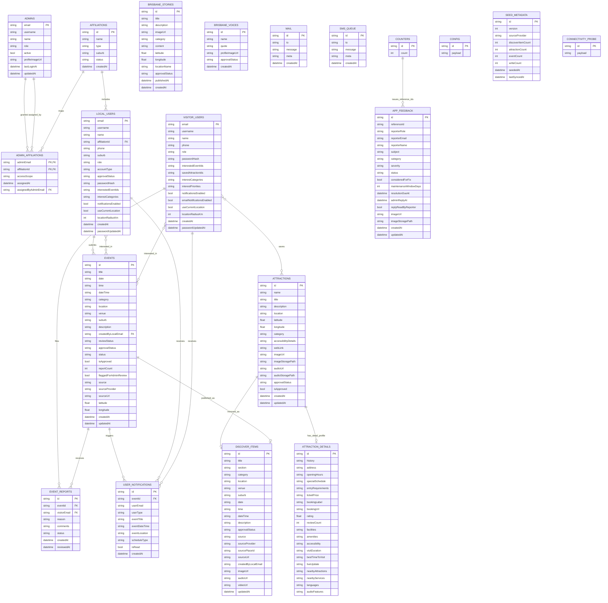

# BrisConnect ERD (Strict v2 + Affiliation Extension)

This diagram models Firestore collections used by BrisConnect, including all
collections declared in `firestore.rules`.

## Notes

- Firestore document IDs are semantic in several collections: `admins`, `local_users`, and `visitor_users` use lowercase email as the document key.
- `CONNECTIVITY_PROBE` exists in security rules (`_connectivity_probe/{docId}`) and is read-only from clients.
- `event_reports.id` is a synthetic composite key: `eventId__visitorEmail`.
- `app_feedback.id` is the lowercase form of `referenceId` such as `fb-0001`; the increment source is `counters/app_feedback`.
- `discover_items` is a denormalized catalog. Approved `events` and approved `attractions` are mirrored into it for discovery screens.
- `user_notifications`, `mail`, and `sms_queue` use payload fields like `userEmail`, `eventId`, and `meta` rather than strict Firestore foreign keys, so those links are application-level references.
- `attraction_details` uses the same document ID as its parent attraction when detail data exists.
- `brisbane_stories` and `brisbane_voices` are curated content collections with no enforced foreign-key relationship to the transactional entities.
- `affiliations` and `admin_affiliations` are modeled as an ERD extension for database design and migration planning; they are not currently present in strict Firestore rules.

## Required vs Optional (As Implemented)

- Firestore is schemaless, so required/optional status comes from app write paths, not Firestore schema enforcement.
- Required-on-create fields from current code paths:
    - `local_users`: `name`, `email`, `phone`, `suburb`, `role`, `accountType`, `approvalStatus`, `passwordHash`
    - `visitor_users`: `name`, `email`, `role`, `passwordHash`
    - `events` (local submission and sync paths): `id`, `title`, plus status/source metadata depending on writer
    - `event_reports`: `id`, `eventId`, `visitorEmail`, `reason`, `status`
    - `app_feedback`: `id`, `referenceId`, `reporterRole`, `reporterEmail`, `subject`, `details`, `status`
- Frequently optional or source-dependent:
    - `events`: `venue`, `suburb`, `latitude`, `longitude`, media fields
    - `discover_items`: fields vary by section (`events`, `historical`, `food`)
    - `mail`, `sms_queue`, `config`: flexible payload objects