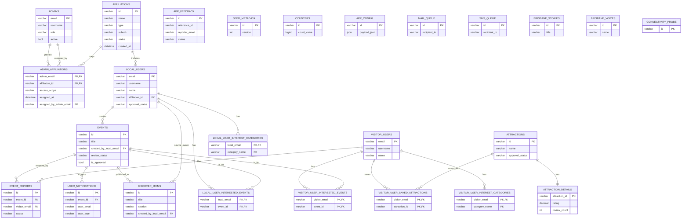

# BrisConnect MySQL ER Diagram

```mermaid
erDiagram
    ADMINS {
      varchar email PK
      varchar username
      varchar role
      bool active
    }

    AFFILIATIONS {
      varchar id PK
      varchar name
      varchar type
      varchar suburb
      varchar status
      datetime created_at
    }

    ADMIN_AFFILIATIONS {
      varchar admin_email PK,FK
      varchar affiliation_id PK,FK
      varchar access_scope
      datetime assigned_at
      varchar assigned_by_admin_email FK
    }

    LOCAL_USERS {
      varchar email PK
      varchar username
      varchar name
      varchar affiliation_id FK
      varchar approval_status
    }

    VISITOR_USERS {
      varchar email PK
      varchar username
      varchar name
    }

    EVENTS {
      varchar id PK
      varchar title
      varchar created_by_local_email FK
      varchar review_status
      bool is_approved
    }

    EVENT_REPORTS {
      varchar id PK
      varchar event_id FK
      varchar visitor_email FK
      varchar status
    }

    APP_FEEDBACK {
      varchar id PK
      varchar reference_id
      varchar reporter_email
      varchar status
    }

    ATTRACTIONS {
      varchar id PK
      varchar name
      varchar approval_status
    }

    ATTRACTION_DETAILS {
      varchar attraction_id PK
      decimal rating
      int review_count
    }

    DISCOVER_ITEMS {
      varchar id PK
      varchar title
      varchar section
      varchar created_by_local_email FK
    }

    USER_NOTIFICATIONS {
      varchar id PK
      varchar event_id FK
      varchar user_email
      varchar user_type
    }

    LOCAL_USER_INTERESTED_EVENTS {
      varchar local_email PK,FK
      varchar event_id PK,FK
    }

    VISITOR_USER_INTERESTED_EVENTS {
      varchar visitor_email PK,FK
      varchar event_id PK,FK
    }

    VISITOR_USER_SAVED_ATTRACTIONS {
      varchar visitor_email PK,FK
      varchar attraction_id PK,FK
    }

    LOCAL_USER_INTEREST_CATEGORIES {
      varchar local_email PK,FK
      varchar category_name PK
    }

    VISITOR_USER_INTEREST_CATEGORIES {
      varchar visitor_email PK,FK
      varchar category_name PK
    }

    SEED_METADATA {
      varchar id PK
      int version
    }

    COUNTERS {
      varchar id PK
      bigint count_value
    }

    APP_CONFIG {
      varchar id PK
      json payload_json
    }

    MAIL_QUEUE {
      varchar id PK
      varchar recipient_to
    }

    SMS_QUEUE {
      varchar id PK
      varchar recipient_to
    }

    BRISBANE_STORIES {
      varchar id PK
      varchar title
    }

    BRISBANE_VOICES {
      varchar id PK
      varchar name
    }

    CONNECTIVITY_PROBE {
      varchar id PK
    }

    ADMINS ||--o{ ADMIN_AFFILIATIONS : granted
    ADMINS ||--o{ ADMIN_AFFILIATIONS : assigned_by
    AFFILIATIONS ||--o{ ADMIN_AFFILIATIONS : maps
    AFFILIATIONS ||--o{ LOCAL_USERS : includes
    LOCAL_USERS ||--o{ EVENTS : creates
    EVENTS ||--o{ EVENT_REPORTS : reported_by
    VISITOR_USERS ||--o{ EVENT_REPORTS : files
    EVENTS ||--o{ USER_NOTIFICATIONS : triggers
    EVENTS ||--o{ DISCOVER_ITEMS : published_as
    LOCAL_USERS ||--o{ DISCOVER_ITEMS : source_owner
    ATTRACTIONS ||--|| ATTRACTION_DETAILS : has

    LOCAL_USERS ||--o{ LOCAL_USER_INTERESTED_EVENTS : has
    EVENTS ||--o{ LOCAL_USER_INTERESTED_EVENTS : in_list

    VISITOR_USERS ||--o{ VISITOR_USER_INTERESTED_EVENTS : has
    EVENTS ||--o{ VISITOR_USER_INTERESTED_EVENTS : in_list

    VISITOR_USERS ||--o{ VISITOR_USER_SAVED_ATTRACTIONS : saves
    ATTRACTIONS ||--o{ VISITOR_USER_SAVED_ATTRACTIONS : saved_item

    LOCAL_USERS ||--o{ LOCAL_USER_INTEREST_CATEGORIES : has
    VISITOR_USERS ||--o{ VISITOR_USER_INTEREST_CATEGORIES : has
```
