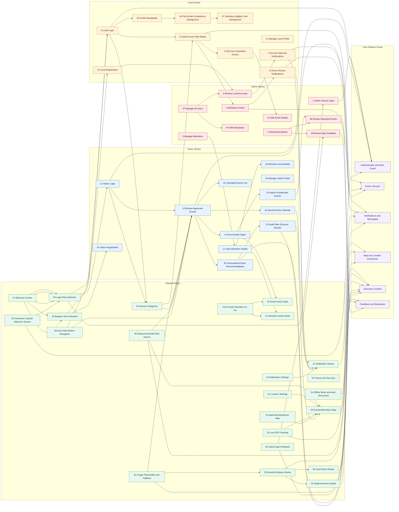

# BrisConnect User Stories Link Diagram

This diagram links all documented BrisConnect stories (1-55) into role groups and
end-to-end feature flows.

## Source

- Story list and IDs: [All_User_Stories_Traceability.md](../All_User_Stories_Traceability.md)
- Supplemental story set: [BrisConnect_Jira_User_Stories.md](../BrisConnect_Jira_User_Stories.md)