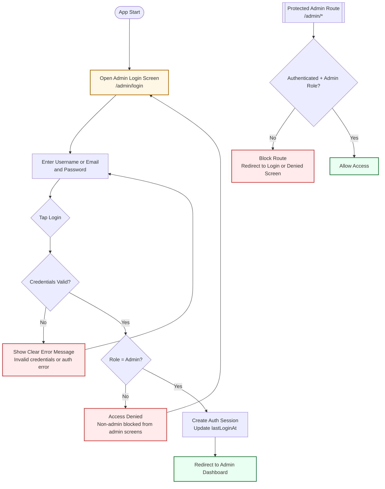

# User Story Walkthrough: Admin Secure Login

This picture represents the in-app flow for the user story:

"As an Admin, I want to log in securely so that I can manage platform operations."

Implementation references in the app:

- `lib/screens/admin_login_screen.dart`
- `lib/auth/admin_auth.dart`
- `lib/services/role_access_service.dart`
- `lib/main.dart` route: `/admin/login`

## Picture (App Flow)

## User Steps and Comments

1. User opens the app and navigates to Admin Login.
Comment: Entry point should always be available, but admin areas are still protected by role checks.

2. User enters username/email and password, then taps Login.
Comment: Credentials are validated securely by authentication logic.

3. If credentials are invalid, the app shows a clear error message.
Comment: This satisfies the acceptance criterion for readable failure feedback.

4. If credentials are valid, the app checks whether the authenticated account has Admin role.
Comment: This prevents Local/Visitor users from entering admin-only screens.

5. If role is not Admin, access is denied and protected routes remain inaccessible.
Comment: Route guards and role checks enforce authorization boundaries.

6. If role is Admin, user is redirected to the Admin Dashboard.
Comment: Successful login path meets dashboard redirection requirement.

7. For every `/admin/*` route access, the app re-validates auth + role.
Comment: Protection applies both at login and at route access time for reliability.
