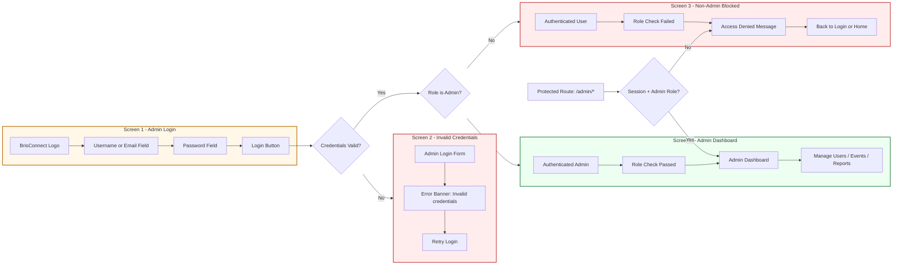

# User Story Storyboard: Admin Login (Mobile Screen Style)

User story:
As an Admin, I want to log in securely so that I can manage platform operations.

## App Storyboard Picture

## User Steps and Comments

1. Open the app and go to Admin Login.
Comment: The entry screen collects admin credentials only.

2. Enter username/email and password, then tap Login.
Comment: Credentials are validated by secure authentication logic.

3. If credentials are invalid, show a clear error message on the same login screen.
Comment: User can immediately correct input and retry.

4. If login succeeds, perform role check before allowing admin navigation.
Comment: Authentication alone is not enough; authorization is mandatory.

5. If the user is not admin, block admin-only screens and show access denied.
Comment: This enforces non-admin restrictions in acceptance criteria.

6. If the user is admin, redirect to Admin Dashboard.
Comment: Successful path satisfies dashboard redirection requirement.

7. On any protected admin route, verify active session and admin role again.
Comment: Route-level guard keeps admin features inaccessible without correct role.
