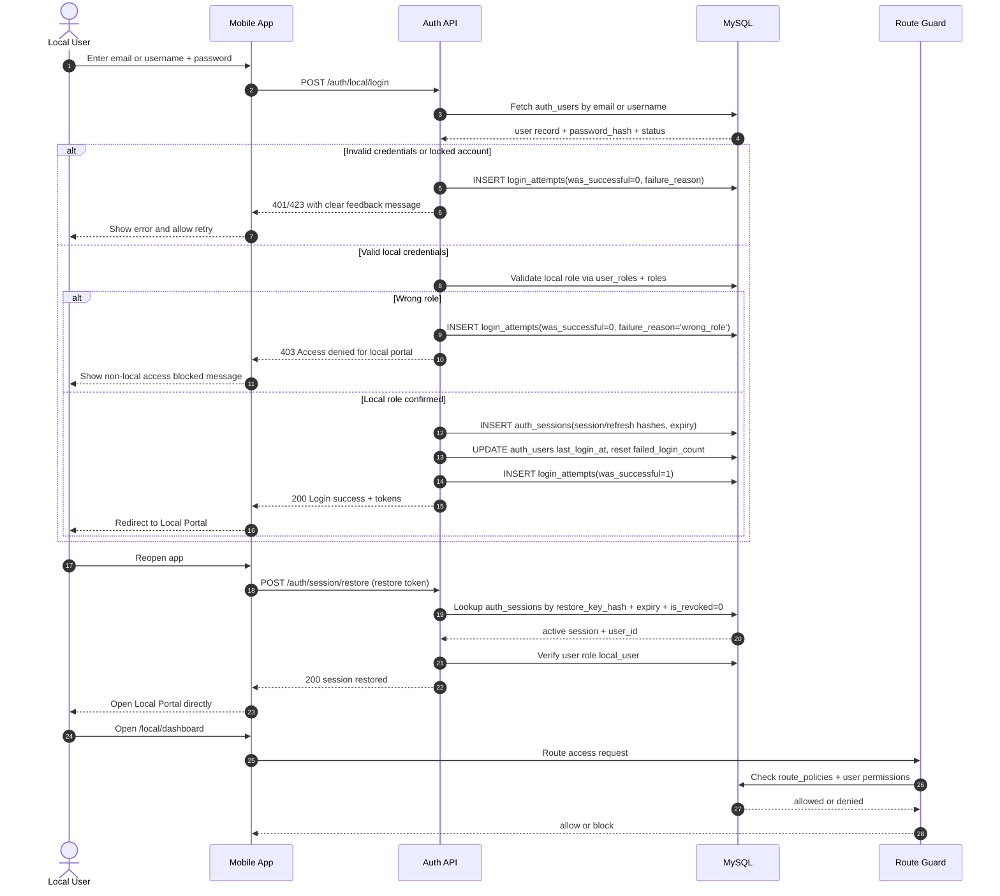

# Local Login: Sequence Diagram and SQL Query Pack

User story:
As a Local user, I want to log in to my account so that I can access local portal features.

## Sequence Diagram

## Steps and Notes

1. Credentials are checked against secure password hashes in auth_users.
2. Invalid credentials write login_attempts and return clear UI feedback.
3. Successful auth still requires local role authorization.
4. Local users receive session tokens and are redirected to local portal.
5. Session restoration uses hashed restore key with expiry and revocation checks.
6. Route guard enforces local-only access for every local route.
