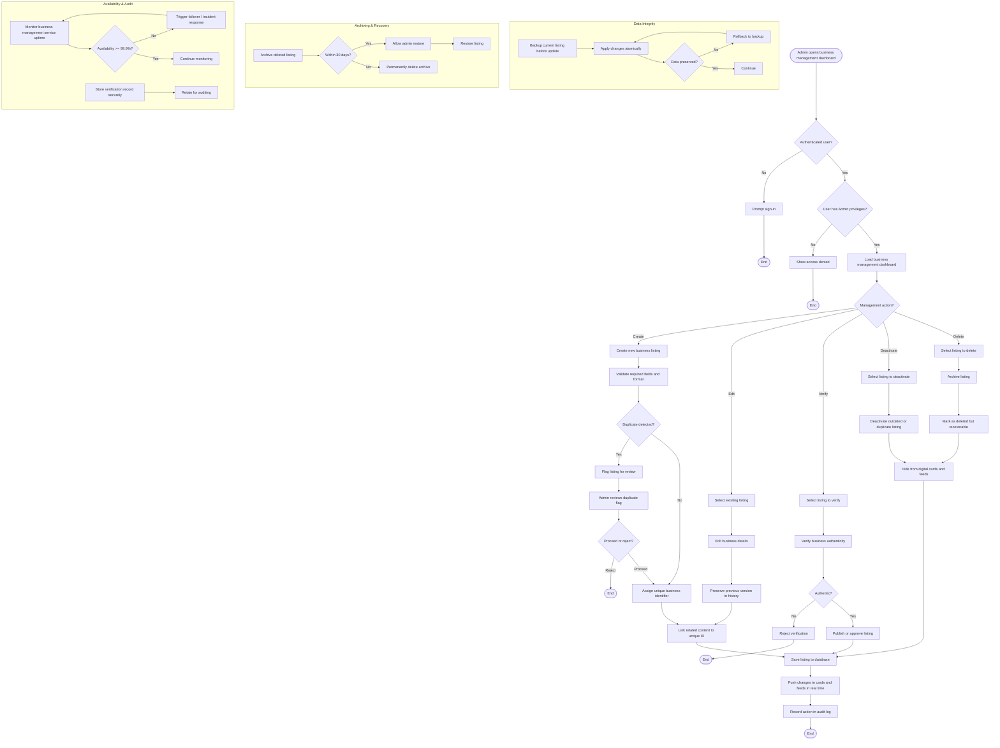

# Activity Diagram: Admin — Manage Local Business Listings

## User Story

**As an** Admin,  
**I want to** manage local business listings,  
**So that** only valid and accurate businesses appear on BrisConnect+.

## Acceptance Criteria

- Admin can create, edit, or delete business listings
- Admin can verify business authenticity before publishing
- Admin can deactivate outdated or duplicate listings
- Changes are reflected immediately on digital cards and feeds
- Each business has a unique identifier linked to all related content
- Only users with Admin privileges can create, edit, verify, or delete business listings.
- No data loss occurs during listing updates.
- Deleted listings are archived for recovery for 30 days.
- Business management services maintain 99.9% uptime.
- Duplicate business records are automatically flagged for review.
- Business verification records are stored for auditing purposes.

## Activity Diagram

## Diagram Explanation

1. **Open business management dashboard** — Admin navigates to the business listings section.
2. **Authentication check** — The user must be signed in.
3. **Admin privileges check** — Only users with Admin privileges can proceed; otherwise, access is denied.
4. **Load dashboard** — The business management dashboard is loaded.
5. **Choose action** — Admin selects create, edit, verify, deactivate, or delete.
6. **Create listing** — Admin enters business details; required fields and format are validated.
7. **Duplicate detection** — New listings are checked against existing records and flagged if duplicates are detected.
8. **Assign unique identifier** — Each business receives a unique ID used to link related content.
9. **Edit listing** — Existing details are updated while the previous version is preserved.
10. **Verify authenticity** — Admin reviews and verifies the business before publishing.
11. **Publish listing** — Verified businesses are published and visible on the platform.
12. **Deactivate listing** — Outdated or duplicate listings are deactivated and hidden from cards and feeds.
13. **Delete listing** — Listings are archived and soft-deleted, remaining recoverable for 30 days.
14. **Save and propagate** — Changes are saved and reflected immediately on digital cards and feeds.
15. **Record audit log** — All create, edit, verify, deactivate, and delete actions are logged.
16. **Data integrity** — Listing updates are backed up and applied atomically to prevent data loss.
17. **Archiving and recovery** — Deleted listings are archived and can be restored within 30 days.
18. **Availability and audit** — Services are monitored for 99.9% uptime, and verification records are retained for auditing.
