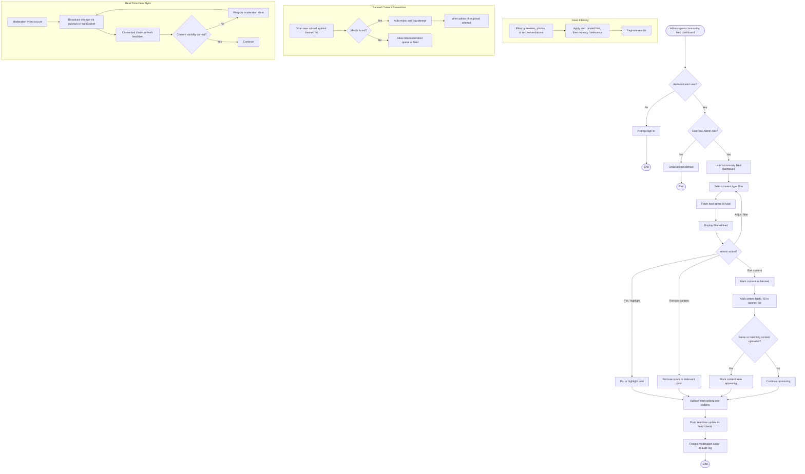

# Activity Diagram: Admin — Control Community Feed

## User Story

**As an** Admin,  
**I want to** control the community feed,  
**So that** I can ensure relevant and safe content is displayed.

## Acceptance Criteria

- Admin can pin or highlight posts in the feed
- Admin can remove spam or irrelevant content
- Admin can filter feed by content type (reviews, photos, recommendations)
- Feed updates reflect moderation actions instantly
- System prevents banned content from reappearing

## Activity Diagram

## Diagram Explanation

1. **Open community feed dashboard** — Admin navigates to the feed management section.
2. **Authentication check** — The user must be signed in.
3. **Admin role check** — Only users with an Admin role can proceed; otherwise, access is denied.
4. **Load dashboard** — The community feed dashboard is loaded.
5. **Select content filter** — Admin filters the feed by reviews, photos, or recommendations.
6. **Fetch feed items** — The system retrieves feed items matching the selected filter.
7. **Display feed** — Filtered feed items are shown to the admin.
8. **Admin action** — Admin chooses to pin/highlight, remove, ban content, or adjust the filter.
9. **Pin or highlight post** — Post is promoted in feed ranking and visually highlighted.
10. **Remove content** — Spam or irrelevant post is hidden from the feed.
11. **Ban content** — Content is added to a banned list to prevent reappearance.
12. **Reupload prevention** — New uploads are scanned against the banned list and blocked if they match.
13. **Update feed ranking** — Feed order and visibility are recalculated based on moderation actions.
14. **Push real-time update** — Changes are broadcast to all connected clients immediately.
15. **Record audit log** — Every moderation action is logged for accountability.
16. **Feed filtering** — Subgraph showing content-type filtering, sorting, and pagination logic.
17. **Banned content prevention** — Subgraph showing automated scanning and blocking of matching reuploads.
18. **Real-time sync** — Subgraph ensuring moderation state is consistently applied across all clients.
