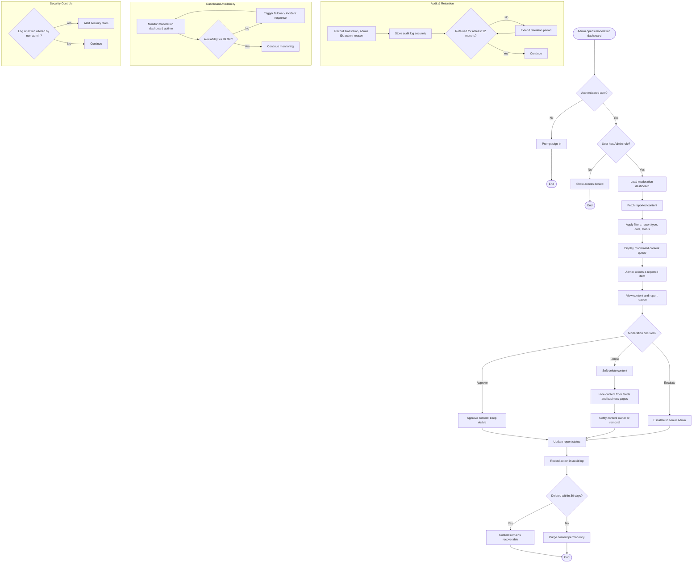

# Activity Diagram: Admin — Content Moderation

## User Story

**As an** Admin,  
**I want to** moderate user-generated content,  
**So that** inappropriate or misleading content is removed from the platform.

## Acceptance Criteria

- Admin can view reported content (reviews, photos, recommendations)
- Admin can approve or delete reported content
- Admin can view reason for each report
- Removed content no longer appears in feeds or business pages
- Users are notified when their content is removed (optional system message)
- All moderation actions are recorded in audit logs
- Only users with Admin roles can access moderation tools.
- All moderation actions are stored securely and cannot be altered by non-admin users.
- Moderation dashboard is available 99.9% of the time.
- Admins can filter reported content by report type, date, and status.
- Deleted content remains recoverable for 30 days by system administrators.
- Audit logs are retained for at least 12 months.

## Activity Diagram

## Diagram Explanation

1. **Open moderation dashboard** — Admin navigates to the content moderation section.
2. **Authentication check** — The user must be signed in.
3. **Admin role check** — Only users with an Admin role can proceed; otherwise, access is denied.
4. **Load dashboard** — The moderation dashboard is loaded.
5. **Fetch reported content** — The system retrieves reported reviews, photos, and recommendations.
6. **Apply filters** — Admins can filter by report type, date, and status.
7. **Display queue** — Filtered reports are shown in the moderation queue.
8. **Select report** — Admin selects an item to review.
9. **View details** — Admin sees the reported content and the reason for the report.
10. **Moderation decision** — Admin chooses to approve, delete, or escalate the report.
11. **Approve content** — Content remains visible on the platform.
12. **Soft-delete content** — Content is hidden from feeds and business pages but remains recoverable for 30 days.
13. **Notify user** — The content owner is optionally notified that their content was removed.
14. **Escalate report** — Report is escalated to a senior admin for further review.
15. **Update report status** — The status of the report is updated accordingly.
16. **Record audit log** — Every moderation action is logged with timestamp, admin ID, action, and reason.
17. **Recoverability check** — Deleted content stays recoverable for 30 days before permanent purging.
18. **Audit and retention** — Audit logs are stored securely and retained for at least 12 months.
19. **Dashboard availability** — Uptime is monitored to maintain 99.9% availability with failover.
20. **Security controls** — Any unauthorised tampering with logs or actions triggers a security alert.
