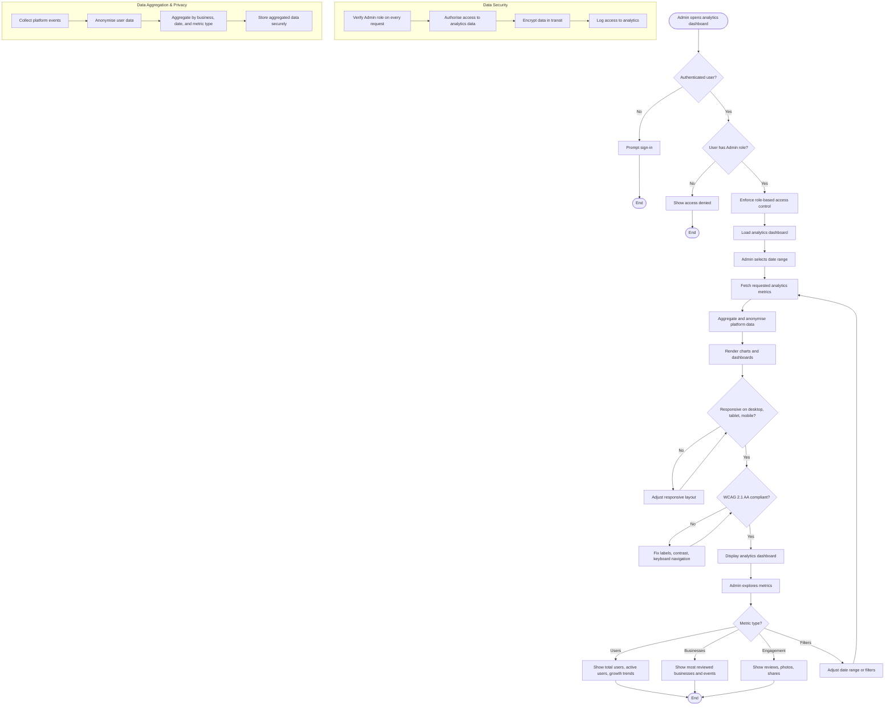

# Activity Diagram: Admin — View Platform Analytics

## User Story

**As an** Admin,  
**I want to** view platform analytics,  
**So that** I can understand user engagement and business performance.

## Acceptance Criteria

- Admin can view total users, active users, and growth trends
- Admin can view most reviewed businesses and events
- Admin can view engagement metrics (reviews, photos, shares)
- Admin can filter analytics by date range
- Data is displayed in charts or dashboards
- Only Admin users can access platform analytics.
- Analytics data is protected through role-based access control.
- Charts are responsive and viewable on desktop, tablet, and mobile devices
- Dashboards comply with WCAG 2.1 AA standards.

## Activity Diagram

## Diagram Explanation

1. **Open analytics dashboard** — Admin navigates to the platform analytics section.
2. **Authentication check** — The user must be signed in.
3. **Admin role check** — Only users with an Admin role can proceed; otherwise, access is denied.
4. **Enforce RBAC** — Role-based access control protects all analytics data and endpoints.
5. **Load dashboard** — The analytics dashboard is loaded.
6. **Select date range** — Admin chooses the period to analyse.
7. **Fetch metrics** — The system retrieves the requested analytics data.
8. **Aggregate and anonymise** — Platform data is aggregated and anonymised before display.
9. **Render charts** — Metrics are visualised in charts and dashboards.
10. **Responsive check** — Layout adapts to desktop, tablet, and mobile screens.
11. **WCAG check** — Charts and dashboards meet WCAG 2.1 AA standards for labels, contrast, and keyboard navigation.
12. **Display dashboard** — The analytics dashboard is shown to the admin.
13. **Explore metrics** — Admin switches between user, business, and engagement metrics, or adjusts filters.
14. **User metrics** — Total users, active users, and growth trends are displayed.
15. **Business metrics** — Most reviewed businesses and events are displayed.
16. **Engagement metrics** — Reviews, photos, and shares are displayed.
17. **Data security** — Admin role is verified on every request, data is encrypted in transit, and access is audited.
18. **Data aggregation and privacy** — Platform events are anonymised and aggregated before storage.
