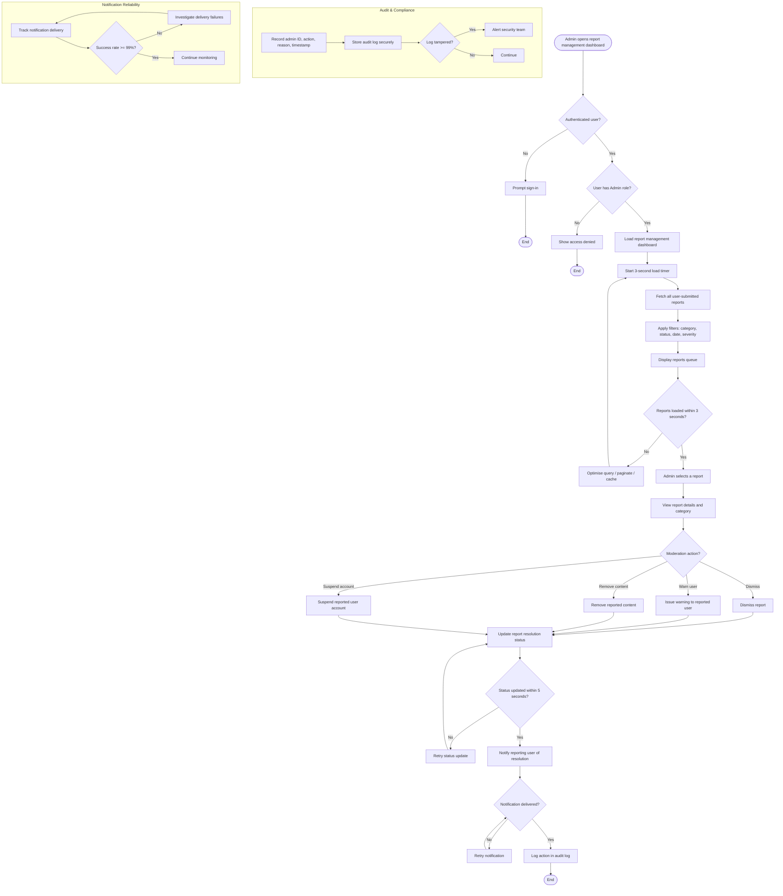

# Activity Diagram: Admin — Review User Reports

## User Story

**As an** Admin,  
**I want to** review user reports,  
**So that** I can maintain trust and safety in the community.

## Acceptance Criteria

- Admin can view all user-submitted reports
- Reports are categorised (spam, inappropriate content, fake review, etc.)
- Admin can take action: dismiss, warn user, remove content, or suspend account
- Report resolution status is updated in real time
- Users are notified when their report is resolved
- Only authenticated Admins can access report management tools.
- All report actions are logged for auditing purposes.
- Reports load within 3 seconds.
- Status updates are reflected within 5 seconds.
- Admins can filter reports by category, status, date, and severity.
- User notifications are delivered successfully 99% of the time.

## Activity Diagram

## Diagram Explanation

1. **Open report management dashboard** — Admin navigates to the user reports section.
2. **Authentication check** — The user must be signed in.
3. **Admin role check** — Only users with an Admin role can proceed; otherwise, access is denied.
4. **Load dashboard** — The report management dashboard is loaded.
5. **Load timer** — Reports must load within 3 seconds.
6. **Fetch reports** — The system retrieves all user-submitted reports.
7. **Apply filters** — Admins can filter reports by category, status, date, and severity.
8. **Display queue** — Filtered reports are shown in the queue.
9. **Load performance check** — If reports fail to load within 3 seconds, the query is optimised and retried.
10. **Select report** — Admin selects a report to review.
11. **View details** — Admin sees the report content and its category, such as spam, inappropriate content, or fake review.
12. **Moderation action** — Admin chooses to dismiss, warn the user, remove content, or suspend the account.
13. **Update status** — The report resolution status is updated in real time.
14. **Status timing check** — Status updates must be reflected within 5 seconds; otherwise, the update is retried.
15. **Notify reporter** — The user who submitted the report is notified of the resolution.
16. **Delivery check** — Notifications are retried until delivered successfully.
17. **Log action** — Every report action is recorded in the audit log.
18. **Audit and compliance** — Audit logs are stored securely and checked for tampering.
19. **Notification reliability** — Delivery success rate is monitored to maintain 99% reliability.
