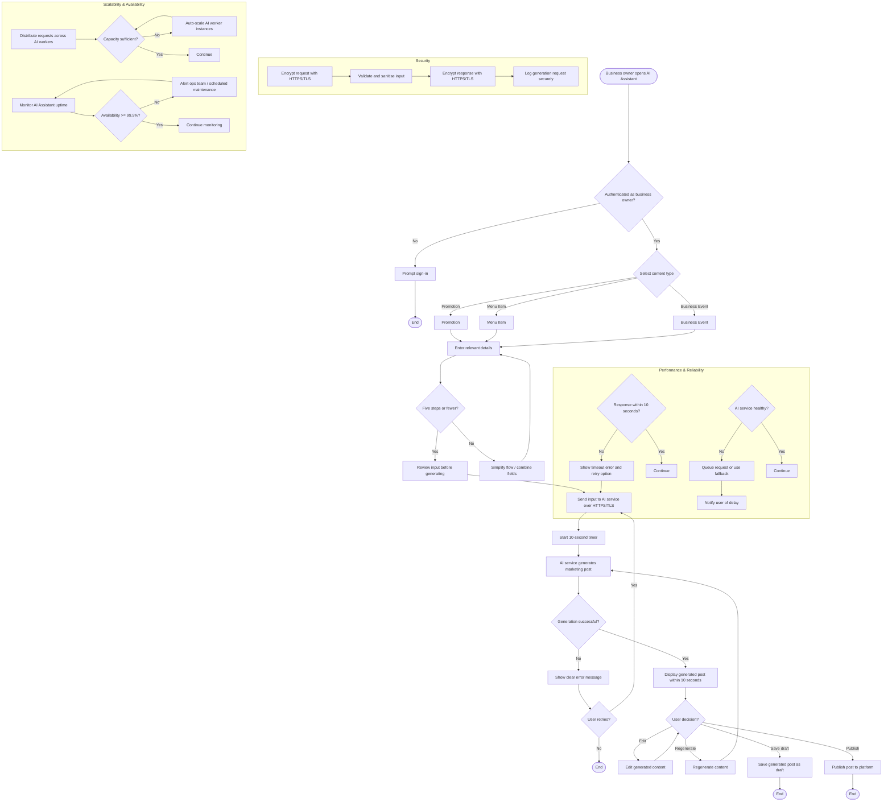

# Activity Diagram: Business Owner — AI Promotional Post Assistant

## User Story

**As a** local food business owner,  
**I want** an AI assistant to generate promotional posts for my promotions, menu items, or business events,  
**So that** I can create engaging marketing content quickly and attract more customers.

## Acceptance Criteria

1. The system shall allow the business owner to select a content type:
   - Promotion
   - Menu Item
   - Business Event
2. The system shall allow the user to enter relevant details (e.g., title, description, price, discount, event date, and location).
3. The system shall send the user input to the AI service to generate a marketing post.
4. The system shall display the generated post within 10 seconds.
5. The system shall allow the user to edit the generated content before publishing.
6. The system shall allow the user to regenerate the content if they are not satisfied.
7. The system shall allow the user to save the generated post as a draft or publish it.
8. **Performance:** The AI-generated post should be returned within **10 seconds** under normal network conditions.
9. **Availability:** The AI Assistant shall be available **99.5%** of the time, excluding scheduled maintenance.
10. **Usability:** The content creation process should require **no more than five steps** from selecting the content type to generating the post.
11. **Security:** All user inputs and generated content shall be transmitted securely using **HTTPS/TLS encryption**.
12. **Reliability:** If the AI service is unavailable, the system shall display a clear error message and allow the user to retry the request.
13. **Scalability:** The system shall support multiple business owners generating AI posts simultaneously without significant performance degradation.

## Activity Diagram

## Diagram Explanation

1. **Open AI Assistant** — Business owner navigates to the AI promotional post assistant.
2. **Authentication check** — Only authenticated business owners can access the assistant.
3. **Select content type** — Owner chooses Promotion, Menu Item, or Business Event.
4. **Enter relevant details** — Owner inputs title, description, price, discount, event date, location, etc.
5. **Five-step usability check** — The flow is kept to no more than five steps from content-type selection to generation; if exceeded, the UI is simplified.
6. **Review input** — Owner confirms details before sending to the AI service.
7. **Send to AI service** — Input is transmitted securely over HTTPS/TLS.
8. **Start 10-second timer** — Performance target begins.
9. **AI generates post** — The AI service creates a marketing post based on the provided details.
10. **Generation success check** — If the AI service fails, a clear error is shown and the user can retry.
11. **Display generated post** — The generated post is shown within 10 seconds.
12. **User decision** — Owner can edit, regenerate, save as draft, or publish.
13. **Edit post** — Owner manually adjusts the generated content.
14. **Regenerate post** — Owner requests a new version from the AI.
15. **Save draft** — Post is saved for later editing or publishing.
16. **Publish post** — Post is published to the platform and becomes visible.
17. **Performance and reliability** — Subgraph monitoring 10-second response time, AI health, timeout errors, retry logic, and fallback/queuing.
18. **Security** — Subgraph enforcing HTTPS/TLS encryption, input validation/sanitisation, and secure audit logging.
19. **Scalability and availability** — Subgraph handling concurrent users via load balancing, auto-scaling AI workers, and 99.5% availability monitoring.
