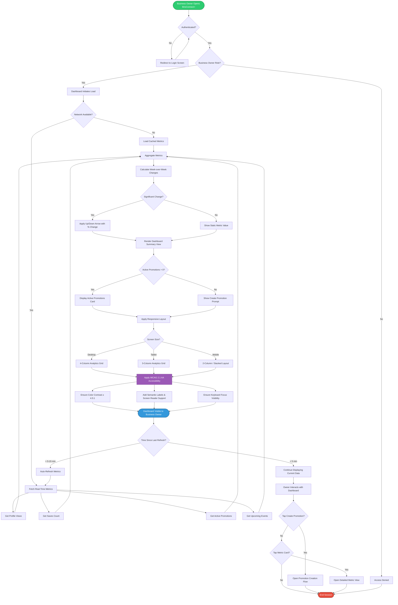

# Business Dashboard Activity Diagram

## User Story
**As a business owner, I want a single home screen summarizing my business's performance, so that I can understand how I'm doing without digging through multiple tabs.**

## Activity Flow Description

| Step | Activity | Acceptance Criteria Coverage |
|------|----------|------------------------------|
| 1 | **Authentication Check** | Only authenticated business owners can access their dashboard |
| 2 | **Role Verification** | Business owner access control |
| 3 | **Network Detection** | Dashboard availability (99.9% uptime) / offline fallback |
| 4 | **Metric Aggregation** | Views, saves, active promotions, upcoming events in one summary |
| 5 | **Change Detection** | Visual flagging for significant week-over-week changes |
| 6 | **Promotion Prompt** | Encourage promotion creation when none active |
| 7 | **Responsive Layout** | Desktop, tablet, and mobile adaptation |
| 8 | **Accessibility Checks** | WCAG 2.1 AA compliance |
| 9 | **Auto-Refresh Loop** | Real-time updates or 5–15 minute refresh |
| 10 | **Interaction Handling** | Tap-to-drill-down and create-promotion flows |

## Performance Targets

- **Initial Load:** 2–3 seconds under normal network conditions
- **Metric Refresh:** < 1 second after initial load
- **Update Frequency:** Every 5–15 minutes (or real-time if available)
- **Availability Target:** 99.9% uptime

## Accessibility Checkpoints

- Color contrast ratio ≥ 4.5:1 for all text and UI elements
- All interactive elements have accessible labels
- Screen reader announcements for metric changes
- Keyboard navigable dashboard cards and buttons
- Focus indicators visible on all focusable elements
